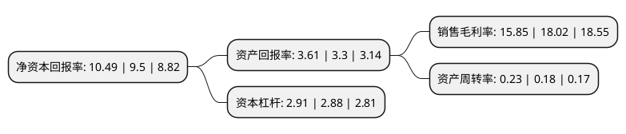

> 本页面由自动化程序生成于 2022年5月20日 01:29
> 内容可能存在错误，如有bug请提交issue至：https://github.com/Eroleice/doc-pi/issues
{.is-warning}

# 上市公司基本情况

## 基本资料

天津创业环保集团股份有限公司（以下简称“创业环保”）成立于1993年06月08日，天津市。于1995年06月30日在上交所主板上市。

创业环保注册资本142,722.843万元，主要业务:污水处理及污水处理厂建设业务，道路及收费站业务。以下是详细信息：

- 公司名称: 天津创业环保集团股份有限公司
- 股票代码: 600874.SH
- 所在地: 天津 - 天津市
- 成立日期: 1993年06月08日
- 注册资本: 142,722.843万元
- 法定代表人: 刘玉军
- 主营业务: 污水处理及污水处理厂建设业务，道路及收费站业务
- 公司官网: www.tjcep.com
- 公司介绍: 公司是国内环保领域的先行者和领先企业。经过多年的运营实践，公司在水务、新能源供冷供热项目运营方面积累了丰富的管理经验，培养了很多优秀的技术和管理人员，很好的保证了项目的安全、稳定运营；在市场拓展方面，经过数年培育，公司已经建立起覆盖全国多省市的集团化市场开发体系，拥有区域化的市场支持团队；在科技研发方面，公司建立起市场化导向的研发体系，拥有污水、污泥、除臭、生物菌制剂、污泥等方面的多项自主科研专利。在人才建设方面，基于项目稳定运营需求的特质，以及多年市场开发、科技研发的积累，公司的员工和管理团队体现出专业、尽责、诚信、担当精神，成为公司未来发展的重要支撑。

## 股东及高管情况

上市公司第一大股东为天津市政投资有限公司，持股715,565,186股，占比50.14%，为上市公司实际控制人。

截至2022年03月31日，上市公司的前十大股东中，共有3名自然人股东，5名机构股东，2个海外主体，其中5%以上大股东共有2名。上市公司前十大股东明细如下：

> 截至2022年03月31日，上市公司前十大股东信息如下：

| 股东名称 | 持股数量（股） | 持股比例 |
| --- | --- | --- |
| 天津市政投资有限公司 | 715,565,186 | 50.14% |
| 香港中央结算(代理人)有限公司 | 337,954,810 | 23.68% |
| 中央汇金资产管理有限责任公司 | 13,868,294 | 0.97% |
| 香港中央结算有限公司(陆股通) | 13,280,153 | 0.93% |
| 浙江锦鑫建设工程有限公司 | 7,453,000 | 0.52% |
| 中国国际金融香港资产管理有限公司-客户资金2 | 3,697,733 | 0.26% |
| 江勇 | 3,420,300 | 0.24% |
| 李命国 | 2,104,785 | 0.15% |
| 林志茂 | 1,719,700 | 0.12% |
| 沈阳铁道煤炭集团有限公司 | 1,500,000 | 0.11% |

## 利润表分析

上市公司2021年总收入为45.35亿元，净利润为7.19亿元，实现盈利。

## 杜邦分析

> 数据列示周期：2021年 | 2020年 | 2019年
{.is-info}

上市公司的净资产收益率在近一年有所上升，上升幅度为10.42%，其变化情况分解如下：
- 上市公司的销售毛利率在近一年下降了-12.04%，可能是生产效率的下降、商品原材料价格上涨或商品价格的下跌所致。
- 上市公司的资产周转率在近一年上升了27.78%，可能是源自于更快的销售回款或库存管理效果提升。
- 上市公司的财务杠杆比率在近一年上升了1.04%，可能是增加负债扩大生产规模。

