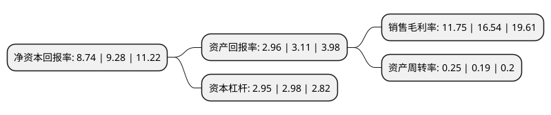

> 本页面由自动化程序生成于 2022年5月20日 01:30
> 内容可能存在错误，如有bug请提交issue至：https://github.com/Eroleice/doc-pi/issues
{.is-warning}

# 上市公司基本情况

## 基本资料

上海环境集团股份有限公司（以下简称“上海环境”）成立于2004年06月28日，上海市。于2017年03月31日在上交所主板上市。

上海环境注册资本112,185.854万元，固体废弃物处置，城市污水处理等环境市政项目投资，建设与运营以下是详细信息：

- 公司名称: 上海环境集团股份有限公司
- 股票代码: 601200.SH
- 所在地: 上海 - 上海市
- 成立日期: 2004年06月28日
- 注册资本: 112,185.854万元
- 法定代表人: 王瑟澜
- 主营业务: 固体废弃物处置，城市污水处理等环境市政项目投资，建设与运营
- 公司官网: www.smi-envir.com
- 公司介绍: 公司是国内固废行业起步最早的专业环保企业之一，始终致力于在中国快速增长的城市固体废弃物和城市污水处理处置领域，提供高效率、高标准、高技术的一站式服务和一揽子解决方案。公司作为国内首个采用湿法烟气处理工艺的企业，烟气实际排放数据远远严格于欧盟2000标准；公司连续多年荣获“中国固废行业十大影响力企业”、“中国固废行业最具社会责任企业”、上海市首批“安全文化建设示范企业”等称号，同时运营多座被国家住建部评定等级为AAA生活垃圾焚烧发电项目的环保企业。

## 股东及高管情况

上市公司第一大股东为上海城投(集团)有限公司，持股521,630,979股，占比46.5%，为上市公司实际控制人。

截至2022年03月31日，上市公司的前十大股东中，共有1名自然人股东，5名机构股东，3个产品账户，1个海外主体，其中5%以上大股东共有2名。上市公司前十大股东明细如下：

> 截至2022年03月31日，上市公司前十大股东信息如下：

| 股东名称 | 持股数量（股） | 持股比例 |
| --- | --- | --- |
| 上海城投(集团)有限公司 | 521,630,979 | 46.5% |
| 长江生态环保集团有限公司 | 58,402,192 | 5.21% |
| 三峡资本控股有限责任公司 | 53,783,649 | 4.79% |
| 弘毅(上海)股权投资基金中心(有限合伙) | 26,277,078 | 2.34% |
| 香港中央结算有限公司(陆股通) | 8,702,423 | 0.78% |
| 中国农业银行股份有限公司-中证500交易型开放式指数证券投资基金 | 4,347,104 | 0.39% |
| 韩涛 | 3,000,000 | 0.27% |
| 中华联合财产保险股份有限公司-传统保险产品 | 2,994,607 | 0.27% |
| 中国银河资产管理有限责任公司 | 2,887,713 | 0.26% |
| 上海东临实业有限公司 | 2,790,000 | 0.25% |

## 利润表分析

上市公司2021年总收入为71.01亿元，净利润为8.34亿元，实现盈利。

## 杜邦分析

> 数据列示周期：2021年 | 2020年 | 2019年
{.is-info}

上市公司的净资产收益率在近一年有所下降，下降幅度为-5.82%，其变化情况分解如下：
- 上市公司的销售毛利率在近一年下降了-28.96%，可能是生产效率的下降、商品原材料价格上涨或商品价格的下跌所致。
- 上市公司的资产周转率在近一年上升了31.58%，可能是源自于更快的销售回款或库存管理效果提升。
- 上市公司的财务杠杆比率在近一年下降了-1.01%，可能是减少负债降低财务费用。

