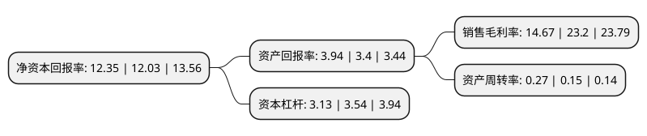

> 本页面由自动化程序生成于 2022年5月20日 01:31
> 内容可能存在错误，如有bug请提交issue至：https://github.com/Eroleice/doc-pi/issues
{.is-warning}

# 上市公司基本情况

## 基本资料

绿色动力环保集团股份有限公司（以下简称“绿色动力”）成立于2000年03月29日，深圳市。于2018年06月11日在上交所主板上市。

绿色动力注册资本139,344万元，主营业务:主要以BOT等特许经营的方式从事生活垃圾焚烧发电厂的投资，建设，运营，维护以及技术顾问业务。以下是详细信息：

- 公司名称: 绿色动力环保集团股份有限公司
- 股票代码: 601330.SH
- 所在地: 广东 - 深圳市
- 成立日期: 2000年03月29日
- 注册资本: 139,344万元
- 法定代表人: 乔德卫
- 主营业务: 主营业务:主要以BOT等特许经营的方式从事生活垃圾焚烧发电厂的投资，建设，运营，维护以及技术顾问业务
- 公司官网: www.dynagreen.com.cn
- 公司介绍: 公司是北京市国有资产经营有限责任公司控股的专门从事循环经济、可再生能源产业的上市企业集团。业务涉及城市垃圾处理项目的投资建设、运营管理、技术研发，核心配套设备的供应，以及顾问咨询等专业化服务，为城市垃圾处理提供整体解决方案。绿色动力是国家级高新技术企业，已获得“中国环保骨干企业、全国环保优秀品牌企业、垃圾处理行业十大标志品牌企业、中国固废十大影响力企业、中国垃圾焚烧发电产业领军企业、国家优质工程奖、国家AAA级生活垃圾焚烧厂”等众多荣誉称号，是国家行业标准的参与制定单位，拥有生活垃圾环境污染治理设施运营资质证书，已经通过了ISO9001、ISO14001和OHSAS18001国际质量、环保和职业健康安全“三标一体化”管理体系认证。

## 股东及高管情况

上市公司第一大股东为北京市国有资产经营有限责任公司，持股594,085,618股，占比42.63%，为上市公司实际控制人。

截至2022年03月31日，上市公司的前十大股东中，共有6名机构股东，2个产品账户，2个海外主体，其中5%以上大股东共有3名。上市公司前十大股东明细如下：

> 截至2022年03月31日，上市公司前十大股东信息如下：

| 股东名称 | 持股数量（股） | 持股比例 |
| --- | --- | --- |
| 北京市国有资产经营有限责任公司 | 594,085,618 | 42.63% |
| 香港中央结算(代理人)有限公司 | 379,480,000 | 27.23% |
| 三峡资本控股有限责任公司 | 84,265,896 | 6.05% |
| 北京国资(香港)有限公司 | 24,859,792 | 1.78% |
| 北京惠泰恒瑞投资有限公司 | 17,170,707 | 1.23% |
| 共青城景秀投资合伙企业(有限合伙) | 7,130,378 | 0.51% |
| 香港中央结算有限公司(陆股通) | 2,775,127 | 0.2% |
| 方圆基金管理(香港)有限公司-方圆增强收益基金 | 2,200,000 | 0.16% |
| 中国人寿保险股份有限公司-分红-个人分红-005L-FH002沪 | 1,700,000 | 0.12% |
| 中国农业银行股份有限公司-南方中证长江保护主题交易型开放式指数证券投资基金 | 1,421,700 | 0.1% |

## 利润表分析

上市公司2021年总收入为50.56亿元，净利润为7.41亿元，实现盈利。

## 杜邦分析

> 数据列示周期：2021年 | 2020年 | 2019年
{.is-info}

上市公司的净资产收益率在近一年有所上升，上升幅度为2.66%，其变化情况分解如下：
- 上市公司的销售毛利率在近一年下降了-36.77%，可能是生产效率的下降、商品原材料价格上涨或商品价格的下跌所致。
- 上市公司的资产周转率在近一年上升了80%，可能是源自于更快的销售回款或库存管理效果提升。
- 上市公司的财务杠杆比率在近一年下降了-11.58%，可能是减少负债降低财务费用。

