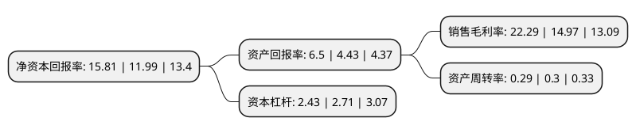

> 本页面由自动化程序生成于 2022年5月20日 01:31
> 内容可能存在错误，如有bug请提交issue至：https://github.com/Eroleice/doc-pi/issues
{.is-warning}

# 上市公司基本情况

## 基本资料

重庆三峰环境集团股份有限公司（以下简称“三峰环境”）成立于2009年12月04日，重庆市。于2020年06月05日在上交所主板上市。

三峰环境注册资本167,826.8万元，公司主营业务包括垃圾焚烧发电项目投资运营，EPC建造以及垃圾焚烧发电核心设备研发制造等。以下是详细信息：

- 公司名称: 重庆三峰环境集团股份有限公司
- 股票代码: 601827.SH
- 所在地: 重庆 - 重庆市
- 成立日期: 2009年12月04日
- 注册资本: 167,826.8万元
- 法定代表人: 雷钦平
- 主营业务: 公司主营业务包括垃圾焚烧发电项目投资运营，EPC建造以及垃圾焚烧发电核心设备研发制造等
- 公司官网: www.cseg.cn
- 公司介绍: 公司自成立以来，一直从事垃圾焚烧发电相关业务，主营业务未发生变化。公司始终以“为了一个更洁净的世界”为使命，以领先的垃圾焚烧发电技术、设备和服务，为我国城市生活垃圾环保治理做出了积极贡献。公司主营业务包括垃圾焚烧发电项目投资运营、EPC建造以及垃圾焚烧发电核心设备研发制造等，具备较强的垃圾焚烧发电全产业链综合服务能力。近年来，公司在垃圾焚烧发电业务基础上，依托产业协同优势，逐步延伸产业链，致力于成为中国和新兴国家市场一流的城市固废处理系统解决方案提供商和全球领先的固废行业知名公众公司。近年来先后荣获E20环境平台和中国城市建设研究院联合评选的“2017年度中国固废行业影响力企业”，中国采购与招标网评选的“中国垃圾焚烧发电PPP项目首选投资商”、“中国垃圾焚烧发电PPP项目技术领先奖”等荣誉，登榜全国工商联环境商会评选的“2018中国环境企业50强”，彰显了公司在行业的优势地位。

## 股东及高管情况

上市公司第一大股东为重庆德润环境有限公司，持股736,099,000股，占比43.86%，为上市公司实际控制人。

截至2022年03月31日，上市公司的前十大股东中，共有8名机构股东，1个产品账户，1个海外主体，其中5%以上大股东共有4名。上市公司前十大股东明细如下：

> 截至2022年03月31日，上市公司前十大股东信息如下：

| 股东名称 | 持股数量（股） | 持股比例 |
| --- | --- | --- |
| 重庆德润环境有限公司 | 736,099,000 | 43.86% |
| 中信环境投资集团有限公司 | 185,978,400 | 11.08% |
| 重庆水务环境控股集团有限公司 | 142,428,000 | 8.49% |
| 重庆市地产集团有限公司 | 101,725,000 | 6.06% |
| 中国信达资产管理股份有限公司 | 61,035,000 | 3.64% |
| 西证股权投资有限公司 | 24,000,008 | 1.43% |
| 重庆市涪陵国有资产投资经营集团有限公司 | 10,179,000 | 0.61% |
| 香港中央结算有限公司(陆股通) | 6,502,645 | 0.39% |
| 杭州汉石投资管理服务有限公司 | 5,083,000 | 0.3% |
| 中国银行股份有限公司-华泰柏瑞创新升级混合型证券投资基金 | 4,584,400 | 0.27% |

## 利润表分析

上市公司2021年总收入为58.73亿元，净利润为13.09亿元，实现盈利。

## 杜邦分析

> 数据列示周期：2021年 | 2020年 | 2019年
{.is-info}

上市公司的净资产收益率在近一年有所上升，上升幅度为31.86%，其变化情况分解如下：
- 上市公司的销售毛利率在近一年上升了48.9%，可能是生产效率的提升、商品原材料价格下跌或商品价格的上涨所致。
- 上市公司的资产周转率在近一年下降了-3.33%，可能是源自于更慢的销售回款或库存管理效果下降。
- 上市公司的财务杠杆比率在近一年下降了-10.33%，可能是减少负债降低财务费用。

