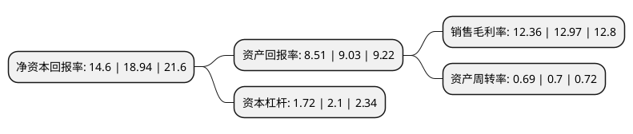

> 本页面由自动化程序生成于 2022年5月20日 01:33
> 内容可能存在错误，如有bug请提交issue至：https://github.com/Eroleice/doc-pi/issues
{.is-warning}

# 上市公司基本情况

## 基本资料

上海盛剑环境系统科技股份有限公司（以下简称“盛剑环境”）成立于2012年06月15日，上海市。于2021年04月07日在上交所主板上市。

盛剑环境注册资本12,511.65万元，公司专注于泛半导体工艺废气治理系统及关键设备的研发设计，加工制造，系统集成及运维管理，主要产品为废气治理系统及设备。以下是详细信息：

- 公司名称: 上海盛剑环境系统科技股份有限公司
- 股票代码: 603324.SH
- 所在地: 上海 - 上海市
- 成立日期: 2012年06月15日
- 注册资本: 12,511.65万元
- 法定代表人: 张伟明
- 主营业务: 公司专注于泛半导体工艺废气治理系统及关键设备的研发设计，加工制造，系统集成及运维管理，主要产品为废气治理系统及设备
- 公司官网: www.sheng-jian.com
- 公司介绍: 公司系为中国泛半导体产业提供工艺废气治理系统解决方案的国内领军企业。公司专注于泛半导体工艺废气治理系统及关键设备的研发设计、加工制造、系统集成及运维管理，致力于为客户定制化提供安全稳定的废气治理系统解决方案，为产业绿色生产创造价值。公司针对泛半导体生产工艺环节持续产生的复杂废气，依据这些废气的特性，提供系统解决方案。公司的工艺废气治理系统解决方案覆盖了客户的生产工艺过程，与其生产工艺同步进行废气收集、处理及排放，有力保障了客户的产能利用率、产品良率、员工职业健康及生态环境，是客户生产工艺不可分割的组成部分。公司深耕泛半导体工艺废气治理领域多年，持续服务于京东方、华星光电、天马微电子、维信诺、中电熊猫、信利光电、惠科光电、中电系统等业内领军企业，积累了领先的设计能力、专业的管理团队及丰富的实战经验，奠定了公司在国内泛半导体工艺废气治理领域的领先地位。

## 股东及高管情况

上市公司第一大股东为张伟明，持股74,477,517股，占比59.53%，为上市公司实际控制人。

截至2022年04月13日，上市公司的前十大股东中，共有2名自然人股东，7名机构股东，1个产品账户，其中5%以上大股东共有1名。上市公司前十大股东明细如下：

> 截至2022年04月13日，上市公司前十大股东信息如下：

| 股东名称 | 持股数量（股） | 持股比例 |
| --- | --- | --- |
| 张伟明 | 74,477,517 | 59.53% |
| 上海昆升企业管理合伙企业(有限合伙) | 4,002,533 | 3.2% |
| 深圳市达晨创通股权投资企业(有限合伙) | 3,466,668 | 2.77% |
| 深圳市达晨财智创业投资管理有限公司-深圳市达晨创通股权投资企业(有限合伙) | 3,466,668 | 2.77% |
| 上海科技创业投资有限公司 | 2,148,993 | 1.72% |
| 中国工商银行股份有限公司-交银施罗德趋势优先混合型证券投资基金 | 1,950,164 | 1.56% |
| 汪哲 | 1,519,949 | 1.21% |
| 上海域盛投资有限公司 | 1,387,668 | 1.11% |
| 连云港舟虹企业管理合伙企业(有限合伙) | 1,362,668 | 1.09% |
| 深圳市达晨财智创业投资管理有限公司-深圳市达晨晨鹰二号股权投资企业(有限合伙) | 1,066,668 | 0.85% |

## 利润表分析

上市公司2021年总收入为12.33亿元，净利润为1.52亿元，实现盈利。

## 杜邦分析

> 数据列示周期：2021年 | 2020年 | 2019年
{.is-info}

上市公司的净资产收益率在近一年有所下降，下降幅度为-22.91%，其变化情况分解如下：
- 上市公司的销售毛利率在近一年下降了-4.7%，可能是生产效率的下降、商品原材料价格上涨或商品价格的下跌所致。
- 上市公司的资产周转率在近一年下降了-1.43%，可能是源自于更慢的销售回款或库存管理效果下降。
- 上市公司的财务杠杆比率在近一年下降了-18.1%，可能是减少负债降低财务费用。

