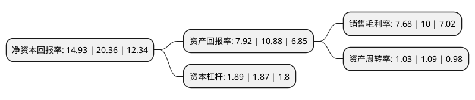

> 本页面由自动化程序生成于 2022年5月20日 01:35
> 内容可能存在错误，如有bug请提交issue至：https://github.com/Eroleice/doc-pi/issues
{.is-warning}

# 上市公司基本情况

## 基本资料

福龙马集团股份有限公司（以下简称“福龙马”）成立于2007年12月21日，龙岩市。于2015年01月26日在上交所主板上市。

福龙马注册资本41,565.574万元，主要业务:环卫清洁装备，垃圾收转装备，新能源及清洁能源环卫装备等环卫装备的研发，生产与销售以及环卫产业运营服务。以下是详细信息：

- 公司名称: 福龙马集团股份有限公司
- 股票代码: 603686.SH
- 所在地: 福建 - 龙岩市
- 成立日期: 2007年12月21日
- 注册资本: 41,565.574万元
- 法定代表人: 张桂潮
- 主营业务: 环卫清洁装备，垃圾收转装备，新能源及清洁能源环卫装备等环卫装备的研发，生产与销售以及环卫产业运营服务
- 公司官网: www.fjlm.com.cn
- 公司介绍: 公司是集城乡环境卫生系统规划设计、环卫装备研发制造销售、环卫运营、投资为一体的环境卫生整体解决方案提供商，拥有博士后科研工作站和省级环境工程研究中心，是国家火炬计划重点高新技术企业、中国城市环境卫生协会环卫运营管理专业委员会主任单位。公司主营业务是环卫清洁装备、垃圾收转装备、新能源及清洁能源环卫装备等环卫装备的研发、生产与销售以及环卫产业运营服务。多年来公司坚持专业化经营战略，专注于环境卫生事业，在环卫装备领域不断探索创新，已形成环卫清洁、垃圾收运、新能源环卫装备三大核心产品体系，可广泛满足城乡环卫清洁和垃圾收转等环卫作业需求。公司围绕自身的核心技术，抢抓发展机遇，实施“环卫装备制造+环卫产业服务”协同发展战略，实现运营服务业带动制造业，制造业支持运营服务业的双向融合新格局，努力成为环境卫生整体解决方案的领先者。

## 股东及高管情况

上市公司第一大股东为张桂丰，持股76,781,900股，占比18.47%，**疑似为**上市公司实际控制人。

截至2022年03月31日，上市公司的前十大股东中，共有1名自然人股东，4名机构股东，3个产品账户，1个海外主体，1名其他股东，其中5%以上大股东共有1名。上市公司前十大股东明细如下：

> 未能通过持股比例判定出上市公司实际控制人（持股30%以上）
> 可能存在通过间接持股、联合持股、协议控制等方式拥有实际控制权的主体，具体请参考上市公司定期公告！
{.is-warning}

> 截至2022年03月31日，上市公司前十大股东信息如下：

| 股东名称 | 持股数量（股） | 持股比例 |
| --- | --- | --- |
| 张桂丰 | 76,781,900 | 18.47% |
| 山东高速股份有限公司 | 20,656,583 | 4.97% |
| 三峡资本控股有限责任公司 | 13,599,932 | 3.27% |
| 四川发展资产经营投资管理有限公司 | 6,429,446 | 1.55% |
| 杭州富邦投资有限公司 | 6,174,340 | 1.49% |
| 华润元大基金-林川-华润元大基金润商1号单一资产管理计划 | 5,919,177 | 1.42% |
| 福龙马集团股份有限公司-第二期员工持股计划 | 5,626,756 | 1.35% |
| 香港中央结算有限公司(陆股通) | 3,962,943 | 0.95% |
| 科威特政府投资局-自有资金 | 3,329,526 | 0.8% |
| 鹏华资产-光大银行-粤财信托-粤财信托-勤道8号集合资金信托计划 | 3,282,730 | 0.79% |

## 利润表分析

上市公司2021年总收入为57.01亿元，净利润为4.37亿元，实现盈利。

## 杜邦分析

> 数据列示周期：2021年 | 2020年 | 2019年
{.is-info}

上市公司的净资产收益率在近一年有所下降，下降幅度为-26.67%，其变化情况分解如下：
- 上市公司的销售毛利率在近一年下降了-23.2%，可能是生产效率的下降、商品原材料价格上涨或商品价格的下跌所致。
- 上市公司的资产周转率在近一年下降了-5.5%，可能是源自于更慢的销售回款或库存管理效果下降。
- 上市公司的财务杠杆比率在近一年上升了1.07%，可能是增加负债扩大生产规模。

