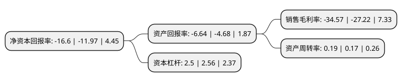

> 本页面由自动化程序生成于 2022年5月20日 01:35
> 内容可能存在错误，如有bug请提交issue至：https://github.com/Eroleice/doc-pi/issues
{.is-warning}

# 上市公司基本情况

## 基本资料

天域生态环境股份有限公司（以下简称“天域生态”）成立于2000年06月21日，重庆市。于2017年03月27日在上交所主板上市。

天域生态注册资本29,014.624万元，公司的主营业务为园林生态工程的设计，施工养护及苗木种植等。公司致力于为政府机构，企事业单位及房地产公司等客户提供园林生态领域的综合服务，包括园林绿化工程，生态湿地修复，市政公园，道路绿化及边坡修复，河湖环境综合治理等生态园林工程的设计，施工养护运营管理及苗木种植业务，同时近年来公司亦在不断推进创新型生态环保科技的研发。以下是详细信息：

- 公司名称: 天域生态环境股份有限公司
- 股票代码: 603717.SH
- 所在地: 重庆 - 重庆市
- 成立日期: 2000年06月21日
- 注册资本: 29,014.624万元
- 法定代表人: 罗卫国
- 主营业务: 公司的主营业务为园林生态工程的设计，施工养护及苗木种植等公司致力于为政府机构，企事业单位及房地产公司等客户提供园林生态领域的综合服务，包括园林绿化工程，生态湿地修复，市政公园，道路绿化及边坡修复，河湖环境综合治理等生态园林工程的设计，施工养护运营管理及苗木种植业务，同时近年来公司亦在不断推进创新型生态环保科技的研发
- 公司官网: www.tygf.cn
- 公司介绍: 公司的主营业务为园林生态工程的设计、施工养护及苗木种植等。公司致力于为政府机构、企事业单位及房地产公司等客户提供园林生态领域的综合服务，包括园林绿化工程、生态湿地修复、市政公园、道路绿化及边坡修复、河湖环境综合治理等生态园林工程的设计、施工养护运营管理及苗木种植业务，同时近年来公司亦在不断推进创新型生态环保科技的研发。

## 股东及高管情况

上市公司第一大股东为罗卫国，持股48,501,829股，占比16.72%，**疑似为**上市公司实际控制人。

截至2022年03月31日，上市公司的前十大股东中，共有6名自然人股东，4个产品账户，其中5%以上大股东共有2名。上市公司前十大股东明细如下：

> 未能通过持股比例判定出上市公司实际控制人（持股30%以上）
> 可能存在通过间接持股、联合持股、协议控制等方式拥有实际控制权的主体，具体请参考上市公司定期公告！
{.is-warning}

> 截至2022年03月31日，上市公司前十大股东信息如下：

| 股东名称 | 持股数量（股） | 持股比例 |
| --- | --- | --- |
| 罗卫国 | 48,501,829 | 16.72% |
| 史东伟 | 43,088,800 | 14.85% |
| 陈吉崇 | 7,996,900 | 2.76% |
| 上海牧鑫资产管理有限公司-牧鑫兴进1号私募证券投资基金 | 7,786,600 | 2.68% |
| 杭州策空投资管理有限公司-策空永胜一期私募证券投资基金 | 7,089,400 | 2.44% |
| 上海子午投资管理有限公司-子午涵瑞2号私募证券投资基金 | 4,809,300 | 1.66% |
| 青岛稳泰私募基金管理有限公司-稳泰旭升2号私募证券投资基金 | 3,960,700 | 1.37% |
| 陈文增 | 3,667,700 | 1.26% |
| 吴杰 | 3,334,560 | 1.15% |
| 区升强 | 3,250,000 | 1.12% |

## 利润表分析

上市公司2021年总收入为6.38亿元，净利润为-2.21亿元，**未实现盈利**。

## 杜邦分析

> 数据列示周期：2021年 | 2020年 | 2019年
{.is-info}

上市公司的净资产收益率在近一年有所上升，上升幅度为38.68%，其变化情况分解如下：
- 上市公司的销售毛利率在近一年上升了27%，可能是生产效率的提升、商品原材料价格下跌或商品价格的上涨所致。
- 上市公司的资产周转率在近一年上升了11.76%，可能是源自于更快的销售回款或库存管理效果提升。
- 上市公司的财务杠杆比率在近一年下降了-2.34%，可能是减少负债降低财务费用。

