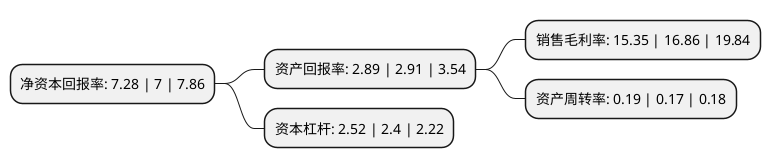

> 本页面由自动化程序生成于 2022年5月20日 01:35
> 内容可能存在错误，如有bug请提交issue至：https://github.com/Eroleice/doc-pi/issues
{.is-warning}

# 上市公司基本情况

## 基本资料

福建海峡环保集团股份有限公司（以下简称“海峡环保”）成立于2002年07月05日，福州市。于2017年02月20日在上交所主板上市。

海峡环保注册资本45,016.758万元，公司主要提供市政生活污水处理服务，在特许经营区域范围内负责市政生活污水处理设施的投资，运营，管理及维护。以下是详细信息：

- 公司名称: 福建海峡环保集团股份有限公司
- 股票代码: 603817.SH
- 所在地: 福建 - 福州市
- 成立日期: 2002年07月05日
- 注册资本: 45,016.758万元
- 法定代表人: 陈宏景
- 主营业务: 公司主要提供市政生活污水处理服务，在特许经营区域范围内负责市政生活污水处理设施的投资，运营，管理及维护
- 公司官网: www.fjhxhb.com
- 公司介绍: 公司是一家主要提供市政生活污水处理服务的企业，是福建省环保行业环境治理领域的龙头企业之一。公司主营业务为污水处理及其再生利用等服务，在特许经营区域范围内负责市政生活污水处理设施的投资、运营、管理及维护。经营范围为污水处理及其再生利用；对污水厂及污水收集、处理、排放设施的投资、建设、管理、维护；给排水工程的咨询、设计；设备销售安装；污水处理、污泥处理的研发、开发、技术转让；城市污水处理作业人员的培训考核鉴定工作；水污染治理；固体废物治理及发电(不含危险废物处理)。

## 股东及高管情况

上市公司第一大股东为福州水务集团有限公司，持股258,970,588股，占比57.53%，为上市公司实际控制人。

截至2022年03月31日，上市公司的前十大股东中，共有3名自然人股东，3名机构股东，3个产品账户，1个海外主体，其中5%以上大股东共有1名。上市公司前十大股东明细如下：

> 截至2022年03月31日，上市公司前十大股东信息如下：

| 股东名称 | 持股数量（股） | 持股比例 |
| --- | --- | --- |
| 福州水务集团有限公司 | 258,970,588 | 57.53% |
| 上海瑞力新兴产业投资基金(有限合伙) | 13,608,700 | 3.02% |
| 福州市投资管理有限公司 | 5,179,412 | 1.15% |
| 陈建明 | 1,893,100 | 0.42% |
| 深圳华博万里私募证券基金管理有限公司-万里价值1号私募证券投资基金 | 1,814,100 | 0.4% |
| 王春 | 1,477,100 | 0.33% |
| 中国民生银行股份有限公司-金元顺安元启灵活配置混合型证券投资基金 | 1,215,200 | 0.27% |
| JPMORGAN CHASE   BANK,NATIONAL ASSOCIATION | 1,176,229 | 0.26% |
| 中国国际金融香港资产管理有限公司-客户资金2 | 1,094,031 | 0.24% |
| 洪绵猛 | 1,056,000 | 0.23% |

## 利润表分析

上市公司2021年总收入为8.89亿元，净利润为1.36亿元，实现盈利。

## 杜邦分析

> 数据列示周期：2021年 | 2020年 | 2019年
{.is-info}

上市公司的净资产收益率在近一年有所上升，上升幅度为4%，其变化情况分解如下：
- 上市公司的销售毛利率在近一年下降了-8.96%，可能是生产效率的下降、商品原材料价格上涨或商品价格的下跌所致。
- 上市公司的资产周转率在近一年上升了11.76%，可能是源自于更快的销售回款或库存管理效果提升。
- 上市公司的财务杠杆比率在近一年上升了5%，可能是增加负债扩大生产规模。

