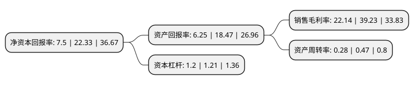

> 本页面由自动化程序生成于 2022年5月20日 01:37
> 内容可能存在错误，如有bug请提交issue至：https://github.com/Eroleice/doc-pi/issues
{.is-warning}

# 上市公司基本情况

## 基本资料

无锡德林海环保科技股份有限公司（以下简称“德林海”）成立于2009年12月10日，无锡市。于2020年07月22日在上交所科创板上市。

德林海注册资本5,947万元，主要从事以湖库蓝藻水华灾害应急处置以及蓝藻水华的预防和控制为重点的蓝藻治理业务，具体包括根据湖库蓝藻治理的政府二元公共需求，开发，销售一体化，成套化蓝藻治理先进整装技术装备以及提供藻水分离站等蓝藻治理技术装备的专业化运行维护服务。以下是详细信息：

- 公司名称: 无锡德林海环保科技股份有限公司
- 股票代码: 688069.SH
- 所在地: 江苏 - 无锡市
- 成立日期: 2009年12月10日
- 注册资本: 5,947万元
- 法定代表人: 胡明明
- 主营业务: 主要从事以湖库蓝藻水华灾害应急处置以及蓝藻水华的预防和控制为重点的蓝藻治理业务，具体包括根据湖库蓝藻治理的政府二元公共需求，开发，销售一体化，成套化蓝藻治理先进整装技术装备以及提供藻水分离站等蓝藻治理技术装备的专业化运行维护服务
- 公司官网: www.wxdlh.com
- 公司介绍: 公司是集关键技术开发、解决方案、系统设计、整装集成、运行维护、监测预警于一体的蓝藻治理综合服务商,主要从事以湖库蓝藻水华灾害应急处置以及蓝藻水华的预防和控制为重点的蓝藻治理业务,先后在一体化二级强化气浮、高效可调式涡井取藻、蓝藻囊团破壁、加压控藻等多项核心、关键技术上取得重大突破，开发出以岸上站点藻水分离系统集成、车载式藻水分离装置、加压控藻船以及深井加压控藻平台等为重点的蓝藻水华防控及灾害应急处置成套化、一体化新型技术装备，在国内蓝藻治理行业占据领军、主导地位，系国内外目前唯一一家在“三大湖”(太湖、巢湖、滇池)以及多个具有重要影响、大型湖库上成功进行大规模、工厂化、无害化灾害应急处置与防控的专业化蓝藻治理企业，亦系唯一一家被江苏省环境保护产业协会评定为环境污染治理工程设计能力甲级(评价类别：生态修复)和环境污染治理能力甲级(评价类别：水污染治理、生态修复)，以及首家制定并执行藻水分离站企业标准(标准号Q/320211JFV01-2018)的专业化蓝藻治理企业,技术成果鉴定为国际领先。

## 股东及高管情况

上市公司第一大股东为胡明明，持股23,000,000股，占比38.67%，为上市公司实际控制人。

截至2022年04月15日，上市公司的前十大股东中，共有8名自然人股东，1名机构股东，1个产品账户，其中5%以上大股东共有3名。上市公司前十大股东明细如下：

> 截至2022年04月15日，上市公司前十大股东信息如下：

| 股东名称 | 持股数量（股） | 持股比例 |
| --- | --- | --- |
| 胡明明 | 23,000,000 | 38.67% |
| 陈虹 | 6,000,000 | 10.09% |
| 顾伟 | 4,400,000 | 7.4% |
| 周新颖 | 2,400,000 | 4.04% |
| 孙阳 | 1,031,851 | 1.74% |
| 中科光荣创业投资基金管理(北京)有限公司-北京中科光荣创业投资中心(有限合伙) | 800,000 | 1.35% |
| 胡云海 | 800,000 | 1.35% |
| 谢建华 | 604,471 | 1.02% |
| 无锡金源融信产业投资企业(有限合伙) | 600,000 | 1.01% |
| 田三红 | 550,000 | 0.92% |

## 杜邦分析

> 数据列示周期：2021年 | 2020年 | 2019年
{.is-info}

上市公司的净资产收益率在近一年有所下降，下降幅度为-66.41%，其变化情况分解如下：
- 上市公司的销售毛利率在近一年下降了-43.56%，可能是生产效率的下降、商品原材料价格上涨或商品价格的下跌所致。
- 上市公司的资产周转率在近一年下降了-40.43%，可能是源自于更慢的销售回款或库存管理效果下降。
- 上市公司的财务杠杆比率在近一年下降了-0.83%，可能是减少负债降低财务费用。

