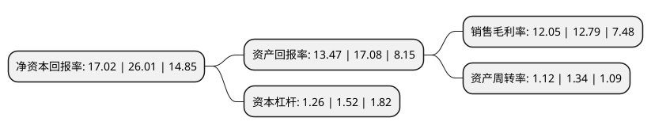

> 本页面由自动化程序生成于 2022年5月20日 01:37
> 内容可能存在错误，如有bug请提交issue至：https://github.com/Eroleice/doc-pi/issues
{.is-warning}

# 上市公司基本情况

## 基本资料

山东英科环保再生资源股份有限公司（以下简称“英科再生”）成立于2005年03月14日，淄博市。于2021年07月09日在上交所科创板上市。

英科再生注册资本13,303.249万元，致力于可再生塑料的回收，再生，利用，形成三大类主营业务，覆盖PS塑料循环利用的完整纵向产业链，并在再生PS塑料为主的基础上，横向拓展再生PET，PE，PP等多种塑料循环利用业务。以下是详细信息：

- 公司名称: 山东英科环保再生资源股份有限公司
- 股票代码: 688087.SH
- 所在地: 山东 - 淄博市
- 成立日期: 2005年03月14日
- 注册资本: 13,303.249万元
- 法定代表人: 刘方毅
- 主营业务: 致力于可再生塑料的回收，再生，利用，形成三大类主营业务，覆盖PS塑料循环利用的完整纵向产业链，并在再生PS塑料为主的基础上，横向拓展再生PET，PE，PP等多种塑料循环利用业务
- 公司官网: www.intco.com.cn
- 公司介绍: 公司与境内外的塑料回收点深入合作，建立全球可再生塑料回收网络，借助自研回收设备降低回收转运成本，持续大量回收可再生塑料，并运用先进的塑料再生技术和再生塑料制品开发技术，实现塑料的再生利用，形成循环经济模式。股份公司及子公司上海英科、六安英科、镇江英科均为高新技术企业，并建有多个省市级研发平台。经过多年的经营，公司凭借稳定的原材料供应渠道，国际先进的核心技术，较强的科技创新能力，新颖时尚的产品设计理念，精益求精的品质要求，独创的PS循环利用模式，积累了优质客户资源，成为全球领先的PS塑料循环利用企业。未来公司还将布局PE、PP等多种塑料的回收再生业务，不断扩大塑料的回收再生品类。

## 股东及高管情况

上市公司第一大股东为淄博雅智投资有限公司，持股43,685,571股，占比32.84%，为上市公司实际控制人。

截至2022年03月31日，上市公司的前十大股东中，共有8名机构股东，2个产品账户，其中5%以上大股东共有3名。上市公司前十大股东明细如下：

> 截至2022年03月31日，上市公司前十大股东信息如下：

| 股东名称 | 持股数量（股） | 持股比例 |
| --- | --- | --- |
| 淄博雅智投资有限公司 | 43,685,571 | 32.84% |
| 英科投資(香港)有限公司 | 12,355,235 | 9.29% |
| 深圳市创新投资集团有限公司 | 6,720,003 | 5.05% |
| 达隆发展有限公司 | 5,983,359 | 4.5% |
| 盈懋有限公司 | 3,840,007 | 2.89% |
| 上海云畔投资管理有限公司-上海君义股权投资中心(有限合伙) | 3,360,002 | 2.53% |
| 国泰君安证券资管-招商银行-国泰君安科创板英科股份1号战略配售集合资产管理计划 | 3,304,313 | 2.48% |
| 淄博英翔投资管理有限公司 | 2,881,921 | 2.17% |
| 上海英新企业管理服务中心(有限合伙) | 2,573,920 | 1.93% |
| 中金资本运营有限公司-中金传化(宁波)产业股权投资基金合伙企业(有限合伙) | 2,494,359 | 1.87% |

## 利润表分析

上市公司2021年总收入为19.9亿元，净利润为2.39亿元，实现盈利。

## 杜邦分析

> 数据列示周期：2021年 | 2020年 | 2019年
{.is-info}

上市公司的净资产收益率在近一年有所下降，下降幅度为-34.56%，其变化情况分解如下：
- 上市公司的销售毛利率在近一年下降了-5.79%，可能是生产效率的下降、商品原材料价格上涨或商品价格的下跌所致。
- 上市公司的资产周转率在近一年下降了-16.42%，可能是源自于更慢的销售回款或库存管理效果下降。
- 上市公司的财务杠杆比率在近一年下降了-17.11%，可能是减少负债降低财务费用。

