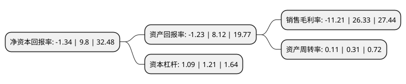

> 本页面由自动化程序生成于 2022年5月20日 01:39
> 内容可能存在错误，如有bug请提交issue至：https://github.com/Eroleice/doc-pi/issues
{.is-warning}

# 上市公司基本情况

## 基本资料

济南恒誉环保科技股份有限公司（以下简称“*ST恒誉”）成立于2006年04月11日，济南市。于2020年07月14日在上交所科创板上市。

*ST恒誉注册资本8,001.073万元，主营业务为有机废弃物裂解技术研发及相关装备设计，生产与销售，要产品为以工业连续化废轮胎裂解生产线，工业连续化废塑料裂解生产线，工业连续化污油泥裂解生产线及工业连续化/间歇式危废裂解生产线等为代表的有机废弃物裂解装备。以下是详细信息：

- 公司名称: 济南恒誉环保科技股份有限公司
- 股票代码: 688309.SH
- 所在地: 山东 - 济南市
- 成立日期: 2006年04月11日
- 注册资本: 8,001.073万元
- 法定代表人: 牛斌
- 主营业务: 主营业务为有机废弃物裂解技术研发及相关装备设计，生产与销售，要产品为以工业连续化废轮胎裂解生产线，工业连续化废塑料裂解生产线，工业连续化污油泥裂解生产线及工业连续化/间歇式危废裂解生产线等为代表的有机废弃物裂解装备
- 公司官网: www.niutech.com
- 公司介绍: 公司始建于八十年代，总部位于山东省济南市，是中国首家专业从事废轮胎、废塑料裂解油化、油品蒸馏及炭黑深加工技术研发及设备制造的国家级高新技术企业。公司经过二十多年的不断研发创新和发展，现已成为全国乃至全球范围内废轮胎、废塑料循环利用的行业领军企业。公司自主研发的具有独立知识产权的工业连续化废轮胎、废塑料裂解生产线采用低温常压催化裂解工艺，在安全、环保、低耗、高效的前提下实现了工业连续化运行，把称之为“黑色污染”、“白色污染”的废轮胎、废塑料、城市生活垃圾、医疗垃圾等，转化为可持续利用的高附加值的能源产品。世纪华泰研发设计并提供的大型连续化裂解工厂已成功安装并在德国、爱沙尼亚、泰国、中国台湾、马来西亚等国家和地区投入到商业化运营，为客户赢得了经济效益的同时也取得了巨大的环境效益和社会效益。公司旗下拥有国内最大的专业研究与制定解决方案的设计团队，以及安装调试团队，可为项目运行方提供完整的解决方案。截止目前，发行人在裂解领域已拥有国内专利技术61项，其中发明专利23项，并就6项技术在美国、加拿大、日本等国家和地区取得了12项国际专利。

## 股东及高管情况

上市公司第一大股东为宁波梅山保税港区筠龙投资管理合伙企业(有限合伙)，持股27,514,586股，占比34.39%，为上市公司实际控制人。

截至2022年04月26日，上市公司的前十大股东中，共有2名自然人股东，7名机构股东，1个产品账户，其中5%以上大股东共有3名。上市公司前十大股东明细如下：

> 截至2022年04月26日，上市公司前十大股东信息如下：

| 股东名称 | 持股数量（股） | 持股比例 |
| --- | --- | --- |
| 宁波梅山保税港区筠龙投资管理合伙企业(有限合伙) | 27,514,586 | 34.39% |
| 宁波梅山保税港区银晟投资管理合伙企业(有限合伙) | 5,026,601 | 6.28% |
| 宁波梅山保税港区荣隆投资管理合伙企业(有限合伙) | 4,981,944 | 6.23% |
| 牛晓璐 | 2,509,905 | 3.14% |
| 合肥丰德瑞高新技术产业投资合伙企业(有限合伙) | 2,197,188 | 2.75% |
| 内蒙古源创绿能节能环保产业创业投资合伙企业(有限合伙) | 1,692,821 | 2.12% |
| 云南融源节能环保产业创业投资基金合伙企业(有限合伙) | 1,190,376 | 1.49% |
| 烟台源创现代服务业创业投资合伙企业(有限合伙) | 1,157,000 | 1.45% |
| 桑绿蓓 | 1,030,376 | 1.29% |
| 烟台源创科技投资中心(有限合伙) | 1,020,556 | 1.28% |

## 杜邦分析

> 数据列示周期：2021年 | 2020年 | 2019年
{.is-info}

上市公司的净资产收益率在近一年有所下降，下降幅度为-113.67%，其变化情况分解如下：
- 上市公司的销售毛利率在近一年下降了-142.58%，可能是生产效率的下降、商品原材料价格上涨或商品价格的下跌所致。
- 上市公司的资产周转率在近一年下降了-64.52%，可能是源自于更慢的销售回款或库存管理效果下降。
- 上市公司的财务杠杆比率在近一年下降了-9.92%，可能是减少负债降低财务费用。

