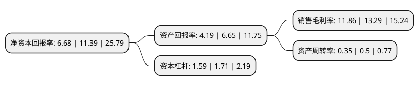

> 本页面由自动化程序生成于 2022年5月20日 01:39
> 内容可能存在错误，如有bug请提交issue至：https://github.com/Eroleice/doc-pi/issues
{.is-warning}

# 上市公司基本情况

## 基本资料

金科环境股份有限公司（以下简称“金科环境”）成立于2004年07月08日，北京市。于2020年05月08日在上交所科创板上市。

金科环境注册资本10,276万元，依托公司自主研发的膜通用平台装备技术，膜系统应用技术，膜系统运营技术等三大核心技术，为客户提供装备及技术解决方案，运营服务以及资源化产品。以下是详细信息：

- 公司名称: 金科环境股份有限公司
- 股票代码: 688466.SH
- 所在地: 北京 - 北京市
- 成立日期: 2004年07月08日
- 注册资本: 10,276万元
- 法定代表人: 张慧春
- 主营业务: 依托公司自主研发的膜通用平台装备技术，膜系统应用技术，膜系统运营技术等三大核心技术，为客户提供装备及技术解决方案，运营服务以及资源化产品
- 公司官网: www.greentech.com.cn
- 公司介绍: 公司是专业从事水深度处理及污废水资源化的国家高新技术企业，主营业务是依托公司自主研发的膜通用平台装备技术、膜系统应用技术、膜系统运营技术等三大核心技术，为客户提供装备及技术解决方案、运营服务以及资源化产品。公司业务的市场领域主要包括市政饮用水深度处理、市政污水和工业废水的深度处理及资源化利用等，公司的综合实力获得国际行业权威机构认可，公司在“全球水淡化和水再利用项目TOP15开发商”中，位列全球第11，是中国四家入围企业之一。公司开发并实施的唐山南堡污废水资源化项目在2019年4月英国伦敦举行的GWI第十三届全球水峰会入围“2019全球水奖Global Water Awards6-年度最佳工业水处理项目”，是全球4个工业水入围项目中，中国唯一入围工业水项目，公司自主研发的核心技术处于国内先进水平，公司自主研发的GTMOST膜通用平台技术，填补了国内空白，实现了不同厂家膜元件在GTMOST膜通用平台装备中的通用互换，有效解决了涉膜水厂用户面对的膜元件不可互换的行业问题。

## 股东及高管情况

上市公司第一大股东为张慧春，持股25,892,250股，占比25.2%，**疑似为**上市公司实际控制人。

截至2022年03月31日，上市公司的前十大股东中，共有6名自然人股东，2名机构股东，2个海外主体，其中5%以上大股东共有3名。上市公司前十大股东明细如下：

> 未能通过持股比例判定出上市公司实际控制人（持股30%以上）
> 可能存在通过间接持股、联合持股、协议控制等方式拥有实际控制权的主体，具体请参考上市公司定期公告！
{.is-warning}

> 截至2022年03月31日，上市公司前十大股东信息如下：

| 股东名称 | 持股数量（股） | 持股比例 |
| --- | --- | --- |
| 张慧春 | 25,892,250 | 25.2% |
| Victorious Joy Water Services Limited | 18,375,000 | 17.88% |
| 北控中科成环保集团有限公司 | 17,625,000 | 17.15% |
| Clean Water  Holdings Limited | 4,959,750 | 4.83% |
| 刘丹枫 | 2,956,500 | 2.88% |
| 吴基端 | 2,457,000 | 2.39% |
| 招商证券投资有限公司 | 1,060,400 | 1.03% |
| 李素益 | 492,750 | 0.48% |
| 罗岚 | 492,750 | 0.48% |
| 姜仁刚 | 397,027 | 0.39% |

## 利润表分析

上市公司2021年总收入为5.59亿元，净利润为0.66亿元，实现盈利。

## 杜邦分析

> 数据列示周期：2021年 | 2020年 | 2019年
{.is-info}

上市公司的净资产收益率在近一年有所下降，下降幅度为-41.35%，其变化情况分解如下：
- 上市公司的销售毛利率在近一年下降了-10.76%，可能是生产效率的下降、商品原材料价格上涨或商品价格的下跌所致。
- 上市公司的资产周转率在近一年下降了-30%，可能是源自于更慢的销售回款或库存管理效果下降。
- 上市公司的财务杠杆比率在近一年下降了-7.02%，可能是减少负债降低财务费用。

