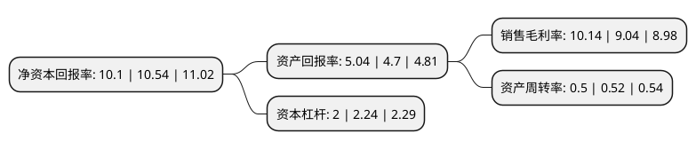

> 本页面由自动化程序生成于 2022年5月20日 01:39
> 内容可能存在错误，如有bug请提交issue至：https://github.com/Eroleice/doc-pi/issues
{.is-warning}

# 上市公司基本情况

## 基本资料

青岛达能环保设备股份有限公司（以下简称“青达环保”）成立于2006年10月09日，青岛市。于2021年07月16日在上交所科创板上市。

青达环保注册资本9,467万元，致力于节能降耗，环保减排设备的设计，制造和销售，为电力，热力，化工，冶金，垃圾处理等领域的客户提供炉渣节能环保处理系统，烟气节能环保处理系统和清洁能源消纳系统解决方案。主要产品为炉渣节能环保处理系统，烟气节能环保处理系统，清洁能源消纳系统设备及零配件。以下是详细信息：

- 公司名称: 青岛达能环保设备股份有限公司
- 股票代码: 688501.SH
- 所在地: 山东 - 青岛市
- 成立日期: 2006年10月09日
- 注册资本: 9,467万元
- 法定代表人: 王勇
- 主营业务: 致力于节能降耗，环保减排设备的设计，制造和销售，为电力，热力，化工，冶金，垃圾处理等领域的客户提供炉渣节能环保处理系统，烟气节能环保处理系统和清洁能源消纳系统解决方案主要产品为炉渣节能环保处理系统，烟气节能环保处理系统，清洁能源消纳系统设备及零配件
- 公司官网: www.daneng.cc
- 公司介绍: 公司深耕节能环保行业，通过加强技术研发，为客户提供全方位的节能、环保解决方案。目前，公司的技术、产品已覆盖包括炉渣、灰尘、烟气、细颗粒物、NOX、SOX、脱硫废水等污染物的防治及锅炉炉渣和烟气余热回收，同时涉足电厂灵活性改造以及清洁能源消纳领域。公司注重技术和产品研发，通过多年的积累，已形成具有较强竞争力的核心技术体系，并将科技成果、研发技术转化为公司具体产品，经过多年持续不断的研发，公司储备了较多的核心技术，如脱硫废水零排放技术、蓄热器技术、捞渣机模锻链技术等，部分技术已经或即将投入应用，特别是模锻链技术实现了进口替代，为客户降低了成本，取得客户的高度认可，未来市场前景良好。随着公司技术储备的逐步推广和产业化应用，公司业务领域将进一步拓宽，也将为未来业绩持续增长注入强大动力。

## 股东及高管情况

上市公司第一大股东为王勇，持股16,371,100股，占比17.29%，**疑似为**上市公司实际控制人。

截至2022年03月31日，上市公司的前十大股东中，共有7名自然人股东，2名机构股东，1个产品账户，其中5%以上大股东共有3名。上市公司前十大股东明细如下：

> 未能通过持股比例判定出上市公司实际控制人（持股30%以上）
> 可能存在通过间接持股、联合持股、协议控制等方式拥有实际控制权的主体，具体请参考上市公司定期公告！
{.is-warning}

> 截至2022年03月31日，上市公司前十大股东信息如下：

| 股东名称 | 持股数量（股） | 持股比例 |
| --- | --- | --- |
| 王勇 | 16,371,100 | 17.29% |
| 冰轮环境技术股份有限公司 | 13,916,000 | 14.7% |
| 刘衍卉 | 5,401,350 | 5.71% |
| 张文涛 | 3,473,000 | 3.67% |
| 东方富海(芜湖)股权投资基金(有限合伙) | 3,044,500 | 3.22% |
| 朱君丽 | 2,625,300 | 2.77% |
| 张军 | 2,550,150 | 2.69% |
| 盛立民 | 2,399,850 | 2.53% |
| 青岛顺合融达投资中心(有限合伙) | 2,238,750 | 2.36% |
| 姜昱 | 2,160,270 | 2.28% |

## 利润表分析

上市公司2021年总收入为6.27亿元，净利润为0.63亿元，实现盈利。

## 杜邦分析

> 数据列示周期：2021年 | 2020年 | 2019年
{.is-info}

上市公司的净资产收益率在近一年有所下降，下降幅度为-4.17%，其变化情况分解如下：
- 上市公司的销售毛利率在近一年上升了12.17%，可能是生产效率的提升、商品原材料价格下跌或商品价格的上涨所致。
- 上市公司的资产周转率在近一年下降了-3.85%，可能是源自于更慢的销售回款或库存管理效果下降。
- 上市公司的财务杠杆比率在近一年下降了-10.71%，可能是减少负债降低财务费用。

