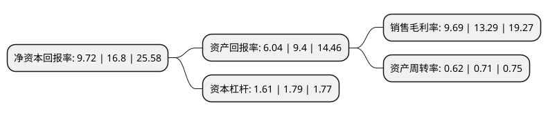

> 本页面由自动化程序生成于 2022年5月20日 01:40
> 内容可能存在错误，如有bug请提交issue至：https://github.com/Eroleice/doc-pi/issues
{.is-warning}

# 上市公司基本情况

## 基本资料

浙江卓锦环保科技股份有限公司（以下简称“卓锦股份”）成立于2003年09月02日，杭州市。于2021年09月16日在上交所科创板上市。

卓锦股份注册资本13,427.737万元，从事环保综合治理服务，环保产品销售与服务，主营业务覆盖“环保综合治理服务”，“环保产品销售与服务”两类，其中环保综合治理服务主要包括土壤及地下水修复，水污染治理，水体修复，废气处理，固废处理与处置等五大业务条线，环保产品销售与服务主要向下游客户提供产品销售及维护服务。以下是详细信息：

- 公司名称: 浙江卓锦环保科技股份有限公司
- 股票代码: 688701.SH
- 所在地: 浙江 - 杭州市
- 成立日期: 2003年09月02日
- 注册资本: 13,427.737万元
- 法定代表人: 卓未龙
- 主营业务: 从事环保综合治理服务，环保产品销售与服务，主营业务覆盖“环保综合治理服务”，“环保产品销售与服务”两类，其中环保综合治理服务主要包括土壤及地下水修复，水污染治理，水体修复，废气处理，固废处理与处置等五大业务条线，环保产品销售与服务主要向下游客户提供产品销售及维护服务
- 公司官网: www.zone-king.com
- 公司介绍: 公司凭借自身核心技术，通过设计定制化的解决方案并采用工程实施的手段对受污染的介质(土壤、地下水及地表水体)及环境污染源(废水、废气、固废)进行修复、处理与处置，以实现环境污染的有效治理和生态环境的改善与重建。公司拥有较为全面的业务资质和服务水平，品牌优势良好。公司注重品牌建设，一直秉承诚信经营理念，先后获得中国环境科学学会理事单位、浙江省环境科学学会副理事长单位、浙江省环保产业协会副会长单位、浙江省生态与环境修复技术协会副会长单位、浙江省环境监测协会副会长单位等荣誉称号；具有环保工程专业承包壹级、电子与智能化工程专业承包贰级、市政公用工程总承包三级、机电工程总承包三级、浙江省环境污染治理工程总承包服务能力评价证书、浙江省环境污染防治工程专项设计服务能力评价证书等业务资质，通过提供一系列优质的项目解决方案、良好的项目施工质量和售后服务，逐渐于业内树立了良好的口碑并形成了品牌效应。

## 股东及高管情况

上市公司第一大股东为卓未龙，持股46,719,617股，占比34.79%，为上市公司实际控制人。

截至2022年03月31日，上市公司的前十大股东中，共有3名自然人股东，5名机构股东，2个产品账户，其中5%以上大股东共有5名。上市公司前十大股东明细如下：

> 截至2022年03月31日，上市公司前十大股东信息如下：

| 股东名称 | 持股数量（股） | 持股比例 |
| --- | --- | --- |
| 卓未龙 | 46,719,617 | 34.79% |
| 杭州高廷投资管理合伙企业(有限合伙) | 20,250,000 | 15.08% |
| 中安润信(北京)创业投资有限公司-天津中安和汇股权投资基金合伙企业(有限合伙) | 10,948,905 | 8.15% |
| 保利(横琴)资本管理有限公司-珠海安丰投资合伙企业(有限合伙) | 8,759,124 | 6.52% |
| 杭州铂澳投资管理有限公司 | 6,750,000 | 5.03% |
| 宁波匡吉新蓝投资合伙企业(有限合伙) | 2,322,000 | 1.73% |
| 富诚海富资管-海通证券-富诚海富通卓锦1号员工参与科创板战略配售集合资产管理计划 | 2,299,632 | 1.71% |
| 杭州商盈投资管理有限公司-杭州创享创业投资合伙企业(有限合伙) | 1,750,547 | 1.3% |
| 吴铭华 | 1,674,000 | 1.25% |
| 周信钢 | 1,510,048 | 1.12% |

## 利润表分析

上市公司2021年总收入为4.13亿元，净利润为0.4亿元，实现盈利。

## 杜邦分析

> 数据列示周期：2021年 | 2020年 | 2019年
{.is-info}

上市公司的净资产收益率在近一年有所下降，下降幅度为-42.14%，其变化情况分解如下：
- 上市公司的销售毛利率在近一年下降了-27.09%，可能是生产效率的下降、商品原材料价格上涨或商品价格的下跌所致。
- 上市公司的资产周转率在近一年下降了-12.68%，可能是源自于更慢的销售回款或库存管理效果下降。
- 上市公司的财务杠杆比率在近一年下降了-10.06%，可能是减少负债降低财务费用。

