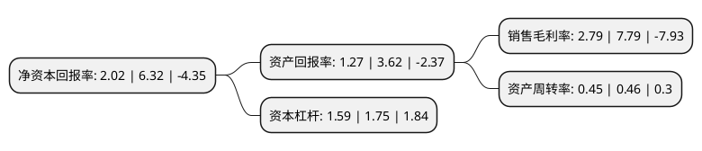

> 本页面由自动化程序生成于 2022年5月20日 01:10
> 内容可能存在错误，如有bug请提交issue至：https://github.com/Eroleice/doc-pi/issues
{.is-warning}

# 上市公司基本情况

## 基本资料

常州亚玛顿股份有限公司（以下简称“亚玛顿”）成立于2006年09月11日，常州市。于2011年10月13日在深交所中小板上市。

亚玛顿注册资本19,906.25万元，本公司主营业务为光伏玻璃镀膜材料技术和工艺技术的研发，光伏玻璃的镀膜生产以及光伏镀膜玻璃销售，主要产品为光伏减反玻璃。以下是详细信息：

- 公司名称: 常州亚玛顿股份有限公司
- 股票代码: 002623.SZ
- 所在地: 江苏 - 常州市
- 成立日期: 2006年09月11日
- 注册资本: 19,906.25万元
- 法定代表人: 林金锡
- 主营业务: 本公司主营业务为光伏玻璃镀膜材料技术和工艺技术的研发，光伏玻璃的镀膜生产以及光伏镀膜玻璃销售，主要产品为光伏减反玻璃
- 公司官网: www.czamd.com
- 公司介绍: 公司是国内研发和生产应用纳米材料在大面积光伏玻璃上镀制减反射膜的企业，产品技术处于行业先进地位。公司自成立以来一直专注于对新材料和新技术的研发和创新，从最初国内首家研发和生产应用纳米材料在大面积光伏玻璃上镀制减反射膜到国内率先一家利用物理钢化技术规模化生产≤2.0mm超薄物理钢化玻璃、超薄双玻组件、投资建设光伏电站项目、以及依托现有技术优势在节能建材、电子消费类产品等领域的开发和拓展，实现了公司多元化的业务发展模式。公司组建江苏省科技创新团队，设立江苏省光电玻璃重点实验室、江苏省高透光率光伏玻璃工程技术研究中心、江苏省太阳能组件用功能性材料工程中心、江苏省企业技术中心、江苏省博士后创新基地等省级重点研发机构。

## 股东及高管情况

上市公司第一大股东为常州亚玛顿科技集团有限公司，持股67,380,200股，占比33.85%，为上市公司实际控制人。

截至2022年05月12日，上市公司的前十大股东中，共有3名自然人股东，2名机构股东，5个产品账户，其中5%以上大股东共有3名。上市公司前十大股东明细如下：

> 截至2022年05月12日，上市公司前十大股东信息如下：

| 股东名称 | 持股数量（股） | 持股比例 |
| --- | --- | --- |
| 常州亚玛顿科技集团有限公司 | 67,380,200 | 33.85% |
| 深创投红土股权投资管理(深圳)有限公司-深创投制造业转型升级新材料基金(有限合伙) | 19,531,250 | 9.81% |
| 林金坤 | 10,449,000 | 5.25% |
| 常州天鼎实业投资合伙企业(有限合伙) | 3,937,500 | 1.98% |
| 广发银行股份有限公司-国泰聚信价值优势灵活配置混合型证券投资基金 | 3,477,100 | 1.75% |
| 全国社保基金一一八组合 | 2,033,100 | 1.02% |
| 中国光大银行股份有限公司-华夏磐益一年定期开放混合型证券投资基金 | 1,685,820 | 0.85% |
| 招商银行股份有限公司-富国清洁能源产业灵活配置混合型证券投资基金 | 1,599,935 | 0.8% |
| 钟书原 | 1,515,900 | 0.76% |
| 钟宝申 | 1,438,700 | 0.72% |

## 利润表分析

上市公司2021年总收入为20.31亿元，净利润为0.56亿元，实现盈利。

## 杜邦分析

> 数据列示周期：2021年 | 2020年 | 2019年
{.is-info}

上市公司的净资产收益率在近一年有所下降，下降幅度为-68.04%，其变化情况分解如下：
- 上市公司的销售毛利率在近一年下降了-64.18%，可能是生产效率的下降、商品原材料价格上涨或商品价格的下跌所致。
- 上市公司的资产周转率在近一年下降了-2.17%，可能是源自于更慢的销售回款或库存管理效果下降。
- 上市公司的财务杠杆比率在近一年下降了-9.14%，可能是减少负债降低财务费用。

