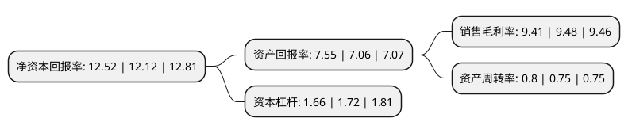

> 本页面由自动化程序生成于 2022年5月20日 01:15
> 内容可能存在错误，如有bug请提交issue至：https://github.com/Eroleice/doc-pi/issues
{.is-warning}

# 上市公司基本情况

## 基本资料

江苏秀强玻璃工艺股份有限公司（以下简称“秀强股份”）成立于2001年09月28日，宿迁市。于2011年01月13日在深交所创业板上市。

秀强股份注册资本61,817.242万元，主要从事玻璃深加工产品的研发，生产与销售，主要产品包括家电玻璃，太阳能玻璃，建筑玻璃等。以下是详细信息：

- 公司名称: 江苏秀强玻璃工艺股份有限公司
- 股票代码: 300160.SZ
- 所在地: 江苏 - 宿迁市
- 成立日期: 2001年09月28日
- 注册资本: 61,817.242万元
- 法定代表人: 冯鑫
- 主营业务: 主要从事玻璃深加工产品的研发，生产与销售，主要产品包括家电玻璃，太阳能玻璃，建筑玻璃等
- 公司官网: www.jsxq.com
- 公司介绍: 公司主要业务包括幼儿教育实体的运营及管理服务业务和玻璃深加工业务两项主营业务。幼儿教育实体的运营及管理服务输出业务主要从事包括经营直营幼儿园实体、幼儿园运营管理服务输出、开发推广幼儿园线上平台“秀强家园”APP等业务。玻璃深加工业务主要从事以印刷、镀膜技术为基础的玻璃深加工产品的研发、生产和销售业务，主要产品为家电玻璃产品、光伏玻璃产品。公司通过了ISO9001、ISO14001、IECQQC080000等体系认证和CCC等产品认证，被认定为“国家级高新技术企业”、“江苏省百强民营科技企业”。

## 股东及高管情况

上市公司第一大股东为珠海港股份有限公司，持股154,681,270股，占比25.02%，**疑似为**上市公司实际控制人。

截至2022年03月31日，上市公司的前十大股东中，共有5名自然人股东，4名机构股东，1个产品账户，其中5%以上大股东共有3名。上市公司前十大股东明细如下：

> 未能通过持股比例判定出上市公司实际控制人（持股30%以上）
> 可能存在通过间接持股、联合持股、协议控制等方式拥有实际控制权的主体，具体请参考上市公司定期公告！
{.is-warning}

> 截至2022年03月31日，上市公司前十大股东信息如下：

| 股东名称 | 持股数量（股） | 持股比例 |
| --- | --- | --- |
| 珠海港股份有限公司 | 154,681,270 | 25.02% |
| 香港恒泰科技有限公司 | 64,920,320 | 10.5% |
| 宿迁市新星投资有限公司 | 51,746,244 | 8.37% |
| 卢秀强 | 11,872,000 | 1.92% |
| 全国社保基金一一二组合 | 3,169,132 | 0.51% |
| 中国国际金融香港资产管理有限公司-客户资金2 | 2,853,607 | 0.46% |
| 赵庆忠 | 1,821,300 | 0.29% |
| 张捷 | 1,730,303 | 0.28% |
| 陈世辉 | 1,615,000 | 0.26% |
| 刘素艳 | 1,557,900 | 0.25% |

## 利润表分析

上市公司2021年总收入为14.57亿元，净利润为1.37亿元，实现盈利。

## 杜邦分析

> 数据列示周期：2021年 | 2020年 | 2019年
{.is-info}

上市公司的净资产收益率在近一年有所上升，上升幅度为3.3%，其变化情况分解如下：
- 上市公司的销售毛利率在近一年下降了-0.74%，可能是生产效率的下降、商品原材料价格上涨或商品价格的下跌所致。
- 上市公司的资产周转率在近一年上升了6.67%，可能是源自于更快的销售回款或库存管理效果提升。
- 上市公司的财务杠杆比率在近一年下降了-3.49%，可能是减少负债降低财务费用。

