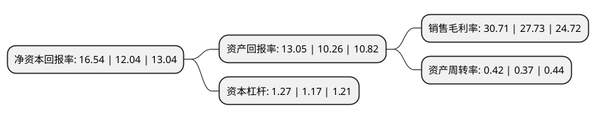

> 本页面由自动化程序生成于 2022年5月20日 01:17
> 内容可能存在错误，如有bug请提交issue至：https://github.com/Eroleice/doc-pi/issues
{.is-warning}

# 上市公司基本情况

## 基本资料

湖北菲利华石英玻璃股份有限公司（以下简称“菲利华”）成立于1999年01月22日，荆州市。于2014年09月10日在深交所创业板上市。

菲利华注册资本33,794.884万元，本公司主要从事光通讯，半导体，太阳能，航空航天及其他领域用高性能石英玻璃材料及制品，石英纤维及制品的生产与销售业务。公司主要产品包括光通讯生产中使用的石英玻璃材料及制品，半导体生产中使用的石英玻璃材料及制品，太阳能生产中使用的石英玻璃材料及制品，航空航天及其他领域生产中使用的石英纤维及制品。以下是详细信息：

- 公司名称: 湖北菲利华石英玻璃股份有限公司
- 股票代码: 300395.SZ
- 所在地: 湖北 - 荆州市
- 成立日期: 1999年01月22日
- 注册资本: 33,794.884万元
- 法定代表人: 吴学民
- 主营业务: 本公司主要从事光通讯，半导体，太阳能，航空航天及其他领域用高性能石英玻璃材料及制品，石英纤维及制品的生产与销售业务公司主要产品包括光通讯生产中使用的石英玻璃材料及制品，半导体生产中使用的石英玻璃材料及制品，太阳能生产中使用的石英玻璃材料及制品，航空航天及其他领域生产中使用的石英纤维及制品
- 公司官网: www.feilihua.com
- 公司介绍: 公司已发展成为国内外具有较大影响力和规模优势的石英材料及石英纤维制造企业，全球少数几家具有石英纤维批量生产能力的制造商，中国航空航天等国防军工领域唯一的石英纤维供应商。公司已取得ISO9001、ISO14001、OHSAS18001管理体系认证，是中国建筑玻璃与工业玻璃协会副会长单位、国家高新技术企业、湖北省高性能石英玻璃及石英纤维工程技术研究中心、湖北省企业技术中心、湖北省博士后产业基地、国家级创新型试点企业。公司致力于航空航天、半导体、太阳能、光纤通讯、光学等高新技术领域的配套服务，其产品技术的实现，始终以上述领域的发展为目标，不断追求技术和品质提升，以全面满足客户需求。

## 股东及高管情况

上市公司第一大股东为邓家贵，持股26,252,916股，占比7.77%，**疑似为**上市公司实际控制人。

截至2022年03月31日，上市公司的前十大股东中，共有2名自然人股东，1名机构股东，7个产品账户，其中5%以上大股东共有3名。上市公司前十大股东明细如下：

> 未能通过持股比例判定出上市公司实际控制人（持股30%以上）
> 可能存在通过间接持股、联合持股、协议控制等方式拥有实际控制权的主体，具体请参考上市公司定期公告！
{.is-warning}

> 上市公司第一大股东持股不超过10%，请检查是否存在公司控制权风险！
{.is-danger}

> 截至2022年03月31日，上市公司前十大股东信息如下：

| 股东名称 | 持股数量（股） | 持股比例 |
| --- | --- | --- |
| 邓家贵 | 26,252,916 | 7.77% |
| 吴学民 | 21,581,393 | 6.39% |
| 北京汇宝金源投资管理中心(有限合伙) | 20,700,000 | 6.13% |
| 全国社保基金四零六组合 | 15,175,051 | 4.49% |
| 中国农业银行股份有限公司-南方军工改革灵活配置混合型证券投资基金 | 9,298,387 | 2.75% |
| 广发基金管理有限公司-社保基金四二零组合 | 9,006,383 | 2.67% |
| 全国社保基金一一三组合 | 7,992,752 | 2.37% |
| 中华联合财产保险股份有限公司-传统保险产品 | 7,582,818 | 2.24% |
| 中国工商银行股份有限公司-华夏军工安全灵活配置混合型证券投资基金 | 6,992,369 | 2.07% |
| 基本养老保险基金八零二组合 | 6,438,665 | 1.91% |

## 利润表分析

上市公司2021年总收入为12.23亿元，净利润为3.75亿元，实现盈利。

## 杜邦分析

> 数据列示周期：2021年 | 2020年 | 2019年
{.is-info}

上市公司的净资产收益率在近一年有所上升，上升幅度为37.38%，其变化情况分解如下：
- 上市公司的销售毛利率在近一年上升了10.75%，可能是生产效率的提升、商品原材料价格下跌或商品价格的上涨所致。
- 上市公司的资产周转率在近一年上升了13.51%，可能是源自于更快的销售回款或库存管理效果提升。
- 上市公司的财务杠杆比率在近一年上升了8.55%，可能是增加负债扩大生产规模。

