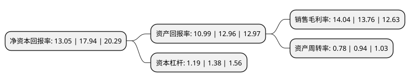

> 本页面由自动化程序生成于 2022年5月20日 01:23
> 内容可能存在错误，如有bug请提交issue至：https://github.com/Eroleice/doc-pi/issues
{.is-warning}

# 上市公司基本情况

## 基本资料

山东力诺特种玻璃股份有限公司（以下简称“力诺特玻”）成立于2002年03月01日，济南市。于2021年11月11日在深交所创业板上市。

力诺特玻注册资本23,241万元，主营业务为特种玻璃的研发，生产及销售。以下是详细信息：

- 公司名称: 山东力诺特种玻璃股份有限公司
- 股票代码: 301188.SZ
- 所在地: 山东 - 济南市
- 成立日期: 2002年03月01日
- 注册资本: 23,241万元
- 法定代表人: 孙庆法
- 主营业务: 主营业务为特种玻璃的研发，生产及销售
- 公司官网: www.linuo-glass.com
- 公司介绍: 公司的主营业务为特种玻璃的研发、生产及销售，致力于硼硅玻璃的开发和应用，主要产品有药用玻璃、耐热玻璃和电光源玻璃等系列。公司是中国医药包装协会副会长单位、中国医药包装协会标准化委员会副主任单位、中国医药包装协会玻璃专业委员会副主任单位、中国日用玻璃协会副理事长单位、全国玻璃仪器标准化技术委员会副主任委员单位，国内唯一的中国医药包装协会药用玻璃培训基地的所在地，参与起草了药用玻璃管、微波炉用玻璃托盘、红外线灯泡等多项国家标准和行业标准，拥有数十项专利技术，并获国家火炬计划重点高新技术企业认定，是国内具有较高知名度的特种玻璃制品生产厂商之一。公司专注于硼硅玻璃产品的开发和应用，聚焦药用玻璃和耐热玻璃，致力于成为细分市场的领先者，已连续多年被中国轻工业联合会评为日用玻璃行业十强企业。

## 股东及高管情况

上市公司第一大股东为力诺投资控股集团有限公司，持股72,335,407股，占比31.12%，为上市公司实际控制人。

截至2022年03月31日，上市公司的前十大股东中，共有5名机构股东，5个产品账户，其中5%以上大股东共有4名。上市公司前十大股东明细如下：

> 截至2022年03月31日，上市公司前十大股东信息如下：

| 股东名称 | 持股数量（股） | 持股比例 |
| --- | --- | --- |
| 力诺投资控股集团有限公司 | 72,335,407 | 31.12% |
| 济南财金复星惟实股权投资基金合伙企业(有限合伙) | 16,703,297 | 7.19% |
| 上海复星创富投资管理股份有限公司-宁波梅山保税港区复星惟盈股权投资基金合伙企业(有限合伙) | 16,703,297 | 7.19% |
| 济南鸿道新能源合伙企业(有限合伙) | 15,177,000 | 6.53% |
| 北京洪泰同创投资管理有限公司-深圳洪泰发现股权投资基金合伙企业(有限合伙) | 8,708,792 | 3.75% |
| 东兴证券投资有限公司 | 8,241,758 | 3.55% |
| 中国医药投资有限公司 | 5,384,615 | 2.32% |
| 济南财金投资有限公司 | 5,380,000 | 2.31% |
| 济南经发产业投资基金合伙企业(有限合伙) | 4,395,825 | 1.89% |
| 山东省鲁信资本市场发展股权投资基金合伙企业(有限合伙) | 4,280,000 | 1.84% |

## 利润表分析

上市公司2021年总收入为8.88亿元，净利润为1.24亿元，实现盈利。

## 杜邦分析

> 数据列示周期：2021年 | 2020年 | 2019年
{.is-info}

上市公司的净资产收益率在近一年有所下降，下降幅度为-27.26%，其变化情况分解如下：
- 上市公司的销售毛利率在近一年上升了2.03%，可能是生产效率的提升、商品原材料价格下跌或商品价格的上涨所致。
- 上市公司的资产周转率在近一年下降了-17.02%，可能是源自于更慢的销售回款或库存管理效果下降。
- 上市公司的财务杠杆比率在近一年下降了-13.77%，可能是减少负债降低财务费用。

