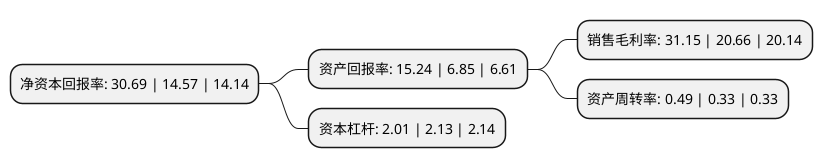

> 本页面由自动化程序生成于 2022年5月20日 01:24
> 内容可能存在错误，如有bug请提交issue至：https://github.com/Eroleice/doc-pi/issues
{.is-warning}

# 上市公司基本情况

## 基本资料

中国巨石股份有限公司（以下简称“中国巨石”）成立于1999年04月16日，嘉兴市。于1999年04月22日在上交所主板上市。

中国巨石注册资本400,313.673万元，主要业务:玻璃纤维的研发，生产与销售，商业房地产的开发与经营，家居产品的连锁经营与物流配送。以下是详细信息：

- 公司名称: 中国巨石股份有限公司
- 股票代码: 600176.SH
- 所在地: 浙江 - 嘉兴市
- 成立日期: 1999年04月16日
- 注册资本: 400,313.673万元
- 法定代表人: 常张利
- 主营业务: 玻璃纤维的研发，生产与销售，商业房地产的开发与经营，家居产品的连锁经营与物流配送
- 公司官网: www.jushi.com
- 公司介绍: 公司是中国建材股份有限公司玻璃纤维业务的核心企业，以玻璃纤维及制品的生产与销售为主营业务，是我国新材料行业进入资本市场早，企业规模大的上市公司之一。经过多年的努力，中国巨石已成为治理完善、战略清晰、资产优良、文化优秀、管理精细、技术先进、营销网络完整的行业龙头企业。公司拥有具有自主知识产权的大型无碱池窑、环保池窑的设计和建造技术；研发了国际首创的纯氧燃烧技术并进行了工业化应用，大大降低单位产能能耗。公司建有玻纤研发实验基地，包括国家认定企业技术中心、省级重点实验室及博士后科研工作站等研发机构，所属检测中心通过了国家实验室认可委员会认可，并获得德国船级社GL认证。

## 股东及高管情况

上市公司第一大股东为中国建材股份有限公司，持股1,079,739,151股，占比26.97%，**疑似为**上市公司实际控制人。

截至2022年03月31日，上市公司的前十大股东中，共有2名机构股东，7个产品账户，1个海外主体，其中5%以上大股东共有3名。上市公司前十大股东明细如下：

> 未能通过持股比例判定出上市公司实际控制人（持股30%以上）
> 可能存在通过间接持股、联合持股、协议控制等方式拥有实际控制权的主体，具体请参考上市公司定期公告！
{.is-warning}

> 截至2022年03月31日，上市公司前十大股东信息如下：

| 股东名称 | 持股数量（股） | 持股比例 |
| --- | --- | --- |
| 中国建材股份有限公司 | 1,079,739,151 | 26.97% |
| 振石控股集团有限公司 | 624,225,514 | 15.59% |
| 香港中央结算有限公司(陆股通) | 321,291,162 | 8.03% |
| 全国社保基金一一三组合 | 76,996,966 | 1.92% |
| 基本养老保险基金八零二组合 | 57,146,927 | 1.43% |
| 中国对外经济贸易信托有限公司-外贸信托-高毅晓峰鸿远集合资金信托计划 | 51,099,550 | 1.28% |
| 上海高毅资产管理合伙企业(有限合伙)-高毅晓峰2号致信基金 | 49,599,753 | 1.24% |
| 全国社保基金一零一组合 | 38,933,136 | 0.97% |
| 全国社保基金一一零组合 | 34,987,432 | 0.87% |
| 中泰证券资管-招商银行-中泰星河12号集合资产管理计划 | 21,716,497 | 0.54% |

## 利润表分析

上市公司2021年总收入为197.06亿元，净利润为61.38亿元，实现盈利。

## 杜邦分析

> 数据列示周期：2021年 | 2020年 | 2019年
{.is-info}

上市公司的净资产收益率在近一年有所上升，上升幅度为110.64%，其变化情况分解如下：
- 上市公司的销售毛利率在近一年上升了50.77%，可能是生产效率的提升、商品原材料价格下跌或商品价格的上涨所致。
- 上市公司的资产周转率在近一年上升了48.48%，可能是源自于更快的销售回款或库存管理效果提升。
- 上市公司的财务杠杆比率在近一年下降了-5.63%，可能是减少负债降低财务费用。

