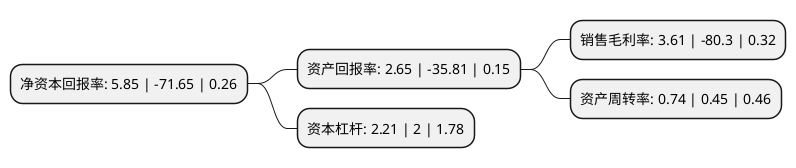

> 本页面由自动化程序生成于 2022年5月20日 01:25
> 内容可能存在错误，如有bug请提交issue至：https://github.com/Eroleice/doc-pi/issues
{.is-warning}

# 上市公司基本情况

## 基本资料

湖北三峡新型建材股份有限公司（以下简称“三峡新材”）成立于1993年03月26日，宜昌市。于2000年09月19日在上交所主板上市。

三峡新材注册资本116,213.205万元，主要产品:浮法玻璃。移动互联网终端业务以下是详细信息：

- 公司名称: 湖北三峡新型建材股份有限公司
- 股票代码: 600293.SH
- 所在地: 湖北 - 宜昌市
- 成立日期: 1993年03月26日
- 注册资本: 116,213.205万元
- 法定代表人: 许锡忠
- 主营业务: 主要产品:浮法玻璃移动互联网终端业务
- 公司官网: www.sxxc.com.cn
- 公司介绍: 公司是一家建材企业，主要从事浮法玻璃、玻璃深加工制品及新型建材产品的科研、生产与销售。公司于2016年完成非公开发行股票工作，利用募集资金217,000万元收购恒波公司100%的股权，公司主营业务在原有的平板玻璃及玻璃深加工基础上，新增移动互联网终端业务，形成双主业发展的模式。公司本部技术力量雄厚，研发能力强，并被湖北省科学技术厅认定为湖北省玻璃工业工程技术研究中心。公司始终坚持走质量效益型道路，注重提升产品品质和品牌形象，通过了ISO9001质量体系认证。公司主导产品“锦屏”牌浮法玻璃被中国名优精品选购指导委员会授予“中国平板玻璃十大著名品牌”荣誉称号，被湖北省政府确认为“湖北省名牌”；“锦屏”牌商标被国家工商总局认定为“中国驰名商标”；“金晶”牌钢化玻璃、中空玻璃获国家产品质量安全认证(3C认证)。

## 股东及高管情况

上市公司第一大股东为深圳市前海佳浩投资合伙企业(有限合伙)，持股95,438,680股，占比8.23%，**疑似为**上市公司实际控制人。

截至2022年05月10日，上市公司的前十大股东中，共有1名自然人股东，8名机构股东，1个产品账户，其中5%以上大股东共有5名。上市公司前十大股东明细如下：

> 未能通过持股比例判定出上市公司实际控制人（持股30%以上）
> 可能存在通过间接持股、联合持股、协议控制等方式拥有实际控制权的主体，具体请参考上市公司定期公告！
{.is-warning}

> 上市公司第一大股东持股不超过10%，请检查是否存在公司控制权风险！
{.is-danger}

> 截至2022年05月10日，上市公司前十大股东信息如下：

| 股东名称 | 持股数量（股） | 持股比例 |
| --- | --- | --- |
| 深圳市前海佳浩投资合伙企业(有限合伙) | 95,438,680 | 8.23% |
| 当阳市建设投资控股集团有限公司 | 65,581,208 | 5.65% |
| 当阳市建设投资控股集团有限公司 | 65,581,208 | 5.65% |
| 海南宗宣达实业投资有限公司 | 63,674,550 | 5.49% |
| 海南宗宣达实业投资有限公司 | 63,674,550 | 5.49% |
| 当阳市国中安投资有限公司 | 55,371,600 | 4.77% |
| 许锡忠 | 51,387,072 | 4.43% |
| 深圳市冠群卓越投资管理有限公司-睿悦冠群8号私募证券投资基金 | 17,449,075 | 1.5% |
| 深圳市前海富荣资产管理有限公司 | 9,000,069 | 0.78% |
| 广西欣阳玻璃科技有限公司 | 7,115,527 | 0.61% |

## 利润表分析

上市公司2021年总收入为31.08亿元，净利润为1.12亿元，实现盈利。

## 杜邦分析

> 数据列示周期：2021年 | 2020年 | 2019年
{.is-info}

上市公司的净资产收益率在近一年有所下降，下降幅度为-108.16%，其变化情况分解如下：
- 上市公司的销售毛利率在近一年下降了-104.5%，可能是生产效率的下降、商品原材料价格上涨或商品价格的下跌所致。
- 上市公司的资产周转率在近一年上升了64.44%，可能是源自于更快的销售回款或库存管理效果提升。
- 上市公司的财务杠杆比率在近一年上升了10.5%，可能是增加负债扩大生产规模。

