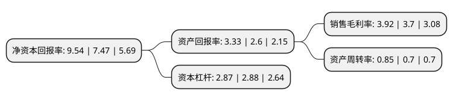

> 本页面由自动化程序生成于 2022年5月20日 01:27
> 内容可能存在错误，如有bug请提交issue至：https://github.com/Eroleice/doc-pi/issues
{.is-warning}

# 上市公司基本情况

## 基本资料

凯盛科技股份有限公司（以下简称“凯盛科技”）成立于2000年09月30日，蚌埠市。于2002年11月08日在上交所主板上市。

凯盛科技注册资本76,388.4万元，主要产品:电子信息显示业务主要包含TFT液晶显示模组，触摸屏模组，TFT玻璃减薄，ITO导电膜玻璃，柔性ITO导电膜，2D/2。5D/3D手机盖板玻璃，电容式触摸屏。上述产品均属于电子信息显示产业链，主要应用于消费类电子终端产品;新材料业务主要包含高纯电熔氧化锆，纳米钛酸钡，超细硅酸锆，球形石英粉等产品。主营业务为:电子信息显示和新材料业务。以下是详细信息：

- 公司名称: 凯盛科技股份有限公司
- 股票代码: 600552.SH
- 所在地: 安徽 - 蚌埠市
- 成立日期: 2000年09月30日
- 注册资本: 76,388.4万元
- 法定代表人: 夏宁
- 主营业务: 主要产品:电子信息显示业务主要包含TFT液晶显示模组，触摸屏模组，TFT玻璃减薄，ITO导电膜玻璃，柔性ITO导电膜，2D/25D/3D手机盖板玻璃，电容式触摸屏上述产品均属于电子信息显示产业链，主要应用于消费类电子终端产品;新材料业务主要包含高纯电熔氧化锆，纳米钛酸钡，超细硅酸锆，球形石英粉等产品主营业务为:电子信息显示和新材料业务
- 公司官网: www.triumphltd.cn
- 公司介绍: 公司有两大业务版块，即电子信息显示和新材料业务。电子信息显示业务主要包含TFT液晶显示模组、触摸屏模组、TFT玻璃减薄、ITO导电膜玻璃、柔性ITO导电膜、2D/2.5D/3D手机盖板玻璃、电容式触摸屏。上述产品均属于电子信息显示产业链，主要应用于消费类电子终端产品。新材料业务主要包含高纯电熔氧化锆、纳米钛酸钡、超细硅酸锆、球形石英粉等产品。电熔氧化锆主要用于陶瓷和耐火材料、耐磨材料领域，在陶瓷生产领域常作为釉用和坯用色料添加剂，此外还广泛应用于军工、电子、光学、航空航天、生物、化学等领域；钛酸钡主要用于制造多层陶瓷电容器(MLCC)、单板陶瓷电容器、热敏电阻、压电陶瓷、微波陶瓷等电子元器件；超细硅酸锆广泛应用于陶瓷等釉料或坯体；球形石英粉主要用于大规模集成电路封装，航空、航天和特种陶瓷等领域。

## 股东及高管情况

上市公司第一大股东为凯盛科技集团有限公司，持股189,133,987股，占比24.76%，**疑似为**上市公司实际控制人。

截至2022年05月10日，上市公司的前十大股东中，共有6名自然人股东，4名机构股东，其中5%以上大股东共有2名。上市公司前十大股东明细如下：

> 未能通过持股比例判定出上市公司实际控制人（持股30%以上）
> 可能存在通过间接持股、联合持股、协议控制等方式拥有实际控制权的主体，具体请参考上市公司定期公告！
{.is-warning}

> 截至2022年05月10日，上市公司前十大股东信息如下：

| 股东名称 | 持股数量（股） | 持股比例 |
| --- | --- | --- |
| 凯盛科技集团有限公司 | 189,133,987 | 24.76% |
| 安徽华光光电材料科技集团有限公司 | 166,755,932 | 21.83% |
| 中建材玻璃新材料研究院集团有限公司 | 33,510,646 | 4.39% |
| 凯盛科技集团有限公司 | 17,351,455 | 2.27% |
| 欧木兰 | 13,273,433 | 1.74% |
| 郑天云 | 10,493,700 | 1.37% |
| 陈雷 | 7,113,436 | 0.93% |
| 禤新洲 | 6,072,183 | 0.79% |
| 张瑾 | 5,570,000 | 0.73% |
| 王志 | 5,397,764 | 0.71% |

## 利润表分析

上市公司2021年总收入为63.24亿元，净利润为2.48亿元，实现盈利。

## 杜邦分析

> 数据列示周期：2021年 | 2020年 | 2019年
{.is-info}

上市公司的净资产收益率在近一年有所上升，上升幅度为27.71%，其变化情况分解如下：
- 上市公司的销售毛利率在近一年上升了5.95%，可能是生产效率的提升、商品原材料价格下跌或商品价格的上涨所致。
- 上市公司的资产周转率在近一年上升了21.43%，可能是源自于更快的销售回款或库存管理效果提升。
- 上市公司的财务杠杆比率在近一年下降了-0.35%，可能是减少负债降低财务费用。

