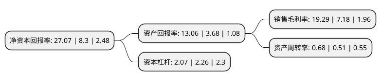

> 本页面由自动化程序生成于 2022年5月20日 01:27
> 内容可能存在错误，如有bug请提交issue至：https://github.com/Eroleice/doc-pi/issues
{.is-warning}

# 上市公司基本情况

## 基本资料

山东金晶科技股份有限公司（以下简称“金晶科技”）成立于1999年12月31日，淄博市。于2002年08月15日在上交所主板上市。

金晶科技注册资本142,877万元，玻璃和纯碱以下是详细信息：

- 公司名称: 山东金晶科技股份有限公司
- 股票代码: 600586.SH
- 所在地: 山东 - 淄博市
- 成立日期: 1999年12月31日
- 注册资本: 142,877万元
- 法定代表人: 王刚
- 主营业务: 玻璃和纯碱
- 公司官网: www.cnggg.cn
- 公司介绍: 公司是以玻璃、纯碱及其延伸产品的开发、生产、加工、经营为主业，进军太阳能新材料、节能新材料领域的大型集团公司，是国家高新技术企业，中国新材料基地骨干企业。公司主要生产超白玻璃、离线镀膜玻璃、在线镀膜玻璃、阳光膜玻璃，颜色玻璃、防火玻璃、汽车玻璃、低盐重质玻璃纯碱、轻质纯碱、小苏打及小苏打洗涤剂等产品，主要为建筑、汽车、太阳能、工业品等细分市场提供绿色、环保、节能、安全等差异化产品及服务。金晶依托浮法和LOW_E玻璃优势，大力发展下游加工业务，产品远销欧美、日韩、东南亚、澳洲、中东等上百个国家和地区。

## 股东及高管情况

上市公司第一大股东为山东金晶节能玻璃有限公司，持股457,635,278股，占比32.03%，为上市公司实际控制人。

截至2022年04月11日，上市公司的前十大股东中，共有3名自然人股东，1名机构股东，6个产品账户，其中5%以上大股东共有1名。上市公司前十大股东明细如下：

> 截至2022年04月11日，上市公司前十大股东信息如下：

| 股东名称 | 持股数量（股） | 持股比例 |
| --- | --- | --- |
| 山东金晶节能玻璃有限公司 | 457,635,278 | 32.03% |
| 余似苹 | 10,011,200 | 0.7% |
| 上海赤钥投资有限公司-赤钥3号私募证券投资基金 | 8,511,700 | 0.6% |
| 中国建设银行股份有限公司-浙商丰利增强债券型证券投资基金 | 8,000,000 | 0.56% |
| 嘉实基金-农业银行-嘉实中证金融资产管理计划 | 5,854,300 | 0.41% |
| 信泰人寿保险股份有限公司-传统产品 | 5,834,200 | 0.41% |
| 李铭 | 5,156,100 | 0.36% |
| 莫海 | 5,010,900 | 0.35% |
| 中国建设银行股份有限公司-广发中证全指建筑材料指数型发起式证券投资基金 | 3,932,400 | 0.28% |
| 全国社保基金四一二组合 | 3,917,600 | 0.27% |

## 利润表分析

上市公司2021年总收入为69.21亿元，净利润为13.34亿元，实现盈利。

## 杜邦分析

> 数据列示周期：2021年 | 2020年 | 2019年
{.is-info}

上市公司的净资产收益率在近一年有所上升，上升幅度为226.14%，其变化情况分解如下：
- 上市公司的销售毛利率在近一年上升了168.66%，可能是生产效率的提升、商品原材料价格下跌或商品价格的上涨所致。
- 上市公司的资产周转率在近一年上升了33.33%，可能是源自于更快的销售回款或库存管理效果提升。
- 上市公司的财务杠杆比率在近一年下降了-8.41%，可能是减少负债降低财务费用。

