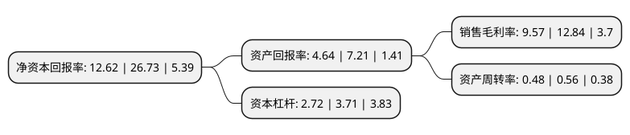

> 本页面由自动化程序生成于 2022年5月20日 01:29
> 内容可能存在错误，如有bug请提交issue至：https://github.com/Eroleice/doc-pi/issues
{.is-warning}

# 上市公司基本情况

## 基本资料

洛阳玻璃股份有限公司（以下简称“洛阳玻璃”）成立于1996年08月07日，洛阳市。于1995年10月31日在上交所主板上市。

洛阳玻璃注册资本64,567.496万元，浮法平板玻璃的制造和销售以下是详细信息：

- 公司名称: 洛阳玻璃股份有限公司
- 股票代码: 600876.SH
- 所在地: 河南 - 洛阳市
- 成立日期: 1996年08月07日
- 注册资本: 64,567.496万元
- 法定代表人: 张冲
- 主营业务: 浮法平板玻璃的制造和销售
- 公司官网: www.zhglb.com
- 公司介绍: 公司原主要从事浮法玻璃的制造和销售、技术服务。拥有国家级技术中心，生产无色、蓝色、茶色、灰色、绿色等多种色彩和规格的优质浮法玻璃和在线镀膜玻璃。拥有浮法玻璃生产核心技术及多项自主知识产权。2015年，公司通过重大资产重组，不在经营普通浮法玻璃业务，而是以超薄玻璃基板为主营业务，以传承和发扬浮法玻璃生产工艺为导向，保持和强化在科研创新和产品自主化等方面的核心竞争力，为打破下游国内厂商主要通过进口采购超薄玻璃基板的局面、提升电子元器件产业链的国产化水平、促进下游企业完善供应商体系并优化成本结构持续作出贡献。2018年公司通过重大资产重组,收购合肥新能源100%股权、桐城新能源100%股权和宜兴新能源70.99%股权,公司在超薄玻璃基板业务的基础上，发展光伏玻璃业务，有助于增大公司资产规模，提升公司抵御风险和持续盈利能力；有利于提升公司资产质量，改善公司财务状况。

## 股东及高管情况

上市公司第一大股东为香港中央结算(代理人)有限公司，持股249,138,789股，占比38.59%，为上市公司实际控制人。

截至2022年03月31日，上市公司的前十大股东中，共有3名机构股东，5个产品账户，2个海外主体，其中5%以上大股东共有4名。上市公司前十大股东明细如下：

> 截至2022年03月31日，上市公司前十大股东信息如下：

| 股东名称 | 持股数量（股） | 持股比例 |
| --- | --- | --- |
| 香港中央结算(代理人)有限公司 | 249,138,789 | 38.59% |
| 中国洛阳浮法玻璃集团有限责任公司 | 111,195,912 | 17.22% |
| 中建材玻璃新材料研究院集团有限公司 | 70,290,049 | 10.89% |
| 深创投红土股权投资管理(深圳)有限公司-深创投制造业转型升级新材料基金(有限合伙) | 38,853,812 | 6.02% |
| 凯盛科技集团有限公司 | 19,400,423 | 3% |
| 中国农业银行股份有限公司-交银施罗德先进制造混合型证券投资基金 | 9,582,507 | 1.48% |
| 招商银行股份有限公司-交银施罗德均衡成长一年持有期混合型证券投资基金 | 7,342,568 | 1.14% |
| 中国建设银行股份有限公司-交银施罗德启明混合型证券投资基金 | 5,983,403 | 0.93% |
| 国改双百发展基金管理有限公司-科改策源(重庆)私募股权投资基金合伙企业(有限合伙) | 5,234,589 | 0.81% |
| 香港中央结算有限公司(陆股通) | 4,902,666 | 0.76% |

## 利润表分析

上市公司2021年总收入为36.05亿元，净利润为3.45亿元，实现盈利。

## 杜邦分析

> 数据列示周期：2021年 | 2020年 | 2019年
{.is-info}

上市公司的净资产收益率在近一年有所下降，下降幅度为-52.79%，其变化情况分解如下：
- 上市公司的销售毛利率在近一年下降了-25.47%，可能是生产效率的下降、商品原材料价格上涨或商品价格的下跌所致。
- 上市公司的资产周转率在近一年下降了-14.29%，可能是源自于更慢的销售回款或库存管理效果下降。
- 上市公司的财务杠杆比率在近一年下降了-26.68%，可能是减少负债降低财务费用。

