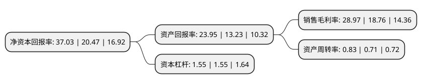

> 本页面由自动化程序生成于 2022年5月20日 01:31
> 内容可能存在错误，如有bug请提交issue至：https://github.com/Eroleice/doc-pi/issues
{.is-warning}

# 上市公司基本情况

## 基本资料

株洲旗滨集团股份有限公司（以下简称“旗滨集团”）成立于2005年07月08日，株洲市。于2011年08月12日在上交所主板上市。

旗滨集团注册资本268,628.807万元，玻璃及制品生产，销售;建筑材料，原辅材料批零兼营。普通货运(有效期至2018年1月23日)，在港区内从事普通货物装卸，仓储，堆码，货运代理服务。企业管理服务。以下是详细信息：

- 公司名称: 株洲旗滨集团股份有限公司
- 股票代码: 601636.SH
- 所在地: 湖南 - 株洲市
- 成立日期: 2005年07月08日
- 注册资本: 268,628.807万元
- 法定代表人: 姚培武
- 主营业务: 玻璃及制品生产，销售;建筑材料，原辅材料批零兼营普通货运(有效期至2018年1月23日)，在港区内从事普通货物装卸，仓储，堆码，货运代理服务企业管理服务
- 公司官网: www.kibing-glass.com
- 公司介绍: 公司主营业务为玻璃及制品生产、销售，玻璃加工，装卸劳务；主要产品分为三大类：优质浮法玻璃、在线LOW-E镀膜玻璃和LOW-E镀膜玻璃基片、深加工玻璃产品。公司自成立以来，在吸收原新光明公司的优秀技术和管理人才基础上，不断引进玻璃行业优秀的技术和管理人才加盟公司，并与英国玻璃咨询公司进行全面技术合作，对超白光伏玻璃基片生产技术和在线镀膜技术进行了联合开发，提高了技术研发与创新能力，在原料配料与称量技术、熔化技术、锡槽成型技术、退火窑技术、自动控制技术等方面有了较大的进步，企业规模迅速扩大，综合竞争能力快速加强。公司逐步从单一增加浮法玻璃规模的增长方式转变为生产在线LOW-E镀膜玻璃和提高产品附加值的增长模式，促使公司坚持技术创新、坚持走高端产品路线，形成向高科技、高质量、高附加值产品要效益的经营理念。

## 股东及高管情况

上市公司第一大股东为福建旗滨集团有限公司，持股681,172,979股，占比25.36%，**疑似为**上市公司实际控制人。

截至2022年03月31日，上市公司的前十大股东中，共有1名自然人股东，1名机构股东，7个产品账户，1个海外主体，其中5%以上大股东共有2名。上市公司前十大股东明细如下：

> 未能通过持股比例判定出上市公司实际控制人（持股30%以上）
> 可能存在通过间接持股、联合持股、协议控制等方式拥有实际控制权的主体，具体请参考上市公司定期公告！
{.is-warning}

> 截至2022年03月31日，上市公司前十大股东信息如下：

| 股东名称 | 持股数量（股） | 持股比例 |
| --- | --- | --- |
| 福建旗滨集团有限公司 | 681,172,979 | 25.36% |
| 俞其兵 | 402,500,000 | 14.98% |
| 香港中央结算有限公司(陆股通) | 76,314,036 | 2.84% |
| 株洲旗滨集团股份有限公司-中长期发展计划之第三期员工持股计划 | 27,220,150 | 1.01% |
| 中国建设银行股份有限公司-易方达环保主题灵活配置混合型证券投资基金 | 25,496,531 | 0.95% |
| 中国建设银行股份有限公司-易方达产业升级一年封闭运作混合型证券投资基金 | 23,104,605 | 0.86% |
| 中国工商银行股份有限公司-富国天惠精选成长混合型证券投资基金(LOF) | 20,009,875 | 0.74% |
| 全国社保基金一一四组合 | 19,760,140 | 0.74% |
| 交通银行股份有限公司-易方达高端制造混合型发起式证券投资基金 | 18,486,258 | 0.69% |
| 招商银行股份有限公司-易方达智造优势混合型证券投资基金 | 16,963,506 | 0.63% |

## 利润表分析

上市公司2021年总收入为145.72亿元，净利润为42.21亿元，实现盈利。

## 杜邦分析

> 数据列示周期：2021年 | 2020年 | 2019年
{.is-info}

上市公司的净资产收益率在近一年有所上升，上升幅度为80.9%，其变化情况分解如下：
- 上市公司的销售毛利率在近一年上升了54.42%，可能是生产效率的提升、商品原材料价格下跌或商品价格的上涨所致。
- 上市公司的资产周转率在近一年上升了16.9%，可能是源自于更快的销售回款或库存管理效果提升。
- 上市公司的财务杠杆比率在近一年下降了0%，可能是减少负债降低财务费用。

