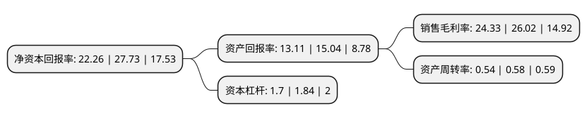

> 本页面由自动化程序生成于 2022年5月20日 01:31
> 内容可能存在错误，如有bug请提交issue至：https://github.com/Eroleice/doc-pi/issues
{.is-warning}

# 上市公司基本情况

## 基本资料

福莱特玻璃集团股份有限公司（以下简称“福莱特”）成立于1998年06月24日，嘉兴市。于2019年02月15日在上交所主板上市。

福莱特注册资本214,689.325万元，主营业务为光伏玻璃，浮法玻璃，工程玻璃和家居玻璃的研发，生产和销售，以及玻璃用石英矿的开采和销售和EPC光伏电站工程建设，其中，光伏玻璃是公司最主要的产品。以下是详细信息：

- 公司名称: 福莱特玻璃集团股份有限公司
- 股票代码: 601865.SH
- 所在地: 浙江 - 嘉兴市
- 成立日期: 1998年06月24日
- 注册资本: 214,689.325万元
- 法定代表人: 阮洪良
- 主营业务: 主营业务为光伏玻璃，浮法玻璃，工程玻璃和家居玻璃的研发，生产和销售，以及玻璃用石英矿的开采和销售和EPC光伏电站工程建设，其中，光伏玻璃是公司最主要的产品
- 公司官网: www.flatgroup.com.cn
- 公司介绍: 公司是中国最大的光伏玻璃原片制造商之一，主要从事设计、开发、生产及销售售往中国及海外光伏组件生产商的光伏玻璃。公司的光伏玻璃产品通常为光伏深加工玻璃，尤其是超白光伏压花玻璃，其主要用于生产晶体硅光伏电池，而晶体硅光伏电池随后可安装组成晶体硅光伏组件。公司的光伏玻璃亦可用作薄膜光伏电池的盖板。公司主要向国内外光伏组件生产商出售公司的光伏玻璃产品。尽管公司的大部分收益来自光伏玻璃，但公司亦生产及出售浮法玻璃、家居玻璃及工程玻璃，而此等玻璃连同光伏玻璃构成公司的四大玻璃产品。

## 股东及高管情况

上市公司第一大股东为香港中央结算(代理人)有限公司，持股449,943,880股，占比20.96%，**疑似为**上市公司实际控制人。

截至2022年03月31日，上市公司的前十大股东中，共有6名自然人股东，2个产品账户，2个海外主体，其中5%以上大股东共有4名。上市公司前十大股东明细如下：

> 未能通过持股比例判定出上市公司实际控制人（持股30%以上）
> 可能存在通过间接持股、联合持股、协议控制等方式拥有实际控制权的主体，具体请参考上市公司定期公告！
{.is-warning}

> 截至2022年03月31日，上市公司前十大股东信息如下：

| 股东名称 | 持股数量（股） | 持股比例 |
| --- | --- | --- |
| 香港中央结算(代理人)有限公司 | 449,943,880 | 20.96% |
| 阮洪良 | 439,358,400 | 20.46% |
| 阮泽云 | 350,532,000 | 16.33% |
| 姜瑾华 | 324,081,600 | 15.1% |
| 郑文荣 | 46,801,800 | 2.18% |
| 沈福泉 | 31,201,200 | 1.45% |
| 祝全明 | 31,201,200 | 1.45% |
| 上海浦东发展银行股份有限公司-广发高端制造股票型发起式证券投资基金 | 22,361,791 | 1.04% |
| 香港中央结算有限公司(陆股通) | 21,060,298 | 0.98% |
| 中国工商银行股份有限公司-广发创新升级灵活配置混合型证券投资基金 | 16,031,883 | 0.75% |

## 利润表分析

上市公司2021年总收入为87.13亿元，净利润为21.19亿元，实现盈利。

## 杜邦分析

> 数据列示周期：2021年 | 2020年 | 2019年
{.is-info}

上市公司的净资产收益率在近一年有所下降，下降幅度为-19.73%，其变化情况分解如下：
- 上市公司的销售毛利率在近一年下降了-6.5%，可能是生产效率的下降、商品原材料价格上涨或商品价格的下跌所致。
- 上市公司的资产周转率在近一年下降了-6.9%，可能是源自于更慢的销售回款或库存管理效果下降。
- 上市公司的财务杠杆比率在近一年下降了-7.61%，可能是减少负债降低财务费用。

