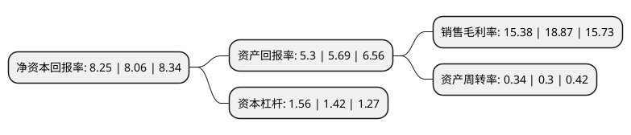

> 本页面由自动化程序生成于 2022年5月20日 01:33
> 内容可能存在错误，如有bug请提交issue至：https://github.com/Eroleice/doc-pi/issues
{.is-warning}

# 上市公司基本情况

## 基本资料

宏和电子材料科技股份有限公司（以下简称“宏和科技”）成立于1998年08月13日，上海市。于2019年07月19日在上交所主板上市。

宏和科技注册资本88,437万元，主营业务:中高端电子级玻璃纤维布的研发，生产和销售。公司主要产品为中高端电子级玻璃纤维布系列产品，主要包括极薄型(厚度低于28μm)，超薄型(厚度28-35μm)，薄型(厚度36-100μm)电子级玻璃纤维布。电子级玻璃纤维布为特定规格之玻璃纤维纱织造而成，具有绝缘，高强度，高耐热，高耐化学性，高耐燃性，电气特性佳及尺寸安定性佳等优点，为制造电子产品核心铜箔基板的重要原料，使基板具备优质的电气特性及机械强度等性能需求，从而广泛应用于智能手机，平板及笔记本电脑，服务器，汽车电子及其它高科技电子产品。以下是详细信息：

- 公司名称: 宏和电子材料科技股份有限公司
- 股票代码: 603256.SH
- 所在地: 上海 - 上海市
- 成立日期: 1998年08月13日
- 注册资本: 88,437万元
- 法定代表人: 毛嘉明
- 主营业务: 主营业务:中高端电子级玻璃纤维布的研发，生产和销售公司主要产品为中高端电子级玻璃纤维布系列产品，主要包括极薄型(厚度低于28μm)，超薄型(厚度28-35μm)，薄型(厚度36-100μm)电子级玻璃纤维布电子级玻璃纤维布为特定规格之玻璃纤维纱织造而成，具有绝缘，高强度，高耐热，高耐化学性，高耐燃性，电气特性佳及尺寸安定性佳等优点，为制造电子产品核心铜箔基板的重要原料，使基板具备优质的电气特性及机械强度等性能需求，从而广泛应用于智能手机，平板及笔记本电脑，服务器，汽车电子及其它高科技电子产品
- 公司官网: www.gracefabric.com
- 公司介绍: 公司为一家主要从事中高端电子级玻璃纤维布的研发、生产和销售的高新技术企业，是全球领先的中高端电子级玻璃纤维布专业厂商。公司主要产品为中高端电子级玻璃纤维布系列产品,主要包括极薄型(厚度低于28μm),超薄型(厚度28-35μm),薄型(厚度36-100μm)电子级玻璃纤维布.电子级玻璃纤维布为特定规格之玻璃纤维纱织造而成,具有绝缘,高强度,高耐热,高耐化学性,高耐燃性,电气特性佳及尺寸安定性佳等优点,为制造电子产品核心铜箔基板的重要原料,使基板具备优质的电气特性及机械强度等性能需求,从而广泛应用于智能手机,平板及笔记本电脑,服务器,汽车电子及其它高科技电子产品.公司自2008年以来被持续认定为国家高新技术企业，拥有多项专利及自主研发的专有技术。

## 股东及高管情况

上市公司第一大股东为远益国际有限公司，持股658,405,037股，占比74.45%，为上市公司实际控制人。

截至2022年03月31日，上市公司的前十大股东中，共有6名自然人股东，1名机构股东，3个海外主体，其中5%以上大股东共有1名。上市公司前十大股东明细如下：

> 截至2022年03月31日，上市公司前十大股东信息如下：

| 股东名称 | 持股数量（股） | 持股比例 |
| --- | --- | --- |
| 远益国际有限公司 | 658,405,037 | 74.45% |
| UNICORN ACE LIMITED | 28,805,220 | 3.26% |
| SHARP TONE INTERNATIONAL  LIMITED | 28,805,220 | 3.26% |
| INTEGRITY LINK LIMITED | 24,690,190 | 2.79% |
| 毛嘉明 | 3,110,706 | 0.35% |
| 钱世英 | 2,141,192 | 0.24% |
| 朱彬 | 1,999,759 | 0.23% |
| 张尚民 | 1,848,000 | 0.21% |
| 杜甫 | 1,723,045 | 0.19% |
| 廖明雄 | 1,642,058 | 0.19% |

## 利润表分析

上市公司2021年总收入为8.08亿元，净利润为1.24亿元，实现盈利。

## 杜邦分析

> 数据列示周期：2021年 | 2020年 | 2019年
{.is-info}

上市公司的净资产收益率在近一年有所上升，上升幅度为2.36%，其变化情况分解如下：
- 上市公司的销售毛利率在近一年下降了-18.49%，可能是生产效率的下降、商品原材料价格上涨或商品价格的下跌所致。
- 上市公司的资产周转率在近一年上升了13.33%，可能是源自于更快的销售回款或库存管理效果提升。
- 上市公司的财务杠杆比率在近一年上升了9.86%，可能是增加负债扩大生产规模。

