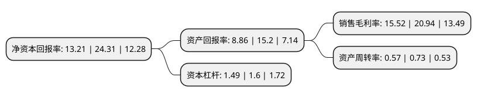

> 本页面由自动化程序生成于 2022年5月20日 01:34
> 内容可能存在错误，如有bug请提交issue至：https://github.com/Eroleice/doc-pi/issues
{.is-warning}

# 上市公司基本情况

## 基本资料

重庆再升科技股份有限公司（以下简称“再升科技”）成立于2007年06月28日，重庆市。于2015年01月22日在上交所主板上市。

再升科技注册资本72,503.101万元，主营业务;公司的主营业务为微纤维玻璃棉及其制品的研发，生产和销售。主要产品:包括微纤维玻璃棉，玻璃纤维滤纸，真空绝热板(简称“VIP”)芯材。以下是详细信息：

- 公司名称: 重庆再升科技股份有限公司
- 股票代码: 603601.SH
- 所在地: 重庆 - 重庆市
- 成立日期: 2007年06月28日
- 注册资本: 72,503.101万元
- 法定代表人: 郭茂
- 主营业务: 主营业务;公司的主营业务为微纤维玻璃棉及其制品的研发，生产和销售主要产品:包括微纤维玻璃棉，玻璃纤维滤纸，真空绝热板(简称“VIP”)芯材
- 公司官网: www.cqzskj.com
- 公司介绍: 公司的主营业务为微纤维玻璃棉制品的研发、生产和销售。目前，公司生产的微纤维玻璃棉制品主要应用于洁净(目前主要为空气过滤)和节能保温(目前主要为冰箱、冰柜行业)领域。公司是国内主要的玻璃纤维滤纸生产企业之一。公司研发生产的超高效空气过滤纸(ULPA)、纳米纤维空气过滤纸被重庆市科学委员会评为“重庆市高新技术产品”，超高效空气过滤纸(ULPA)还获得科学技术部科技型中小企业技术创新基金管理中心立项。公司是国内首批生产真空绝热板芯材的企业之一，也是全球主要的真空绝热板芯材生产商之一。公司研发生产的VIP纳米芯材被评为“重庆市高新技术产品”，并连续两年获得重庆市优秀新产品三等奖；冰箱专用真空绝热板芯材已获得科学技术部科技型中小企业技术创新基金管理中心立项。

## 股东及高管情况

上市公司第一大股东为郭茂，持股265,758,863股，占比36.63%，为上市公司实际控制人。

截至2022年03月31日，上市公司的前十大股东中，共有1名自然人股东，2名机构股东，5个产品账户，2个海外主体，其中5%以上大股东共有2名。上市公司前十大股东明细如下：

> 截至2022年03月31日，上市公司前十大股东信息如下：

| 股东名称 | 持股数量（股） | 持股比例 |
| --- | --- | --- |
| 郭茂 | 265,758,863 | 36.63% |
| 上海广岑投资中心(有限合伙) | 44,924,880 | 6.19% |
| 香港中央结算有限公司(陆股通) | 27,219,706 | 3.75% |
| 兴业银行股份有限公司-天弘永利债券型证券投资基金 | 22,632,565 | 3.12% |
| 南京融京汇聚股权投资合伙企业(有限合伙) | 17,600,013 | 2.43% |
| 中国银行股份有限公司-天弘增强回报债券型证券投资基金 | 12,761,176 | 1.76% |
| MERRILL LYNCH INTERNATIONAL | 8,749,886 | 1.21% |
| 施罗德投资管理(香港)有限公司-施罗德环球基金系列中国A股(交易所) | 8,681,104 | 1.2% |
| 中国建设银行股份有限公司-景顺长城环保优势股票型证券投资基金 | 8,567,599 | 1.18% |
| 中国银行股份有限公司-景顺长城优选混合型证券投资基金 | 7,680,299 | 1.06% |

## 利润表分析

上市公司2021年总收入为16.19亿元，净利润为2.51亿元，实现盈利。

## 杜邦分析

> 数据列示周期：2021年 | 2020年 | 2019年
{.is-info}

上市公司的净资产收益率在近一年有所下降，下降幅度为-45.66%，其变化情况分解如下：
- 上市公司的销售毛利率在近一年下降了-25.88%，可能是生产效率的下降、商品原材料价格上涨或商品价格的下跌所致。
- 上市公司的资产周转率在近一年下降了-21.92%，可能是源自于更慢的销售回款或库存管理效果下降。
- 上市公司的财务杠杆比率在近一年下降了-6.88%，可能是减少负债降低财务费用。

