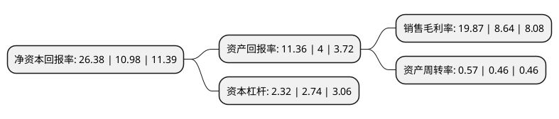

> 本页面由自动化程序生成于 2022年5月20日 01:36
> 内容可能存在错误，如有bug请提交issue至：https://github.com/Eroleice/doc-pi/issues
{.is-warning}

# 上市公司基本情况

## 基本资料

山东玻纤集团股份有限公司（以下简称“山东玻纤”）成立于2008年02月20日，临沂市。于2020年09月03日在上交所主板上市。

山东玻纤注册资本50,000万元，主营业务是玻璃纤维及其制品的研发，生产与销售，并在沂水县范围内提供热电产品。主要产品分为玻纤类产品和热电类产品两大类。以下是详细信息：

- 公司名称: 山东玻纤集团股份有限公司
- 股票代码: 605006.SH
- 所在地: 山东 - 临沂市
- 成立日期: 2008年02月20日
- 注册资本: 50,000万元
- 法定代表人: 高贵恒
- 主营业务: 主营业务是玻璃纤维及其制品的研发，生产与销售，并在沂水县范围内提供热电产品主要产品分为玻纤类产品和热电类产品两大类
- 公司官网: www.glasstex.cn
- 公司介绍: 公司是一家专注于玻璃纤维及其制品的研发生产的高新技术企业,司采用池窑法生产玻璃纤维，依托于持续的研发创新和不断改进的生产技术，已经形成了无碱纱、中碱纱和玻纤制品三大类产品，主要应用于建筑材料、交通运输、电子电器、环保风电、石油化工、航空以及消费品等领域。公司通过实施内部培养及外部引进优秀人才的策略，拥有了一支从业经验丰富的研发团队，并建立了玻纤技术研究院。公司已获得ISO9001质量管理体系认证、ISO14001环境管理体系认证、OHSAS18001职业健康安全管理体系认证、CQM能源管理体系认证和CMS测量管理体系认证，完善的产品体系和全流程的质量管控为公司市场拓展提供了保障。公司凭借稳定、优质的产品质量获得了国内外客户的认可，公司产品销往全国绝大部分省、市、自治区，远销欧、美、亚、非洲等多个国家和地区。

## 股东及高管情况

上市公司第一大股东为临沂矿业集团有限责任公司，持股316,441,633股，占比52.7403%，为上市公司实际控制人。

截至2022年05月11日，上市公司的前十大股东中，共有5名自然人股东，4名机构股东，1个产品账户，其中5%以上大股东共有4名。上市公司前十大股东明细如下：

> 截至2022年05月11日，上市公司前十大股东信息如下：

| 股东名称 | 持股数量（股） | 持股比例 |
| --- | --- | --- |
| 临沂矿业集团有限责任公司 | 316,441,633 | 52.7403% |
| 临沂矿业集团有限责任公司 | 263,701,361 | 52.74% |
| 东方邦信创业投资有限公司 | 79,461,960 | 13.2437% |
| 东方邦信创业投资有限公司 | 76,218,300 | 15.24% |
| 黄河三角洲产业投资基金管理有限公司-北京黄河三角洲投资中心(有限合伙) | 4,850,560 | 0.97% |
| 牛爱君 | 4,140,000 | 0.83% |
| 宋忠玲 | 3,048,000 | 0.61% |
| 李钊 | 2,278,000 | 0.46% |
| 高贵恒 | 2,159,000 | 0.43% |
| 吴同德 | 1,270,000 | 0.25% |

## 利润表分析

上市公司2021年总收入为27.48亿元，净利润为5.46亿元，实现盈利。

## 杜邦分析

> 数据列示周期：2021年 | 2020年 | 2019年
{.is-info}

上市公司的净资产收益率在近一年有所上升，上升幅度为140.26%，其变化情况分解如下：
- 上市公司的销售毛利率在近一年上升了129.98%，可能是生产效率的提升、商品原材料价格下跌或商品价格的上涨所致。
- 上市公司的资产周转率在近一年上升了23.91%，可能是源自于更快的销售回款或库存管理效果提升。
- 上市公司的财务杠杆比率在近一年下降了-15.33%，可能是减少负债降低财务费用。

