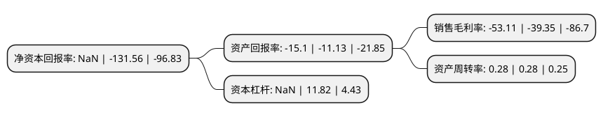

> 本页面由自动化程序生成于 2022年5月20日 01:01
> 内容可能存在错误，如有bug请提交issue至：https://github.com/Eroleice/doc-pi/issues
{.is-warning}

# 上市公司基本情况

## 基本资料

宜华健康医疗股份有限公司（以下简称“*ST宜康”）成立于1993年02月19日，汕头市。于2000年08月07日在深交所主板上市。

*ST宜康注册资本87,769.756万元，主营业务:医疗机构运营及服务和养老社区运营及服务以下是详细信息：

- 公司名称: 宜华健康医疗股份有限公司
- 股票代码: 000150.SZ
- 所在地: 广东 - 汕头市
- 成立日期: 1993年02月19日
- 注册资本: 87,769.756万元
- 法定代表人: 刘壮青
- 主营业务: 主营业务:医疗机构运营及服务和养老社区运营及服务
- 公司官网: www.yihuahealth.com
- 公司介绍: 公司前身为宜华地产股份有限公司。2014年，宜华地产抓住机遇，全面转型健康产业，在医疗大健康领域全面发力，构建“宜华医疗健康产业生态圈”。2015年2月，宜华地产股份有限公司正式更名为“宜华健康医疗股份有限公司”。宜华健康通过投资并购了众安康后勤集团公司、爱奥乐医疗器械(深圳)有限公司、达孜赛勒康医疗投资管理公司、亲和源集团有限公司等四家子公司；并投资参股了网络医院平台深圳友德医科技公司，目前已成功构建了医疗养老后勤服务、医疗机构专业服务和养老社区专业服务的“三位一体”服务体系，同时延伸到医疗专业工程、慢病及健康管理、护理康复、互联网医疗等领域，逐步打造体系完整，协同高效的医疗健康产业生态圈。

## 股东及高管情况

上市公司第一大股东为宜华企业(集团)有限公司，持股282,244,515股，占比32.1574%，为上市公司实际控制人。

截至2022年03月31日，上市公司的前十大股东中，共有8名自然人股东，2名机构股东，其中5%以上大股东共有3名。上市公司前十大股东明细如下：

> 截至2022年03月31日，上市公司前十大股东信息如下：

| 股东名称 | 持股数量（股） | 持股比例 |
| --- | --- | --- |
| 宜华企业(集团)有限公司 | 282,244,515 | 32.1574% |
| 林正刚 | 74,192,147 | 8.45% |
| 林正刚 | 74,192,147 | 8.45% |
| 李岳雄 | 11,453,400 | 1.3% |
| 代妙琼 | 10,568,040 | 1.2% |
| 汕头市汇泉物业管理有限公司 | 10,006,640 | 1.14% |
| 陈泓 | 4,000,000 | 0.46% |
| 周英本 | 2,100,105 | 0.24% |
| 张传红 | 2,002,800 | 0.23% |
| 孙秀霞 | 1,806,812 | 0.21% |

## 利润表分析

上市公司2021年总收入为13.34亿元，净利润为-7.09亿元，**未实现盈利**。

## 杜邦分析

> 数据列示周期：2021年 | 2020年 | 2019年
{.is-info}

上市公司的净资产收益率在近一年有所下降，下降幅度为NaN%，其变化情况分解如下：
- 上市公司的销售毛利率在近一年上升了34.97%，可能是生产效率的提升、商品原材料价格下跌或商品价格的上涨所致。
- 上市公司的资产周转率在近一年下降了0%，可能是源自于更慢的销售回款或库存管理效果下降。
- 上市公司的财务杠杆比率在近一年下降了NaN%，可能是减少负债降低财务费用。

