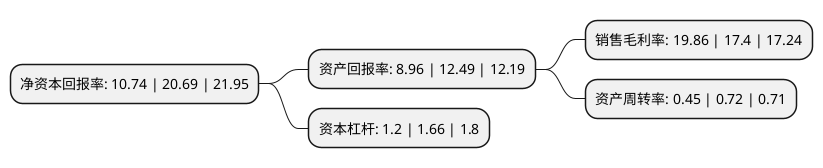

> 本页面由自动化程序生成于 2022年5月20日 01:01
> 内容可能存在错误，如有bug请提交issue至：https://github.com/Eroleice/doc-pi/issues
{.is-warning}

# 上市公司基本情况

## 基本资料

派斯双林生物制药股份有限公司（以下简称“派林生物”）成立于1995年05月22日，太原市。于1996年06月28日在深交所主板上市。

派林生物注册资本73,291.923万元，主营业务:血液制品的研究，开发，生产和销售。主要产品:人血白蛋白，静注人免疫球蛋白(pH4)，人免疫球蛋白，乙型肝炎人免疫球蛋白，破伤风人免疫球蛋白，狂犬病人免疫球蛋白以下是详细信息：

- 公司名称: 派斯双林生物制药股份有限公司
- 股票代码: 000403.SZ
- 所在地: 山西 - 太原市
- 成立日期: 1995年05月22日
- 注册资本: 73,291.923万元
- 法定代表人: 付绍兰
- 主营业务: 主营业务:血液制品的研究，开发，生产和销售主要产品:人血白蛋白，静注人免疫球蛋白(pH4)，人免疫球蛋白，乙型肝炎人免疫球蛋白，破伤风人免疫球蛋白，狂犬病人免疫球蛋白
- 公司官网: null
- 公司介绍: 公司的主要业务为生产和销售血液制品，公司主要产品为人血白蛋白、静注人免疫球蛋白(pH4)、人免疫球蛋白、乙型肝炎人免疫球蛋白、破伤风人免疫球蛋白、狂犬病人免疫球蛋白。公司始终致力于发展子公司广东双林的血液制品产业，公司拥有独立的研发团队，建有广东省血液制品工程技术研究开发中心、广东省企业技术中心、湛江市生物制药工程技术研究开发中心和广东省制药行业最高规格的SPF及现代化动物实验中心。“压滤工艺分离人血浆蛋白的方法”获得广东省发明专利金奖、国家专利奖优秀奖。

## 股东及高管情况

上市公司第一大股东为杭州浙民投天弘投资合伙企业(有限合伙)，持股134,464,531股，占比18.35%，**疑似为**上市公司实际控制人。

截至2022年03月31日，上市公司的前十大股东中，共有3名自然人股东，7名机构股东，其中5%以上大股东共有5名。上市公司前十大股东明细如下：

> 未能通过持股比例判定出上市公司实际控制人（持股30%以上）
> 可能存在通过间接持股、联合持股、协议控制等方式拥有实际控制权的主体，具体请参考上市公司定期公告！
{.is-warning}

> 截至2022年03月31日，上市公司前十大股东信息如下：

| 股东名称 | 持股数量（股） | 持股比例 |
| --- | --- | --- |
| 杭州浙民投天弘投资合伙企业(有限合伙) | 134,464,531 | 18.35% |
| 杭州浙民投天弘投资合伙企业(有限合伙) | 134,464,531 | 18.35% |
| 哈尔滨同智成科技开发有限公司 | 80,381,128 | 10.97% |
| 哈尔滨同智成科技开发有限公司 | 80,381,128 | 10.97% |
| 深圳市航运健康科技有限公司 | 38,591,804 | 5.27% |
| 哈尔滨兰香生物技术咨询有限公司 | 22,916,777 | 3.13% |
| 杨峰 | 16,029,172 | 2.19% |
| 杨莉 | 16,029,172 | 2.19% |
| 西藏浙岩投资管理有限公司 | 15,149,684 | 2.07% |
| 张景瑞 | 10,686,115 | 1.46% |

## 杜邦分析

> 数据列示周期：2021年 | 2020年 | 2019年
{.is-info}

上市公司的净资产收益率在近一年有所下降，下降幅度为-48.09%，其变化情况分解如下：
- 上市公司的销售毛利率在近一年上升了14.14%，可能是生产效率的提升、商品原材料价格下跌或商品价格的上涨所致。
- 上市公司的资产周转率在近一年下降了-37.5%，可能是源自于更慢的销售回款或库存管理效果下降。
- 上市公司的财务杠杆比率在近一年下降了-27.71%，可能是减少负债降低财务费用。

