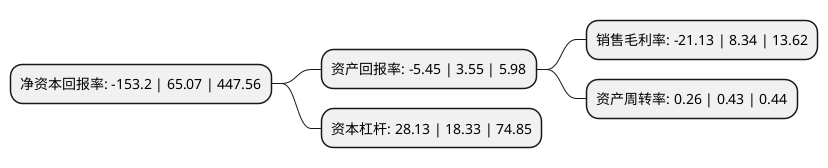

> 本页面由自动化程序生成于 2022年5月20日 01:02
> 内容可能存在错误，如有bug请提交issue至：https://github.com/Eroleice/doc-pi/issues
{.is-warning}

# 上市公司基本情况

## 基本资料

南华生物医药股份有限公司（以下简称“南华生物”）成立于1991年10月18日，长沙市。于1992年12月08日在深交所主板上市。

南华生物注册资本31,157.39万元，主要业务:生物医药，节能环保及基金资管以下是详细信息：

- 公司名称: 南华生物医药股份有限公司
- 股票代码: 000504.SZ
- 所在地: 湖南 - 长沙市
- 成立日期: 1991年10月18日
- 注册资本: 31,157.39万元
- 法定代表人: 杨云
- 主营业务: 生物医药，节能环保及基金资管
- 公司官网: www.nhbiogroup.com
- 公司介绍: 公司是目前国内一家国资控股的干细胞、免疫细胞及组织工程产业主板上市公司。公司主要从事“生物医药”和“节能环保”两个板块的业务。公司“生物医药”板块业务包括干细胞储存服务、化妆品的生产和销售、医疗器械设备及耗材的代理和销售，主要通过子公司博爱康民、干细胞临床转化研究中心、南华基业具体进行。公司的干细胞存储业务经历了从依靠技术委托服务的经营模式到自主开展技术服务、发展湖南省内自有干细胞库的经营模式。公司凭借自身强劲的科研优势，与国内外著名科研机构、知名学府、医疗单位和国家级干细胞存储机构建立并保持了良好的合作关系。公司在持续以细胞存储、细胞治疗为龙头的大健康产业领域布局的同时，致力于将公司发展成为生物医疗、节能技术服务的双主业公司。控股城光节能，建立起节能服务业务新版块，依托国有控股平台，大力开发湖南市场，形成更强的区位竞争优势，将节能服务业务做大做强。城光节能是国家认定的高新技术企业，拥有多项国家专利，所提供的各系列的产品已通过了国家权威检测机构——国家质量监督总局电光源检测中心的认证、ISO9001:2008认证、CE电子产品安全认证、欧盟RoSH认证。

## 股东及高管情况

上市公司第一大股东为湖南省财信产业基金管理有限公司，持股79,701,655股，占比25.58%，**疑似为**上市公司实际控制人。

截至2022年03月31日，上市公司的前十大股东中，共有5名自然人股东，2名机构股东，3个产品账户，其中5%以上大股东共有2名。上市公司前十大股东明细如下：

> 未能通过持股比例判定出上市公司实际控制人（持股30%以上）
> 可能存在通过间接持股、联合持股、协议控制等方式拥有实际控制权的主体，具体请参考上市公司定期公告！
{.is-warning}

> 截至2022年03月31日，上市公司前十大股东信息如下：

| 股东名称 | 持股数量（股） | 持股比例 |
| --- | --- | --- |
| 湖南省财信产业基金管理有限公司 | 79,701,655 | 25.58% |
| 上海和平大宗股权投资基金管理有限公司 | 35,600,000 | 11.43% |
| 重庆国际信托股份有限公司-重庆信托·耀龙9号集合资金信托计划 | 15,500,000 | 4.97% |
| 合肥曦景科技有限公司 | 14,522,162 | 4.66% |
| 叶超英 | 3,164,401 | 1.02% |
| 深圳霖泽投资有限公司 | 2,780,900 | 0.89% |
| 林亚圆 | 2,500,000 | 0.8% |
| 邵雄 | 2,499,100 | 0.8% |
| 吕丽仙 | 2,476,600 | 0.79% |
| 徐晓 | 2,452,581 | 0.79% |

## 利润表分析

上市公司2021年总收入为1.56亿元，净利润为-0.34亿元，**未实现盈利**。

## 杜邦分析

> 数据列示周期：2021年 | 2020年 | 2019年
{.is-info}

上市公司的净资产收益率在近一年有所下降，下降幅度为-335.44%，其变化情况分解如下：
- 上市公司的销售毛利率在近一年下降了-353.36%，可能是生产效率的下降、商品原材料价格上涨或商品价格的下跌所致。
- 上市公司的资产周转率在近一年下降了-39.53%，可能是源自于更慢的销售回款或库存管理效果下降。
- 上市公司的财务杠杆比率在近一年上升了53.46%，可能是增加负债扩大生产规模。

