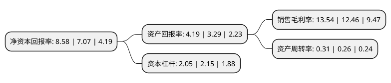

> 本页面由自动化程序生成于 2022年5月20日 01:02
> 内容可能存在错误，如有bug请提交issue至：https://github.com/Eroleice/doc-pi/issues
{.is-warning}

# 上市公司基本情况

## 基本资料

万泽实业股份有限公司（以下简称“万泽股份”）成立于1992年11月04日，汕头市。于1994年01月10日在深交所主板上市。

万泽股份注册资本50,070.81万元，主营业务:微生态制剂，高温合金的研发，生产及销售以下是详细信息：

- 公司名称: 万泽实业股份有限公司
- 股票代码: 000534.SZ
- 所在地: 广东 - 汕头市
- 成立日期: 1992年11月04日
- 注册资本: 50,070.81万元
- 法定代表人: 黄振光
- 主营业务: 主营业务:微生态制剂，高温合金的研发，生产及销售
- 公司官网: www.wedgeind.com
- 公司介绍: 公司以深圳为基础，同时辐射至珠三角、长三角、北京、西北等区域进行房地产业务开发和经营项目。公司先后获得“汕头市名优企业协会优秀会员单位”、“广东省A级纳税人”等荣誉称号。公司实施战略转型，逐步介入先进高温合金材料与构件领域，公司已成功建立了超高纯度高温合金熔炼核心技术体系，并完成多项关键技术的开发，同时与国内部分科研院所和企业建立了合作关系。公司已掌握高温母合金与叶片制造的先进技术，成功制备了精密铸造叶片、铸造等轴晶叶片及粉末涡轮盘等样品，各方面性能表现优异。

## 股东及高管情况

上市公司第一大股东为万泽集团有限公司，持股197,608,136股，占比39.47%，为上市公司实际控制人。

截至2022年03月31日，上市公司的前十大股东中，共有5名自然人股东，4名机构股东，1个产品账户，其中5%以上大股东共有2名。上市公司前十大股东明细如下：

> 截至2022年03月31日，上市公司前十大股东信息如下：

| 股东名称 | 持股数量（股） | 持股比例 |
| --- | --- | --- |
| 万泽集团有限公司 | 197,608,136 | 39.47% |
| 江西赣江融创投资有限公司 | 27,791,299 | 5.55% |
| 李敏仙 | 19,564,911 | 3.91% |
| 张智 | 7,317,329 | 1.46% |
| 汕头市东冠电力开发有限公司 | 6,706,517 | 1.34% |
| 鑫宸实业有限公司 | 6,319,900 | 1.26% |
| 徐善水 | 5,770,200 | 1.15% |
| 全国社保基金一零三组合 | 5,499,802 | 1.1% |
| 陶军 | 5,441,100 | 1.09% |
| 陶富华 | 3,602,740 | 0.72% |

## 利润表分析

上市公司2021年总收入为6.56亿元，净利润为0.88亿元，实现盈利。

## 杜邦分析

> 数据列示周期：2021年 | 2020年 | 2019年
{.is-info}

上市公司的净资产收益率在近一年有所上升，上升幅度为21.36%，其变化情况分解如下：
- 上市公司的销售毛利率在近一年上升了8.67%，可能是生产效率的提升、商品原材料价格下跌或商品价格的上涨所致。
- 上市公司的资产周转率在近一年上升了19.23%，可能是源自于更快的销售回款或库存管理效果提升。
- 上市公司的财务杠杆比率在近一年下降了-4.65%，可能是减少负债降低财务费用。

