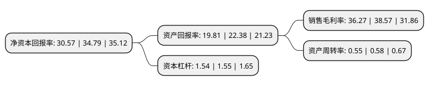

> 本页面由自动化程序生成于 2022年5月20日 01:02
> 内容可能存在错误，如有bug请提交issue至：https://github.com/Eroleice/doc-pi/issues
{.is-warning}

# 上市公司基本情况

## 基本资料

长春高新技术产业(集团)股份有限公司（以下简称“长春高新”）成立于1993年06月10日，长春市。于1996年12月18日在深交所主板上市。

长春高新注册资本40,472.029万元，主要产品:基因重组人生长素，血栓心脉宁，冠脉宁。以下是详细信息：

- 公司名称: 长春高新技术产业(集团)股份有限公司
- 股票代码: 000661.SZ
- 所在地: 吉林 - 长春市
- 成立日期: 1993年06月10日
- 注册资本: 40,472.029万元
- 法定代表人: 马骥
- 主营业务: 主要产品:基因重组人生长素，血栓心脉宁，冠脉宁
- 公司官网: www.ccht.jl.cn
- 公司介绍: 公司于1993年6月成立，是东北地区最早的一批上市公司之一。公司主营业务以生物制药、中成药生产及销售为主，辅以房地产开发、物业管理等。上市多年来，公司凝炼并秉持“创新、专注、包容、共享”的发展理念，坚持以科技创新为源动力，主导产业成功实现由服务于开发区基础设施建设向生物制药及健康产业的转型，随着医药产业项目的成功孵化并壮大，支撑了经营业绩的快速增长，目前公司已成为国内生物医药领域具有一定技术领先优势的上市公司。

## 股东及高管情况

上市公司第一大股东为长春超达投资集团有限公司，持股76,076,954股，占比18.8%，**疑似为**上市公司实际控制人。

截至2022年03月31日，上市公司的前十大股东中，共有3名自然人股东，3名机构股东，3个产品账户，1个海外主体，其中5%以上大股东共有3名。上市公司前十大股东明细如下：

> 未能通过持股比例判定出上市公司实际控制人（持股30%以上）
> 可能存在通过间接持股、联合持股、协议控制等方式拥有实际控制权的主体，具体请参考上市公司定期公告！
{.is-warning}

> 截至2022年03月31日，上市公司前十大股东信息如下：

| 股东名称 | 持股数量（股） | 持股比例 |
| --- | --- | --- |
| 长春超达投资集团有限公司 | 76,076,954 | 18.8% |
| 长春高新超达投资有限公司 | 76,076,954 | 18.8% |
| 金磊 | 34,645,705 | 8.56% |
| 林殿海 | 10,602,129 | 2.62% |
| 香港中央结算有限公司(陆股通) | 9,368,716 | 2.31% |
| 中央汇金资产管理有限责任公司 | 6,427,200 | 1.59% |
| 全国社保基金一一八组合 | 3,869,448 | 0.96% |
| 中国邮政储蓄银行股份有限公司-易方达新收益灵活配置混合型证券投资基金 | 3,745,887 | 0.93% |
| 上海浦东发展银行股份有限公司-易方达裕丰回报债券型证券投资基金 | 3,680,274 | 0.91% |
| 郑海若 | 3,198,800 | 0.79% |

## 利润表分析

上市公司2021年总收入为107.46亿元，净利润为38.97亿元，实现盈利。

## 杜邦分析

> 数据列示周期：2021年 | 2020年 | 2019年
{.is-info}

上市公司的净资产收益率在近一年有所下降，下降幅度为-12.13%，其变化情况分解如下：
- 上市公司的销售毛利率在近一年下降了-5.96%，可能是生产效率的下降、商品原材料价格上涨或商品价格的下跌所致。
- 上市公司的资产周转率在近一年下降了-5.17%，可能是源自于更慢的销售回款或库存管理效果下降。
- 上市公司的财务杠杆比率在近一年下降了-0.65%，可能是减少负债降低财务费用。

