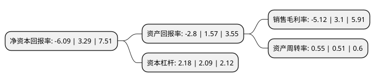

> 本页面由自动化程序生成于 2022年5月20日 01:04
> 内容可能存在错误，如有bug请提交issue至：https://github.com/Eroleice/doc-pi/issues
{.is-warning}

# 上市公司基本情况

## 基本资料

北京中关村科技发展(控股)股份有限公司（以下简称“中关村”）成立于1999年06月08日，北京市。于1999年07月12日在深交所主板上市。

中关村注册资本75,312.698万元，主要业务:信息化服务，生物医药，房地产开发，金融投资。以下是详细信息：

- 公司名称: 北京中关村科技发展(控股)股份有限公司
- 股票代码: 000931.SZ
- 所在地: 北京 - 北京市
- 成立日期: 1999年06月08日
- 注册资本: 75,312.698万元
- 法定代表人: 许钟民
- 主营业务: 信息化服务，生物医药，房地产开发，金融投资
- 公司官网: www.centek.com.cn
- 公司介绍: 公司是一家业务多元的控股集团企业，多种经济成分组成的股份制公司，主要业务从最初的“信息通信、开发建设、生物制药、金融投资”的经营方向到今天的“科技地产”和“生物医药”。公司地产开发坚持“科技地产”战略方向，即充分利用和整合“中关村”品牌资源、股东资源和政府资源，依靠实际操作经验和管理团队，成为众多地产开发企业中有独特竞争力的公司。医药业务依托旗下企业北京华素制药股份有限公司，强化与军事医学科学院研发和孵化器合作，力争建设成为中国最具实力的集研发、生产和销售为一体的一流医药企业。

## 股东及高管情况

上市公司第一大股东为国美控股集团有限公司，持股209,213,228股，占比27.78%，**疑似为**上市公司实际控制人。

截至2022年03月31日，上市公司的前十大股东中，共有3名自然人股东，5名机构股东，1个产品账户，1名其他股东，其中5%以上大股东共有2名。上市公司前十大股东明细如下：

> 未能通过持股比例判定出上市公司实际控制人（持股30%以上）
> 可能存在通过间接持股、联合持股、协议控制等方式拥有实际控制权的主体，具体请参考上市公司定期公告！
{.is-warning}

> 截至2022年03月31日，上市公司前十大股东信息如下：

| 股东名称 | 持股数量（股） | 持股比例 |
| --- | --- | --- |
| 国美控股集团有限公司 | 209,213,228 | 27.78% |
| 国美电器有限公司 | 55,500,355 | 7.37% |
| 北京天鑫财富投资管理有限公司-天鑫医药价值成长1号私募证券投资基金 | 23,029,108 | 3.06% |
| 周爽 | 6,504,797 | 0.86% |
| 周宇光 | 5,988,553 | 0.8% |
| 中关村高科技产业促进中心 | 5,000,000 | 0.66% |
| 林飞燕 | 2,552,111 | 0.34% |
| 北京实创高科技发展有限责任公司 | 1,967,108 | 0.26% |
| 中国普天信息产业集团有限公司 | 1,866,752 | 0.25% |
| 武汉国信房地产发展有限公司 | 1,800,000 | 0.24% |

## 利润表分析

上市公司2021年总收入为19.55亿元，净利润为-1.01亿元，**未实现盈利**。

## 杜邦分析

> 数据列示周期：2021年 | 2020年 | 2019年
{.is-info}

上市公司的净资产收益率在近一年有所下降，下降幅度为-285.11%，其变化情况分解如下：
- 上市公司的销售毛利率在近一年下降了-265.16%，可能是生产效率的下降、商品原材料价格上涨或商品价格的下跌所致。
- 上市公司的资产周转率在近一年上升了7.84%，可能是源自于更快的销售回款或库存管理效果提升。
- 上市公司的财务杠杆比率在近一年上升了4.31%，可能是增加负债扩大生产规模。

