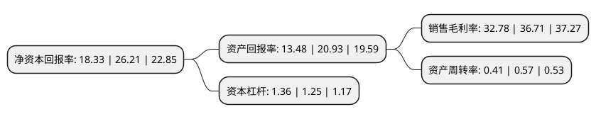

> 本页面由自动化程序生成于 2022年5月20日 01:05
> 内容可能存在错误，如有bug请提交issue至：https://github.com/Eroleice/doc-pi/issues
{.is-warning}

# 上市公司基本情况

## 基本资料

华兰生物工程股份有限公司（以下简称“华兰生物”）成立于1992年03月30日，新乡市。于2004年06月25日在深交所中小板上市。

华兰生物注册资本182,436.673万元，主要产品:人血白蛋白，静注丙球以下是详细信息：

- 公司名称: 华兰生物工程股份有限公司
- 股票代码: 002007.SZ
- 所在地: 河南 - 新乡市
- 成立日期: 1992年03月30日
- 注册资本: 182,436.673万元
- 法定代表人: 安康
- 主营业务: 主要产品:人血白蛋白，静注丙球
- 公司官网: www.hualanbio.com
- 公司介绍: 公司是从事血液制品研发和生产的重点高新技术企业，并首家通过血液制品行业的GMP认证。作为国家定点大型生物制品生产企业，公司以雄厚的技术开发实力、先进的技术水平及生产检测设备、科学规范的经营管理和完善的质量保证体系。公司先后承担多项国家、省、市级科技攻关项目，其中外科用冻干人纤维蛋白胶被列入国家863项目。华兰博士后科研工作站，河南省生物医药工程技术中心和中国科学院生物技术创新与产业化共同基金及中国科学院的多个联合实验室的成立，为企业的高成长性和核心竞争力奠定了坚实的基础。华兰生物拥有人血白蛋白、静注人免疫球蛋白、人免疫球蛋白、人凝血酶原复合物、外科用冻干人纤维蛋白胶等以“华兰”为品牌的血液制品。这些制品的“华兰”商标已成为中国血液制品行业公认品牌。

## 股东及高管情况

上市公司第一大股东为安康，持股326,527,406股，占比17.9%，**疑似为**上市公司实际控制人。

截至2022年03月31日，上市公司的前十大股东中，共有1名自然人股东，4名机构股东，4个产品账户，1个海外主体，其中5%以上大股东共有4名。上市公司前十大股东明细如下：

> 未能通过持股比例判定出上市公司实际控制人（持股30%以上）
> 可能存在通过间接持股、联合持股、协议控制等方式拥有实际控制权的主体，具体请参考上市公司定期公告！
{.is-warning}

> 截至2022年03月31日，上市公司前十大股东信息如下：

| 股东名称 | 持股数量（股） | 持股比例 |
| --- | --- | --- |
| 安康 | 326,527,406 | 17.9% |
| 重庆市晟康生物科技开发有限公司 | 274,438,679 | 15.04% |
| 香港科康有限公司 | 239,893,954 | 13.15% |
| 香港中央结算有限公司(陆股通) | 101,455,737 | 5.56% |
| 中国证券金融股份有限公司 | 54,229,697 | 2.97% |
| 中国银行股份有限公司-招商国证生物医药指数分级证券投资基金 | 16,533,242 | 0.91% |
| 永新县晟康新开企业管理顾问中心(有限合伙) | 13,502,045 | 0.74% |
| 华夏基金-农业银行-华夏中证金融资产管理计划 | 7,782,781 | 0.43% |
| 嘉实基金-农业银行-嘉实中证金融资产管理计划 | 7,701,026 | 0.42% |
| 广发基金-农业银行-广发中证金融资产管理计划 | 5,570,948 | 0.31% |

## 利润表分析

上市公司2021年总收入为44.36亿元，净利润为14.54亿元，实现盈利。

## 杜邦分析

> 数据列示周期：2021年 | 2020年 | 2019年
{.is-info}

上市公司的净资产收益率在近一年有所下降，下降幅度为-30.06%，其变化情况分解如下：
- 上市公司的销售毛利率在近一年下降了-10.71%，可能是生产效率的下降、商品原材料价格上涨或商品价格的下跌所致。
- 上市公司的资产周转率在近一年下降了-28.07%，可能是源自于更慢的销售回款或库存管理效果下降。
- 上市公司的财务杠杆比率在近一年上升了8.8%，可能是增加负债扩大生产规模。

