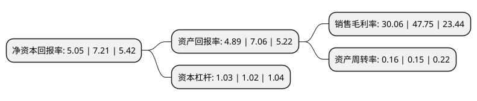

> 本页面由自动化程序生成于 2022年5月20日 01:07
> 内容可能存在错误，如有bug请提交issue至：https://github.com/Eroleice/doc-pi/issues
{.is-warning}

# 上市公司基本情况

## 基本资料

上海莱士血液制品股份有限公司（以下简称“上海莱士”）成立于1988年10月29日，上海市。于2008年06月23日在深交所中小板上市。

上海莱士注册资本674,078.791万元，血液制品的研发，生产和销售。主要产品为人血白蛋白，静注射人免疫球蛋白，凝血因子产品等。以下是详细信息：

- 公司名称: 上海莱士血液制品股份有限公司
- 股票代码: 002252.SZ
- 所在地: 上海 - 上海市
- 成立日期: 1988年10月29日
- 注册资本: 674,078.791万元
- 法定代表人: 陈杰
- 主营业务: 血液制品的研发，生产和销售主要产品为人血白蛋白，静注射人免疫球蛋白，凝血因子产品等
- 公司官网: www.raas-corp.com
- 公司介绍: 公司是在1988年成立的中外合资血液制品大型生产企业，专业从事血液制品，疫苗、诊断试剂及检测器具生产和销售并提供检测服务，主要产品包括人血白蛋白、静注人免疫球蛋白(pH4)、人凝血因子VIII、人凝血酶原复合物、人纤维蛋白原、冻干人凝血酶、外用冻干纤维蛋白粘合剂，是国内同行业中血浆综合利用率高、产品种类齐全、结构合理的血液制品生产企业之一。公司在国内首批通过GMP认证和获得ISO9001证书，是国内较早实现血液制品批量生产的厂家之一。

## 股东及高管情况

上市公司第一大股东为GRIFOLS,S.A.，持股1,766,165,808股，占比26.2%，**疑似为**上市公司实际控制人。

截至2022年04月08日，上市公司的前十大股东中，共有1名自然人股东，5名机构股东，4个海外主体，其中5%以上大股东共有5名。上市公司前十大股东明细如下：

> 未能通过持股比例判定出上市公司实际控制人（持股30%以上）
> 可能存在通过间接持股、联合持股、协议控制等方式拥有实际控制权的主体，具体请参考上市公司定期公告！
{.is-warning}

> 截至2022年04月08日，上市公司前十大股东信息如下：

| 股东名称 | 持股数量（股） | 持股比例 |
| --- | --- | --- |
| GRIFOLS,S.A. | 1,766,165,808 | 26.2% |
| GRIFOLS,S.A. | 1,766,165,808 | 26.2% |
| 科瑞天诚投资控股有限公司 | 708,753,668 | 10.5144% |
| RAAS CHINA LIMITED | 503,027,282 | 7.4624% |
| RAAS CHINA LIMITED | 502,710,449 | 7.46% |
| 中国信达资产管理股份有限公司 | 279,206,652 | 4.14% |
| 华鑫国际信托有限公司-华鑫信托·财富成长五期单一资金信托 | 139,700,000 | 2.07% |
| 苏州信托有限公司-苏信理财·恒源J1604单一资金信托 | 124,922,600 | 1.85% |
| 国泰君安证券股份有限公司 | 81,668,690 | 1.21% |
| 王泽龙 | 80,000,003 | 1.19% |

## 利润表分析

上市公司2021年总收入为42.87亿元，净利润为12.88亿元，实现盈利。

## 杜邦分析

> 数据列示周期：2021年 | 2020年 | 2019年
{.is-info}

上市公司的净资产收益率在近一年有所下降，下降幅度为-29.96%，其变化情况分解如下：
- 上市公司的销售毛利率在近一年下降了-37.05%，可能是生产效率的下降、商品原材料价格上涨或商品价格的下跌所致。
- 上市公司的资产周转率在近一年上升了6.67%，可能是源自于更快的销售回款或库存管理效果提升。
- 上市公司的财务杠杆比率在近一年上升了0.98%，可能是增加负债扩大生产规模。

