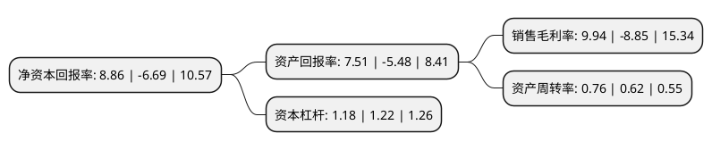

> 本页面由自动化程序生成于 2022年5月20日 01:10
> 内容可能存在错误，如有bug请提交issue至：https://github.com/Eroleice/doc-pi/issues
{.is-warning}

# 上市公司基本情况

## 基本资料

常州千红生化制药股份有限公司（以下简称“千红制药”）成立于2003年04月30日，常州市。于2011年02月18日在深交所中小板上市。

千红制药注册资本127,980万元，主营业务为药品生产许可证范围内的冻干粉，冻干粉针剂(含抗肿瘤药)，小容量注射剂(非最终灭菌)，片剂，硬胶囊剂，颗粒剂，原料药的研发，生产和销售。主要产品包括肝素钠原料药及制剂，胰激肽原酶制剂和门冬酰胺酶原料药及制剂。以下是详细信息：

- 公司名称: 常州千红生化制药股份有限公司
- 股票代码: 002550.SZ
- 所在地: 江苏 - 常州市
- 成立日期: 2003年04月30日
- 注册资本: 127,980万元
- 法定代表人: 王耀方
- 主营业务: 主营业务为药品生产许可证范围内的冻干粉，冻干粉针剂(含抗肿瘤药)，小容量注射剂(非最终灭菌)，片剂，硬胶囊剂，颗粒剂，原料药的研发，生产和销售主要产品包括肝素钠原料药及制剂，胰激肽原酶制剂和门冬酰胺酶原料药及制剂
- 公司官网: www.qhsh.com.cn
- 公司介绍: 公司是专业从事生化药品的研发、生产和销售的国家高新技术企业，主要生产多糖和酶类生化药品。公司突破了生化药物大生产中的技术瓶颈，已将现代分子膜超滤、蛋白质亲和层析、分子螯合、病毒灭活等技术集成运用于生化酶药物和多糖类药物的大规模生产中，取得显著成效，建立了生化药物产业化技术平台。公司肝素钠原料药的质量控制水平已达到国际先进水平，并通过了欧盟COS认证及德国、澳大利亚、巴西、韩国GMP认证；公司生产的可作为依诺肝素原料的肝素产品已通过美国FDA的现场检查；“达肝素钠”原料药已获得日本厚生省的进口许可；公司胰激肽原酶原料药及制剂的产品质量内控标准已被国家药典委员会提升为国家药品标准(WS1-XG-003-2006)。

## 股东及高管情况

上市公司第一大股东为王耀方，持股255,402,000股，占比19.96%，**疑似为**上市公司实际控制人。

截至2022年03月31日，上市公司的前十大股东中，共有7名自然人股东，3个产品账户，其中5%以上大股东共有2名。上市公司前十大股东明细如下：

> 未能通过持股比例判定出上市公司实际控制人（持股30%以上）
> 可能存在通过间接持股、联合持股、协议控制等方式拥有实际控制权的主体，具体请参考上市公司定期公告！
{.is-warning}

> 截至2022年03月31日，上市公司前十大股东信息如下：

| 股东名称 | 持股数量（股） | 持股比例 |
| --- | --- | --- |
| 王耀方 | 255,402,000 | 19.96% |
| 赵刚 | 69,301,000 | 5.41% |
| 蒋建平 | 42,567,000 | 3.33% |
| 王轲 | 38,209,600 | 2.99% |
| 常州千红生化制药股份有限公司-第二期员工持股计划 | 34,000,000 | 2.66% |
| 德邦基金-周冠新-德邦基金常新单一资产管理计划 | 25,500,000 | 1.99% |
| 刘军 | 24,059,644 | 1.88% |
| 天算量化(北京)资本管理有限公司-天算专享9号私募证券投资基金 | 19,400,000 | 1.52% |
| 瞿伦青 | 15,047,400 | 1.18% |
| 赵人谊 | 15,000,000 | 1.17% |

## 利润表分析

上市公司2021年总收入为18.74亿元，净利润为1.86亿元，实现盈利。

## 杜邦分析

> 数据列示周期：2021年 | 2020年 | 2019年
{.is-info}

上市公司的净资产收益率在近一年有所下降，下降幅度为-232.44%，其变化情况分解如下：
- 上市公司的销售毛利率在近一年下降了-212.32%，可能是生产效率的下降、商品原材料价格上涨或商品价格的下跌所致。
- 上市公司的资产周转率在近一年上升了22.58%，可能是源自于更快的销售回款或库存管理效果提升。
- 上市公司的财务杠杆比率在近一年下降了-3.28%，可能是减少负债降低财务费用。

