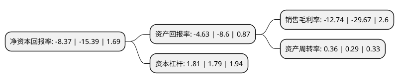

> 本页面由自动化程序生成于 2022年5月20日 01:11
> 内容可能存在错误，如有bug请提交issue至：https://github.com/Eroleice/doc-pi/issues
{.is-warning}

# 上市公司基本情况

## 基本资料

海南双成药业股份有限公司（以下简称“双成药业”）成立于2000年05月22日，海口市。于2012年08月08日在深交所中小板上市。

双成药业注册资本41,200万元，公司产品主要包括注射用胸腺法新，注射用生长抑素，注射用胸腺五肽。公司主营业务是从事化学合成多肽药物的研发，生产和销售。以下是详细信息：

- 公司名称: 海南双成药业股份有限公司
- 股票代码: 002693.SZ
- 所在地: 海南 - 海口市
- 成立日期: 2000年05月22日
- 注册资本: 41,200万元
- 法定代表人: 王成栋
- 主营业务: 公司产品主要包括注射用胸腺法新，注射用生长抑素，注射用胸腺五肽公司主营业务是从事化学合成多肽药物的研发，生产和销售
- 公司官网: www.shuangchengmed.com
- 公司介绍: 公司是我国化学合成多肽行业的重点骨干企业之一，一直从事化学合成多肽药物的研发、生产和销售。公司生产和销售的多肽药物主要包括注射用胸腺法新、注射用生长抑素、注射用胸腺五肽。公司的主导产品免疫调节类多肽产品“基泰”广泛应用于各型肝炎、肿瘤、重症感染等疾病的治疗，并被中国药典、中国国家处方集及相关权威临床诊疗指南收录。公司在化学合成多肽药物合成、纯化、分析、质量保证、活性测定、制剂工艺等方面形成了一整套成熟的技术工艺体系，能规模化、低成本、符合GMP要求地生产高标准的化学合成多肽药物原料药和制剂。

## 股东及高管情况

上市公司第一大股东为海南双成投资有限公司，持股139,516,546股，占比33.86%，为上市公司实际控制人。

截至2022年03月31日，上市公司的前十大股东中，共有6名自然人股东，1名机构股东，3个海外主体，其中5%以上大股东共有2名。上市公司前十大股东明细如下：

> 截至2022年03月31日，上市公司前十大股东信息如下：

| 股东名称 | 持股数量（股） | 持股比例 |
| --- | --- | --- |
| 海南双成投资有限公司 | 139,516,546 | 33.86% |
| HSP INVESTMENT HOLDINGS LIMITED | 64,915,479 | 15.76% |
| 吕良丰 | 8,182,970 | 1.99% |
| 高华-汇丰-GOLDMAN, SACHS & CO.LLC | 3,685,805 | 0.89% |
| 陈文宜 | 2,398,800 | 0.58% |
| 吴彦 | 2,177,600 | 0.53% |
| 王成栋 | 2,110,906 | 0.51% |
| JIANMING LI | 2,000,000 | 0.49% |
| 赖福平 | 1,800,000 | 0.44% |
| 陶巍 | 1,565,200 | 0.38% |

## 利润表分析

上市公司2021年总收入为3.2亿元，净利润为-0.41亿元，**未实现盈利**。

## 杜邦分析

> 数据列示周期：2021年 | 2020年 | 2019年
{.is-info}

上市公司的净资产收益率在近一年有所下降，下降幅度为-45.61%，其变化情况分解如下：
- 上市公司的销售毛利率在近一年下降了-57.06%，可能是生产效率的下降、商品原材料价格上涨或商品价格的下跌所致。
- 上市公司的资产周转率在近一年上升了24.14%，可能是源自于更快的销售回款或库存管理效果提升。
- 上市公司的财务杠杆比率在近一年上升了1.12%，可能是增加负债扩大生产规模。

