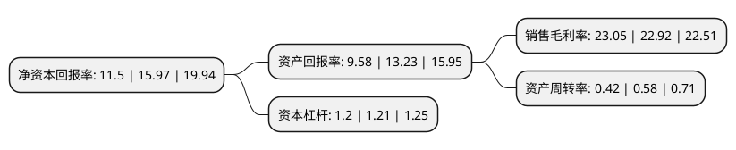

> 本页面由自动化程序生成于 2022年5月20日 01:12
> 内容可能存在错误，如有bug请提交issue至：https://github.com/Eroleice/doc-pi/issues
{.is-warning}

# 上市公司基本情况

## 基本资料

凯莱英医药集团(天津)股份有限公司（以下简称“凯莱英”）成立于1998年10月07日，天津市。于2016年11月18日在深交所中小板上市。

凯莱英注册资本26,434.202万元，主营业务:从事服务于创新药和重磅药物的医药外包服务，主要提供从临床Ⅰ期，Ⅱ期，Ⅲ期至上市后不同阶段的一站式服务，为临床新药提供工艺研发和制备。主要产品覆盖面为创新药和重磅药物。以下是详细信息：

- 公司名称: 凯莱英医药集团(天津)股份有限公司
- 股票代码: 002821.SZ
- 所在地: 天津 - 天津市
- 成立日期: 1998年10月07日
- 注册资本: 26,434.202万元
- 法定代表人: HAO HONG
- 主营业务: 主营业务:从事服务于创新药和重磅药物的医药外包服务，主要提供从临床Ⅰ期，Ⅱ期，Ⅲ期至上市后不同阶段的一站式服务，为临床新药提供工艺研发和制备主要产品覆盖面为创新药和重磅药物
- 公司官网: www.asymchem.com.cn
- 公司介绍: 公司是一家国内领先的CDMO(医药合同定制研发生产)企业，主要致力于全球制药工艺的技术创新和商业化应用，为国内外大中型制药企业、生物技术企业提供药物研发、生产一站式CMC服务。凯莱英积极布局国内市场，目前已形成包括国内创新药CMC服务、MAH业务、制剂研发生产、仿制药一致性评价、临床试验服务、生物样本检测以及药品注册申报等在内的全方位服务体系。公司坚持以技术革新作为核心驱动力，不断研发出多项国际领先专利技术并运用于商业化生产，深耕cGMP高级中间体和原料药领域，服务默沙东、辉瑞、百时美施贵宝、艾伯维、礼来等国内外大中型制药公司，形成与国内外制药巨头深度的嵌入式合作关系。

## 股东及高管情况

上市公司第一大股东为ASYMCHEM LABORATORIES, INCORPORATED，持股88,510,520股，占比33.48%，为上市公司实际控制人。

截至2022年03月31日，上市公司的前十大股东中，共有1名机构股东，5个产品账户，4个海外主体，其中5%以上大股东共有2名。上市公司前十大股东明细如下：

> 截至2022年03月31日，上市公司前十大股东信息如下：

| 股东名称 | 持股数量（股） | 持股比例 |
| --- | --- | --- |
| ASYMCHEM LABORATORIES, INCORPORATED | 88,510,520 | 33.48% |
| 香港中央结算(代理人)有限公司 | 19,680,900 | 7.45% |
| 中国工商银行股份有限公司-中欧医疗健康混合型证券投资基金 | 11,987,613 | 4.53% |
| 香港中央结算有限公司(陆股通) | 11,643,631 | 4.4% |
| HAO HONG | 10,191,928 | 3.86% |
| 天津国荣商务信息咨询有限公司 | 4,743,360 | 1.79% |
| 中国建设银行股份有限公司-工银瑞信前沿医疗股票型证券投资基金 | 4,603,000 | 1.74% |
| 中国银行股份有限公司-广发医疗保健股票型证券投资基金 | 3,349,025 | 1.27% |
| 中国工商银行股份有限公司-中欧医疗创新股票型证券投资基金 | 2,847,299 | 1.08% |
| 中国银行股份有限公司-招商国证生物医药指数分级证券投资基金 | 2,472,607 | 0.94% |

## 利润表分析

上市公司2021年总收入为46.38亿元，净利润为10.69亿元，实现盈利。

## 杜邦分析

> 数据列示周期：2021年 | 2020年 | 2019年
{.is-info}

上市公司的净资产收益率在近一年有所下降，下降幅度为-27.99%，其变化情况分解如下：
- 上市公司的销售毛利率在近一年上升了0.57%，可能是生产效率的提升、商品原材料价格下跌或商品价格的上涨所致。
- 上市公司的资产周转率在近一年下降了-27.59%，可能是源自于更慢的销售回款或库存管理效果下降。
- 上市公司的财务杠杆比率在近一年下降了-0.83%，可能是减少负债降低财务费用。

