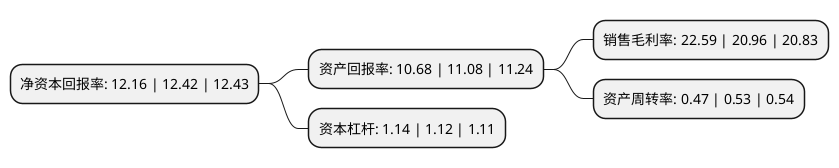

> 本页面由自动化程序生成于 2022年5月20日 01:12
> 内容可能存在错误，如有bug请提交issue至：https://github.com/Eroleice/doc-pi/issues
{.is-warning}

# 上市公司基本情况

## 基本资料

深圳市卫光生物制品股份有限公司（以下简称“卫光生物”）成立于1986年04月07日，深圳市。于2017年06月16日在深交所中小板上市。

卫光生物注册资本22,680万元，主要从事生物制品生产，销售及研发。主要产品包括人血白蛋白，静注人免疫球蛋白，乙型肝炎人免疫球蛋白，狂犬病人免疫球蛋白，破伤风人免疫球蛋白等。以下是详细信息：

- 公司名称: 深圳市卫光生物制品股份有限公司
- 股票代码: 002880.SZ
- 所在地: 广东 - 深圳市
- 成立日期: 1986年04月07日
- 注册资本: 22,680万元
- 法定代表人: 张战
- 主营业务: 主要从事生物制品生产，销售及研发主要产品包括人血白蛋白，静注人免疫球蛋白，乙型肝炎人免疫球蛋白，狂犬病人免疫球蛋白，破伤风人免疫球蛋白等
- 公司官网: www.szwg.com
- 公司介绍: 公司是国家级高新技术企业，深圳市唯一的血液制品生产企业，国有控股上市企业。公司创建于1985年，由深圳市光明集团有限公司和国药中生武汉生物制品研究所有限责任公司合资组建，主要从事血液制品的研发、生产和销售。产品包括人血白蛋白、静注人免疫球蛋白(pH4)、冻干静注人免疫球蛋白(pH4)、人免疫球蛋白、乙型肝炎人免疫球蛋白、狂犬病人免疫球蛋白、破伤风人免疫球蛋白、组织胺人免疫球蛋白、人纤维蛋白原，共9个品种21个规格。公司凭借雄厚的技术开发实力、领先的技术水平，一流的生产检测设备、科学规范的经营管理和完善的质量保证体系，在社会上树立了良好的企业形象。公司先后获得“国家高新技术企业”、“广东省自主创新示范企业”、“深圳市科技创新奖”、“深圳市市长质量奖鼓励奖”、“深圳市首届质量百强企业”、“光明新区标杆企业”、“光明新区纳税大户”等多项荣誉。

## 股东及高管情况

上市公司第一大股东为深圳市光明区国有资产监督管理局，持股147,987,000股，占比65.25%，为上市公司实际控制人。

截至2022年03月31日，上市公司的前十大股东中，共有6名自然人股东，1名机构股东，1个产品账户，1个海外主体，1名其他股东，其中5%以上大股东共有2名。上市公司前十大股东明细如下：

> 截至2022年03月31日，上市公司前十大股东信息如下：

| 股东名称 | 持股数量（股） | 持股比例 |
| --- | --- | --- |
| 深圳市光明区国有资产监督管理局 | 147,987,000 | 65.25% |
| 武汉生物制品研究所有限责任公司 | 16,443,000 | 7.25% |
| 李曼 | 3,343,200 | 1.47% |
| 朱雪松 | 2,471,123 | 1.09% |
| 贺洁 | 1,450,000 | 0.64% |
| 李琳 | 1,365,201 | 0.6% |
| 香港中央结算有限公司(陆股通) | 1,073,584 | 0.47% |
| 深圳市卫光生物制品股份有限公司-第一期员工持股计划 | 820,890 | 0.36% |
| 徐永明 | 720,000 | 0.32% |
| 金和枝 | 698,040 | 0.31% |

## 利润表分析

上市公司2021年总收入为9.07亿元，净利润为2.04亿元，实现盈利。

## 杜邦分析

> 数据列示周期：2021年 | 2020年 | 2019年
{.is-info}

上市公司的净资产收益率在近一年有所下降，下降幅度为-2.09%，其变化情况分解如下：
- 上市公司的销售毛利率在近一年上升了7.78%，可能是生产效率的提升、商品原材料价格下跌或商品价格的上涨所致。
- 上市公司的资产周转率在近一年下降了-11.32%，可能是源自于更慢的销售回款或库存管理效果下降。
- 上市公司的财务杠杆比率在近一年上升了1.79%，可能是增加负债扩大生产规模。

