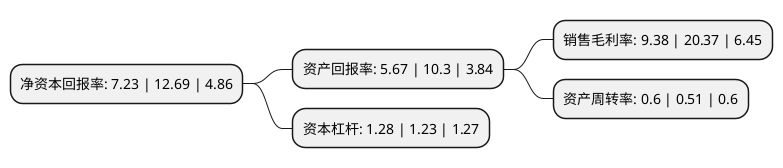

> 本页面由自动化程序生成于 2022年5月20日 01:14
> 内容可能存在错误，如有bug请提交issue至：https://github.com/Eroleice/doc-pi/issues
{.is-warning}

# 上市公司基本情况

## 基本资料

安徽安科生物工程(集团)股份有限公司（以下简称“安科生物”）成立于2000年09月28日，合肥市。于2009年10月30日在深交所创业板上市。

安科生物注册资本163,846.556万元，生物制品的研究，开发，生产和销售，主导产品为重组人干扰素和重组人生长激素系列产品。以下是详细信息：

- 公司名称: 安徽安科生物工程(集团)股份有限公司
- 股票代码: 300009.SZ
- 所在地: 安徽 - 合肥市
- 成立日期: 2000年09月28日
- 注册资本: 163,846.556万元
- 法定代表人: 宋礼华
- 主营业务: 生物制品的研究，开发，生产和销售，主导产品为重组人干扰素和重组人生长激素系列产品
- 公司官网: www.ankebio.com
- 公司介绍: 公司是一家以生物医药产业为主的具有自主创新能力的国家级高新技术企业，公司长期致力于基因工程、细胞工程、基因检测等生物技术产品的研究开发、生产、销售。目前公司形成了以生物医药为主轴，以中西药物和精准医疗为两翼“一主两翼”发展格局。公司主要业务涵盖生物制品、核酸检测产品、多肽药物、现代中成药、化学合成药等产业领域，逐步落实精准医疗的发展战略，形成基因检测、靶向抗肿瘤药物开发、细胞免疫治疗技术等一系列精准医疗全产业链布局。公司先后承担了国家“863”计划、国家科技攻关计划、国家重点火炬计划、国家重大新药创制及省级科技攻关项目数十项，先后荣获包括国家科技进步奖、安徽省重大科技成就奖、安徽省科技进步奖在内的国家和省部级科技大奖多项。

## 股东及高管情况

上市公司第一大股东为宋礼华，持股434,578,710股，占比26.52%，**疑似为**上市公司实际控制人。

截至2022年03月31日，上市公司的前十大股东中，共有6名自然人股东，3个产品账户，1个海外主体，其中5%以上大股东共有2名。上市公司前十大股东明细如下：

> 未能通过持股比例判定出上市公司实际控制人（持股30%以上）
> 可能存在通过间接持股、联合持股、协议控制等方式拥有实际控制权的主体，具体请参考上市公司定期公告！
{.is-warning}

> 截至2022年03月31日，上市公司前十大股东信息如下：

| 股东名称 | 持股数量（股） | 持股比例 |
| --- | --- | --- |
| 宋礼华 | 434,578,710 | 26.52% |
| 宋礼名 | 114,889,420 | 7.01% |
| 李名非 | 19,541,373 | 1.19% |
| 中国银行股份有限公司-招商国证生物医药指数分级证券投资基金 | 17,289,988 | 1.06% |
| 付永标 | 17,190,584 | 1.05% |
| 香港中央结算有限公司(陆股通) | 15,208,962 | 0.93% |
| 王荣海 | 14,013,963 | 0.86% |
| 上海固信资产管理有限公司-长三角(上海)产业创新股权投资基金合伙企业(有限合伙) | 11,200,000 | 0.68% |
| 安徽安科生物工程(集团)股份有限公司-第2期员工持股计划 | 10,654,872 | 0.65% |
| 赵辉 | 10,036,500 | 0.61% |

## 利润表分析

上市公司2021年总收入为21.68亿元，净利润为2.03亿元，实现盈利。

## 杜邦分析

> 数据列示周期：2021年 | 2020年 | 2019年
{.is-info}

上市公司的净资产收益率在近一年有所下降，下降幅度为-43.03%，其变化情况分解如下：
- 上市公司的销售毛利率在近一年下降了-53.95%，可能是生产效率的下降、商品原材料价格上涨或商品价格的下跌所致。
- 上市公司的资产周转率在近一年上升了17.65%，可能是源自于更快的销售回款或库存管理效果提升。
- 上市公司的财务杠杆比率在近一年上升了4.07%，可能是增加负债扩大生产规模。

