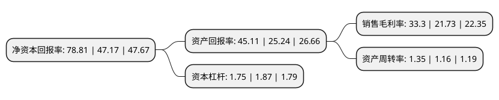

> 本页面由自动化程序生成于 2022年5月20日 01:15
> 内容可能存在错误，如有bug请提交issue至：https://github.com/Eroleice/doc-pi/issues
{.is-warning}

# 上市公司基本情况

## 基本资料

重庆智飞生物制品股份有限公司（以下简称“智飞生物”）成立于1995年07月20日，重庆市。于2010年09月28日在深交所创业板上市。

智飞生物注册资本160,000万元，主营业务为疫苗，生物制品的研发，生产和销售。自主产品包括:A群C群脑膜炎球菌多糖结合疫苗，ACYW135群脑膜炎球菌多糖疫苗，微卡(注射用母牛分枝杆菌)等;独家买断代理产品包括:Hib疫苗，甲肝减毒活疫苗等。以下是详细信息：

- 公司名称: 重庆智飞生物制品股份有限公司
- 股票代码: 300122.SZ
- 所在地: 重庆 - 重庆市
- 成立日期: 1995年07月20日
- 注册资本: 160,000万元
- 法定代表人: 蒋仁生
- 主营业务: 主营业务为疫苗，生物制品的研发，生产和销售自主产品包括:A群C群脑膜炎球菌多糖结合疫苗，ACYW135群脑膜炎球菌多糖疫苗，微卡(注射用母牛分枝杆菌)等;独家买断代理产品包括:Hib疫苗，甲肝减毒活疫苗等
- 公司官网: www.zhifeishengwu.com
- 公司介绍: 公司系一家集疫苗研发、生产、销售、配送及进出口为一体的生物高科技企业，主营的人用疫苗为国家七大战略性新兴产业，发展前景广阔。现在售产品包括AC群脑膜炎球菌(结合)b型流感嗜血杆菌(结合)联合疫苗(喜贝康)、b型流感嗜血杆菌结合疫苗(喜菲贝)、A、C、Y、W135群脑膜炎球菌多糖疫苗(盟威克)、注射用母牛分枝杆菌(微卡)、A群C群脑膜炎球菌多糖结合疫苗(盟纳康)等自主产品及统一销售默沙东授权的23价肺炎球菌多糖疫苗、甲型肝炎灭活疫苗(人二倍体细胞)、四价人乳头瘤病毒疫苗(酿酒酵母)、九价人乳头瘤病毒疫苗(酿酒酵母)、口服五价重配轮状病毒减毒活疫苗(Vero细胞)等所有进口疫苗。公司荣获全国非公有制企业双强百佳党组织、重庆市精神文明单位、全国“守合同重信用”企业、全国商务诚信试点企业、重庆市创新型企业、重庆市制造企业百强等荣誉称号。

## 股东及高管情况

上市公司第一大股东为蒋仁生，持股773,049,000股，占比48.32%，为上市公司实际控制人。

截至2022年03月31日，上市公司的前十大股东中，共有5名自然人股东，4个产品账户，1个海外主体，其中5%以上大股东共有2名。上市公司前十大股东明细如下：

> 截至2022年03月31日，上市公司前十大股东信息如下：

| 股东名称 | 持股数量（股） | 持股比例 |
| --- | --- | --- |
| 蒋仁生 | 773,049,000 | 48.32% |
| 蒋凌峰 | 86,400,000 | 5.4% |
| 刘铁鹰 | 61,000,000 | 3.81% |
| 香港中央结算有限公司(陆股通) | 38,023,697 | 2.38% |
| 中国工商银行股份有限公司-中欧医疗健康混合型证券投资基金 | 15,004,169 | 0.94% |
| 吴冠江 | 12,619,100 | 0.79% |
| 中国银行股份有限公司-招商国证生物医药指数分级证券投资基金 | 11,819,100 | 0.74% |
| 上海迎水投资管理有限公司-迎水合力13号私募证券投资基金 | 11,717,000 | 0.73% |
| 蒋喜生 | 11,200,000 | 0.7% |
| 上海迎水投资管理有限公司-迎水合力9号私募证券投资基金 | 9,966,000 | 0.62% |

## 利润表分析

上市公司2021年总收入为306.52亿元，净利润为102.08亿元，实现盈利。

## 杜邦分析

> 数据列示周期：2021年 | 2020年 | 2019年
{.is-info}

上市公司的净资产收益率在近一年有所上升，上升幅度为67.08%，其变化情况分解如下：
- 上市公司的销售毛利率在近一年上升了53.24%，可能是生产效率的提升、商品原材料价格下跌或商品价格的上涨所致。
- 上市公司的资产周转率在近一年上升了16.38%，可能是源自于更快的销售回款或库存管理效果提升。
- 上市公司的财务杠杆比率在近一年下降了-6.42%，可能是减少负债降低财务费用。

