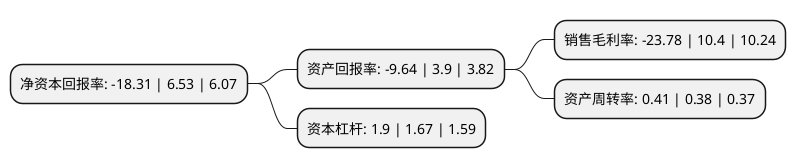

> 本页面由自动化程序生成于 2022年5月20日 01:15
> 内容可能存在错误，如有bug请提交issue至：https://github.com/Eroleice/doc-pi/issues
{.is-warning}

# 上市公司基本情况

## 基本资料

睿智医药科技股份有限公司（以下简称“睿智医药”）成立于2000年01月26日，江门市。于2010年12月22日在深交所创业板上市。

睿智医药注册资本49,977.689万元，主营业务为微生态营养制品为主，向微生态医疗研发，服务延伸。以下是详细信息：

- 公司名称: 睿智医药科技股份有限公司
- 股票代码: 300149.SZ
- 所在地: 广东 - 江门市
- 成立日期: 2000年01月26日
- 注册资本: 49,977.689万元
- 法定代表人: 曾宪维
- 主营业务: 主营业务为微生态营养制品为主，向微生态医疗研发，服务延伸
- 公司官网: www.cppt.com.cn
- 公司介绍: 公司系一家领先的医药研发外包服务机构(CRO+CDMO业务)，秉持科技为本，技术为先、全球运营、卓越品质的发展理念，致力于持续为全球医药健康产业创新赋能。为全球制药企业、生物技术研发公司及科研院校提供涵盖生物药及化学药的临床前研发(CRO业务)与临床药物开发生产(CDMO)的新药研发生产一体化服务。

## 股东及高管情况

上市公司第一大股东为北海八本创业投资有限公司，持股76,342,300股，占比15.28%，**疑似为**上市公司实际控制人。

截至2022年03月31日，上市公司的前十大股东中，共有1名自然人股东，6名机构股东，1个产品账户，2个海外主体，其中5%以上大股东共有4名。上市公司前十大股东明细如下：

> 未能通过持股比例判定出上市公司实际控制人（持股30%以上）
> 可能存在通过间接持股、联合持股、协议控制等方式拥有实际控制权的主体，具体请参考上市公司定期公告！
{.is-warning}

> 截至2022年03月31日，上市公司前十大股东信息如下：

| 股东名称 | 持股数量（股） | 持股比例 |
| --- | --- | --- |
| 北海八本创业投资有限公司 | 76,342,300 | 15.28% |
| 杭州磁晅量佳投资管理合伙企业(有限合伙) | 51,185,660 | 10.24% |
| 上海睿昀企业管理中心(有限合伙) | 39,278,829 | 7.86% |
| 香港中央结算有限公司(陆股通) | 28,589,961 | 5.72% |
| 曾宪经 | 24,555,275 | 4.91% |
| MEGA STAR CENTRE LIMITED | 22,711,333 | 4.54% |
| 禄丰宝云企业管理有限公司 | 14,990,000 | 3% |
| 湖南嘉泉商务有限公司 | 12,360,118 | 2.47% |
| 中国国际金融(香港)有限公司-中金稳定收益专户 | 9,956,700 | 1.99% |
| 中国工商银行股份有限公司-融通健康产业灵活配置混合型证券投资基金 | 8,000,000 | 1.6% |

## 利润表分析

上市公司2021年总收入为16.9亿元，净利润为-4.03亿元，**未实现盈利**。

## 杜邦分析

> 数据列示周期：2021年 | 2020年 | 2019年
{.is-info}

上市公司的净资产收益率在近一年有所下降，下降幅度为-380.4%，其变化情况分解如下：
- 上市公司的销售毛利率在近一年下降了-328.65%，可能是生产效率的下降、商品原材料价格上涨或商品价格的下跌所致。
- 上市公司的资产周转率在近一年上升了7.89%，可能是源自于更快的销售回款或库存管理效果提升。
- 上市公司的财务杠杆比率在近一年上升了13.77%，可能是增加负债扩大生产规模。

