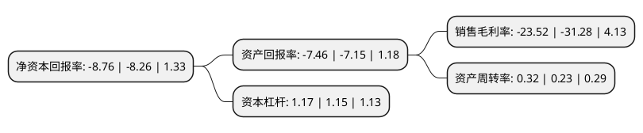

> 本页面由自动化程序生成于 2022年5月20日 01:15
> 内容可能存在错误，如有bug请提交issue至：https://github.com/Eroleice/doc-pi/issues
{.is-warning}

# 上市公司基本情况

## 基本资料

舒泰神(北京)生物制药股份有限公司（以下简称“舒泰神”）成立于2002年08月16日，北京市。于2011年04月15日在深交所创业板上市。

舒泰神注册资本47,603.454万元，主要从事生物制品和部分化学药品的研发，生产和销售。主要产品为注射用鼠神经生长因子“苏肽生”和聚乙二醇电解质散剂“舒泰清”，其中“苏肽生”是国家一类新药，主要用于神经保护和修复神经损伤;“舒泰清”是国家四类新药，主要用于清肠和治疗便秘。以下是详细信息：

- 公司名称: 舒泰神(北京)生物制药股份有限公司
- 股票代码: 300204.SZ
- 所在地: 北京 - 北京市
- 成立日期: 2002年08月16日
- 注册资本: 47,603.454万元
- 法定代表人: 周志文
- 主营业务: 主要从事生物制品和部分化学药品的研发，生产和销售主要产品为注射用鼠神经生长因子“苏肽生”和聚乙二醇电解质散剂“舒泰清”，其中“苏肽生”是国家一类新药，主要用于神经保护和修复神经损伤;“舒泰清”是国家四类新药，主要用于清肠和治疗便秘
- 公司官网: www.staidson.com
- 公司介绍: 公司是以研发、生产和销售生物制品为主的制药企业，主要从事生物制品和部分化学药品的研发、生产和销售。公司自主研制开发了国家一类新药——注射用鼠神经生长因子“苏肽生”和国内唯一具有清肠和便秘两个适应症的清肠便秘类药物——聚乙二醇电解质散剂“舒泰清”。公司主要产品被认定为“国家火炬计划产品”、“北京市高新技术成果转化项目”、“国家生物医药高技术产业化示范工程项目”及“北京市自主创新产品”，获得北京市科技进步三等奖。

## 股东及高管情况

上市公司第一大股东为熠昭(北京)医药科技有限公司，持股177,152,363股，占比37.21%，为上市公司实际控制人。

截至2022年05月13日，上市公司的前十大股东中，共有4名自然人股东，6名机构股东，其中5%以上大股东共有6名。上市公司前十大股东明细如下：

> 截至2022年05月13日，上市公司前十大股东信息如下：

| 股东名称 | 持股数量（股） | 持股比例 |
| --- | --- | --- |
| 熠昭(北京)医药科技有限公司 | 177,152,363 | 37.21% |
| 熠昭(北京)医药科技有限公司 | 177,152,363 | 37.21% |
| 熠昭(北京)医药科技有限公司 | 176,832,363 | 37.147% |
| 香塘集团有限公司 | 58,992,286 | 12.39% |
| 香塘集团有限公司 | 57,492,286 | 12.0773% |
| 香塘集团有限公司 | 57,492,286 | 12.0773% |
| 周志文 | 5,279,269 | 1.11% |
| 曾文胜 | 3,083,200 | 0.65% |
| 顾晓磊 | 1,280,000 | 0.27% |
| 刘邦 | 1,160,200 | 0.24% |

## 利润表分析

上市公司2021年总收入为5.84亿元，净利润为-1.38亿元，**未实现盈利**。

## 杜邦分析

> 数据列示周期：2021年 | 2020年 | 2019年
{.is-info}

上市公司的净资产收益率在近一年有所上升，上升幅度为6.05%，其变化情况分解如下：
- 上市公司的销售毛利率在近一年下降了-24.81%，可能是生产效率的下降、商品原材料价格上涨或商品价格的下跌所致。
- 上市公司的资产周转率在近一年上升了39.13%，可能是源自于更快的销售回款或库存管理效果提升。
- 上市公司的财务杠杆比率在近一年上升了1.74%，可能是增加负债扩大生产规模。

