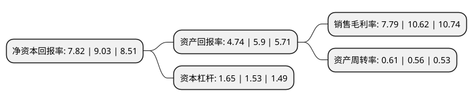

> 本页面由自动化程序生成于 2022年5月20日 01:16
> 内容可能存在错误，如有bug请提交issue至：https://github.com/Eroleice/doc-pi/issues
{.is-warning}

# 上市公司基本情况

## 基本资料

河北常山生化药业股份有限公司（以下简称“常山药业”）成立于2000年09月28日，石家庄市。于2011年08月19日在深交所创业板上市。

常山药业注册资本93,496.688万元，公司的主营业务为肝素系列产品的研发，生产和销售，是国内少数拥有完整肝素产品产业链，能够同时从事肝素钠原料药和肝素制剂药品研发，生产和销售的龙头企业之一，主导产品为肝素钠原料药(注射级和非注射级)，低分子量肝素钙注射液，肝素钠注射液。以下是详细信息：

- 公司名称: 河北常山生化药业股份有限公司
- 股票代码: 300255.SZ
- 所在地: 河北 - 石家庄市
- 成立日期: 2000年09月28日
- 注册资本: 93,496.688万元
- 法定代表人: 高晓东
- 主营业务: 公司的主营业务为肝素系列产品的研发，生产和销售，是国内少数拥有完整肝素产品产业链，能够同时从事肝素钠原料药和肝素制剂药品研发，生产和销售的龙头企业之一，主导产品为肝素钠原料药(注射级和非注射级)，低分子量肝素钙注射液，肝素钠注射液
- 公司官网: www.hbcsbio.com
- 公司介绍: 公司是国内少数拥有完整肝素产品产业链、能够同时从事肝素钠原料药和肝素制剂药品研发、生产和销售的龙头企业之一。公司主导产品包括肝素钠原料药(注射级和非注射级)、低分子量肝素钙注射液和肝素钠注射液。公司被认定为国家级高新技术企业，是国家发改委、财政部创新投资试点的首家生物制药行业企业，已被列入国家“十二五”规划的“重大新药创新”项目。公司核心产品肝素钠原料药通过欧盟CEP认证、法国GMP认证，可在欧盟全部国家进行销售，目前公司产品已销往法国、德国、意大利、西班牙等欧盟国家以及欧盟之外的多个国家。公司先后获得“河北省优秀民营科技企业”、“河北省优秀民营企业”、“河北省农业产业化经营重点龙头企业”、“河北省出口名牌”等荣誉。

## 股东及高管情况

上市公司第一大股东为高树华，持股333,644,728股，占比35.69%，为上市公司实际控制人。

截至2022年03月31日，上市公司的前十大股东中，共有6名自然人股东，3名机构股东，1个产品账户，其中5%以上大股东共有2名。上市公司前十大股东明细如下：

> 截至2022年03月31日，上市公司前十大股东信息如下：

| 股东名称 | 持股数量（股） | 持股比例 |
| --- | --- | --- |
| 高树华 | 333,644,728 | 35.69% |
| 国投高科技投资有限公司 | 108,403,020 | 11.59% |
| 河北华旭化工有限公司 | 32,002,400 | 3.42% |
| 陈曦 | 19,123,188 | 2.05% |
| 刘辉 | 15,064,428 | 1.61% |
| 陶明顺 | 7,119,063 | 0.76% |
| 朱明 | 5,921,900 | 0.63% |
| 宁波梅山保税港区凌顶投资管理有限公司-凌顶五号私募证券投资基金 | 3,670,900 | 0.39% |
| 大连洪善商贸有限公司 | 2,952,900 | 0.32% |
| 孙朝辉 | 2,880,000 | 0.31% |

## 利润表分析

上市公司2021年总收入为29.68亿元，净利润为2.31亿元，实现盈利。

## 杜邦分析

> 数据列示周期：2021年 | 2020年 | 2019年
{.is-info}

上市公司的净资产收益率在近一年有所下降，下降幅度为-13.4%，其变化情况分解如下：
- 上市公司的销售毛利率在近一年下降了-26.65%，可能是生产效率的下降、商品原材料价格上涨或商品价格的下跌所致。
- 上市公司的资产周转率在近一年上升了8.93%，可能是源自于更快的销售回款或库存管理效果提升。
- 上市公司的财务杠杆比率在近一年上升了7.84%，可能是增加负债扩大生产规模。

