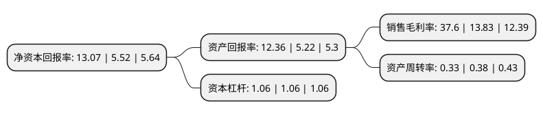

> 本页面由自动化程序生成于 2022年5月20日 01:18
> 内容可能存在错误，如有bug请提交issue至：https://github.com/Eroleice/doc-pi/issues
{.is-warning}

# 上市公司基本情况

## 基本资料

北京赛升药业股份有限公司（以下简称“赛升药业”）成立于1999年05月20日，北京市。于2015年06月26日在深交所创业板上市。

赛升药业注册资本48,166.64万元，主要从事生物生化药品的研发，生产和销售。经过多年的研发生产积累，公司已经形成心脑血管，免疫调节，神经系统用药三大系列产品。以下是详细信息：

- 公司名称: 北京赛升药业股份有限公司
- 股票代码: 300485.SZ
- 所在地: 北京 - 北京市
- 成立日期: 1999年05月20日
- 注册资本: 48,166.64万元
- 法定代表人: 马骉
- 主营业务: 主要从事生物生化药品的研发，生产和销售经过多年的研发生产积累，公司已经形成心脑血管，免疫调节，神经系统用药三大系列产品
- 公司官网: www.ssyy.com.cn
- 公司介绍: 公司是一家专注于研发、生产、销售生物药物(活性蛋白酶、活性多肽、活性多糖、两性脂类)的高新技术企业。公司已经建立起以科技、创新、销售、服务为一体的高新技术产业和基于抗体与抗体可变区亲和层析分离纯化技术的生物大分子研发平台。产品研发方向主要为心脑血管类、免疫调节(抗肿瘤)类、神经系统类、生物多肽、生物新材料、慢病未病诊疗管理等天然或生物技术类药物。公司现拥有多个临床疗效确切、独家或首家生产的国药准字号产品并拥有四十余项国家发明专利，同时公司为多个药品的国家标准起草单位。

## 股东及高管情况

上市公司第一大股东为马骉，持股238,464,000股，占比49.51%，为上市公司实际控制人。

截至2022年03月31日，上市公司的前十大股东中，共有8名自然人股东，1个产品账户，1个海外主体，其中5%以上大股东共有2名。上市公司前十大股东明细如下：

> 截至2022年03月31日，上市公司前十大股东信息如下：

| 股东名称 | 持股数量（股） | 持股比例 |
| --- | --- | --- |
| 马骉 | 238,464,000 | 49.51% |
| 马丽 | 34,596,791 | 7.18% |
| 青骓投资管理有限公司-青骓裕福八期私募证券投资基金 | 9,600,000 | 1.99% |
| 刘淑芹 | 8,748,000 | 1.82% |
| 俞春妹 | 1,079,600 | 0.22% |
| 郭林 | 1,058,800 | 0.22% |
| 黄庆仰 | 1,050,000 | 0.22% |
| 朱志峰 | 999,600 | 0.21% |
| 胡民富 | 990,000 | 0.21% |
| 香港中央结算有限公司(陆股通) | 876,754 | 0.18% |

## 利润表分析

上市公司2021年总收入为10.5亿元，净利润为3.95亿元，实现盈利。

## 杜邦分析

> 数据列示周期：2021年 | 2020年 | 2019年
{.is-info}

上市公司的净资产收益率在近一年有所上升，上升幅度为136.78%，其变化情况分解如下：
- 上市公司的销售毛利率在近一年上升了171.87%，可能是生产效率的提升、商品原材料价格下跌或商品价格的上涨所致。
- 上市公司的资产周转率在近一年下降了-13.16%，可能是源自于更慢的销售回款或库存管理效果下降。
- 上市公司的财务杠杆比率在近一年下降了0%，可能是减少负债降低财务费用。

