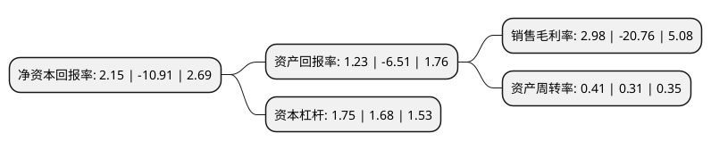

> 本页面由自动化程序生成于 2022年5月20日 01:18
> 内容可能存在错误，如有bug请提交issue至：https://github.com/Eroleice/doc-pi/issues
{.is-warning}

# 上市公司基本情况

## 基本资料

山东赛托生物科技股份有限公司（以下简称“赛托生物”）成立于2010年01月19日，菏泽市。于2017年01月06日在深交所创业板上市。

赛托生物注册资本10,725.257万元，赛托生物是一家应用基因工程技术和微生物转化技术制造甾体药物原料的企业。以甾体药物核心原料——雄烯二酮为突破口，开发了系列化产品。主要产品为甾体药物原料。以下是详细信息：

- 公司名称: 山东赛托生物科技股份有限公司
- 股票代码: 300583.SZ
- 所在地: 山东 - 菏泽市
- 成立日期: 2010年01月19日
- 注册资本: 10,725.257万元
- 法定代表人: 米奇
- 主营业务: 赛托生物是一家应用基因工程技术和微生物转化技术制造甾体药物原料的企业以甾体药物核心原料——雄烯二酮为突破口，开发了系列化产品主要产品为甾体药物原料
- 公司官网: www.sitobiotech.com
- 公司介绍: 公司是专业从事新型甾体激素药物核心中间体及衍生品研发、生产为一体的生物医药企业。公司立足于生物制药的前沿领域，以甾体药物领域的核心生物型原料为突破口，率先实现了生物制药技术在甾体药物领域的规模化应用。目前，公司拥有雄烯二酮、九羟基雄烯二酮、雄二烯二酮等五大系列生物型甾体药物原料的规模化生产技术，在国内甾体药物中间体行业走在了前列。发展至今，公司已成为山东省高新技术企业、山东省企业技术中心、菏泽市工业企业20强，工商银行、中国银行AA+级信用企业，并且已通过ISO90001:2015质量体系认证，山东省安全生产三级标准化等认证。

## 股东及高管情况

上市公司第一大股东为山东润鑫投资有限公司，持股27,060,864股，占比25.23%，**疑似为**上市公司实际控制人。

截至2022年04月13日，上市公司的前十大股东中，共有6名自然人股东，4名机构股东，其中5%以上大股东共有3名。上市公司前十大股东明细如下：

> 未能通过持股比例判定出上市公司实际控制人（持股30%以上）
> 可能存在通过间接持股、联合持股、协议控制等方式拥有实际控制权的主体，具体请参考上市公司定期公告！
{.is-warning}

> 截至2022年04月13日，上市公司前十大股东信息如下：

| 股东名称 | 持股数量（股） | 持股比例 |
| --- | --- | --- |
| 山东润鑫投资有限公司 | 27,060,864 | 25.23% |
| 米超杰 | 24,448,000 | 22.79% |
| 米超杰 | 24,448,000 | 22.79% |
| 盐城合孚企业管理合伙企业(有限合伙) | 5,362,628 | 5% |
| 俊朗惠 | 5,362,628 | 5% |
| 俊朗惠企业管理(宁波)合伙企业(有限合伙) | 5,362,628 | 5% |
| 盐城合孚企业管理合伙企业(有限合伙) | 5,362,628 | 5% |
| 米奇 | 2,960,000 | 2.76% |
| 李立峰 | 1,580,000 | 1.47% |
| 孔庆芝 | 630,500 | 0.59% |

## 利润表分析

上市公司2021年总收入为12.02亿元，净利润为0.35亿元，实现盈利。

## 杜邦分析

> 数据列示周期：2021年 | 2020年 | 2019年
{.is-info}

上市公司的净资产收益率在近一年有所下降，下降幅度为-119.71%，其变化情况分解如下：
- 上市公司的销售毛利率在近一年下降了-114.35%，可能是生产效率的下降、商品原材料价格上涨或商品价格的下跌所致。
- 上市公司的资产周转率在近一年上升了32.26%，可能是源自于更快的销售回款或库存管理效果提升。
- 上市公司的财务杠杆比率在近一年上升了4.17%，可能是增加负债扩大生产规模。

