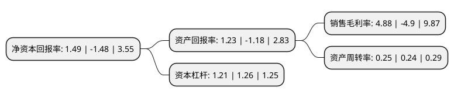

> 本页面由自动化程序生成于 2022年5月20日 01:19
> 内容可能存在错误，如有bug请提交issue至：https://github.com/Eroleice/doc-pi/issues
{.is-warning}

# 上市公司基本情况

## 基本资料

武汉海特生物制药股份有限公司（以下简称“海特生物”）成立于1992年04月08日，武汉市。于2017年08月08日在深交所创业板上市。

海特生物注册资本12,210.417万元，主营业务为生物制品(注射用鼠神经生长因子冻干粉针剂，注射用抗乙肝转移因子冻干粉针剂)，凝血酶和其他化学药品的研发，生产和销售。主要产品为生物制品(注射用鼠神经生长因子冻干粉针剂，注射用抗乙肝转移因子冻干粉针剂)，凝血酶和其他化学药品。以下是详细信息：

- 公司名称: 武汉海特生物制药股份有限公司
- 股票代码: 300683.SZ
- 所在地: 湖北 - 武汉市
- 成立日期: 1992年04月08日
- 注册资本: 12,210.417万元
- 法定代表人: 陈亚
- 主营业务: 主营业务为生物制品(注射用鼠神经生长因子冻干粉针剂，注射用抗乙肝转移因子冻干粉针剂)，凝血酶和其他化学药品的研发，生产和销售主要产品为生物制品(注射用鼠神经生长因子冻干粉针剂，注射用抗乙肝转移因子冻干粉针剂)，凝血酶和其他化学药品
- 公司官网: www.hiteck.com.cn
- 公司介绍: 公司是一家以创建一流生物创新药企业为目标的湖北省高新技术生物制药企业。主营业务为生物制品(注射用鼠神经生长因子冻干粉针剂、注射用抗乙肝转移因子冻干粉针剂)、凝血酶和其他化学药品的研发、生产和销售。主导产品金路捷——注射用鼠神经生长因子属国家一类新生物制品，为全球第一个获得政府批准上市的神经损伤类疾病用药。金路捷的神经修复疗效获得了广大临床一线医生和国家医保部门的认可。2009年，金路捷正式进入国家医保乙类药品目录；2015年，注射用鼠神经生长因子被收录到国家药典2015版三部。公司是中华全国工商业联合会医药业商会常务理事单位。近年来，公司及其产品获得了多项国家、省、市的奖项和荣誉。

## 股东及高管情况

上市公司第一大股东为武汉三江源投资发展有限公司，持股40,000,000股，占比32.76%，为上市公司实际控制人。

截至2022年03月31日，上市公司的前十大股东中，共有7名自然人股东，2名机构股东，1个产品账户，其中5%以上大股东共有2名。上市公司前十大股东明细如下：

> 截至2022年03月31日，上市公司前十大股东信息如下：

| 股东名称 | 持股数量（股） | 持股比例 |
| --- | --- | --- |
| 武汉三江源投资发展有限公司 | 40,000,000 | 32.76% |
| 陈亚 | 11,050,000 | 9.05% |
| 沈祥龙 | 3,125,000 | 2.56% |
| 蒋仕波 | 3,042,967 | 2.49% |
| 武汉博肽企业发展有限公司 | 3,000,000 | 2.46% |
| 吴洪新 | 3,000,000 | 2.46% |
| 陈传兴 | 2,375,000 | 1.95% |
| 中国工商银行股份有限公司-华夏磐利一年定期开放混合型证券投资基金 | 1,406,250 | 1.15% |
| 严洁 | 1,263,000 | 1.03% |
| 高原 | 1,250,000 | 1.02% |

## 利润表分析

上市公司2021年总收入为6.14亿元，净利润为0.3亿元，实现盈利。

## 杜邦分析

> 数据列示周期：2021年 | 2020年 | 2019年
{.is-info}

上市公司的净资产收益率在近一年有所下降，下降幅度为-200.68%，其变化情况分解如下：
- 上市公司的销售毛利率在近一年下降了-199.59%，可能是生产效率的下降、商品原材料价格上涨或商品价格的下跌所致。
- 上市公司的资产周转率在近一年上升了4.17%，可能是源自于更快的销售回款或库存管理效果提升。
- 上市公司的财务杠杆比率在近一年下降了-3.97%，可能是减少负债降低财务费用。

