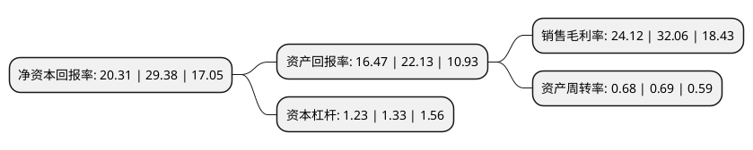

> 本页面由自动化程序生成于 2022年5月20日 01:23
> 内容可能存在错误，如有bug请提交issue至：https://github.com/Eroleice/doc-pi/issues
{.is-warning}

# 上市公司基本情况

## 基本资料

诚达药业股份有限公司（以下简称“诚达药业”）成立于1980年06月30日，嘉兴市。于2022年01月20日在深交所创业板上市。

诚达药业注册资本9,669.614万元，为跨国制药企业及医药研发机构提供关键医药中间体CDMO服务，并从事左旋肉碱系列产品的研发，生产和销售。以下是详细信息：

- 公司名称: 诚达药业股份有限公司
- 股票代码: 301201.SZ
- 所在地: 浙江 - 嘉兴市
- 成立日期: 1980年06月30日
- 注册资本: 9,669.614万元
- 法定代表人: 葛建利
- 主营业务: 为跨国制药企业及医药研发机构提供关键医药中间体CDMO服务，并从事左旋肉碱系列产品的研发，生产和销售
- 公司官网: www.chengdapharm.com
- 公司介绍: 公司主要致力于为跨国制药企业及医药研发机构提供关键医药中间体CDMO服务，并从事左旋肉碱系列产品的研发、生产和销售。公司自成立以来坚持深耕医药CDMO领域，在药物临床试验和商业化阶段为客户提供关键医药中间体的工艺研发及优化、质量研究和定制生产等服务。经过二十多年的积累，公司所服务的终端药物涉及抗肿瘤、艾滋病、乙肝、丙肝、骨髓纤维化、癫痫、帕金森症等多个治疗领域。公司服务的终端定制客户包括Incyte、Helsinn、礼来/Evonik、Gilead、GSK等跨国制药企业。左旋肉碱系列产品方面，公司是全球左旋肉碱系列产品的主要供应商之一，公司产品出口全球30多个国家，具有较强的市场竞争力。CDMO企业的研发和生产能力将对药品能否顺利上市、药品价格能否被患者接受等方面产生重要影响。经过多年的探索与实践，公司在化学合成工艺开发和生产方面积累了丰富的技术经验，通过将自主研发创新与体系化建设相结合，公司具备了较强的科技成果转化能力。

## 股东及高管情况

上市公司第一大股东为深圳市晟泰投资管理有限公司-深圳前海晟泰投资企业(有限合伙)，持股15,500,000股，占比16.03%，**疑似为**上市公司实际控制人。

截至2022年03月31日，上市公司的前十大股东中，共有2名自然人股东，8名机构股东，其中5%以上大股东共有3名。上市公司前十大股东明细如下：

> 未能通过持股比例判定出上市公司实际控制人（持股30%以上）
> 可能存在通过间接持股、联合持股、协议控制等方式拥有实际控制权的主体，具体请参考上市公司定期公告！
{.is-warning}

> 截至2022年03月31日，上市公司前十大股东信息如下：

| 股东名称 | 持股数量（股） | 持股比例 |
| --- | --- | --- |
| 深圳市晟泰投资管理有限公司-深圳前海晟泰投资企业(有限合伙) | 15,500,000 | 16.03% |
| 深圳前海晟泰投资企业(有限合伙) | 15,500,000 | 16.03% |
| 黄洪林 | 12,205,000 | 12.62% |
| 嘉善县汇达投资合伙企业(有限合伙) | 3,800,000 | 3.93% |
| 嘉兴麦尔特股权投资合伙企业(有限合伙) | 2,736,842 | 2.83% |
| 浙江诚合资产管理有限公司-杭州诚合善达投资合伙企业(有限合伙) | 2,180,000 | 2.25% |
| 杭州诚合善达投资合伙企业(有限合伙) | 2,180,000 | 2.25% |
| 嘉善汇诚股权投资合伙企业(有限合伙) | 2,080,400 | 2.15% |
| 王喆 | 2,000,000 | 2.07% |
| 深圳市九恒投资顾问有限公司 | 2,000,000 | 2.07% |

## 利润表分析

上市公司2021年总收入为4.15亿元，净利润为1亿元，实现盈利。

## 杜邦分析

> 数据列示周期：2021年 | 2020年 | 2019年
{.is-info}

上市公司的净资产收益率在近一年有所下降，下降幅度为-30.87%，其变化情况分解如下：
- 上市公司的销售毛利率在近一年下降了-24.77%，可能是生产效率的下降、商品原材料价格上涨或商品价格的下跌所致。
- 上市公司的资产周转率在近一年下降了-1.45%，可能是源自于更慢的销售回款或库存管理效果下降。
- 上市公司的财务杠杆比率在近一年下降了-7.52%，可能是减少负债降低财务费用。

