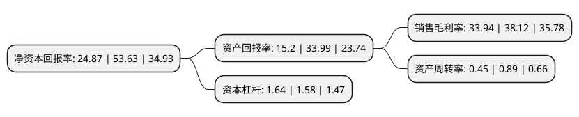

> 本页面由自动化程序生成于 2022年5月20日 01:23
> 内容可能存在错误，如有bug请提交issue至：https://github.com/Eroleice/doc-pi/issues
{.is-warning}

# 上市公司基本情况

## 基本资料

华兰生物疫苗股份有限公司（以下简称“华兰疫苗”）成立于2005年11月09日，新乡市。于2022年02月18日在深交所创业板上市。

华兰疫苗注册资本40,001万元，发行人主营业务为人用疫苗的研发，生产和销售。公司主营业务产品包括流感病毒裂解疫苗，四价流感病毒裂解疫苗，甲型H1N1流感病毒裂解疫苗，ACYW135群脑膜炎球菌多糖疫苗，重组乙型肝炎疫苗(汉逊酵母)，A群C群脑膜炎球菌多糖疫苗。以下是详细信息：

- 公司名称: 华兰生物疫苗股份有限公司
- 股票代码: 301207.SZ
- 所在地: 河南 - 新乡市
- 成立日期: 2005年11月09日
- 注册资本: 40,001万元
- 法定代表人: 安康
- 主营业务: 发行人主营业务为人用疫苗的研发，生产和销售公司主营业务产品包括流感病毒裂解疫苗，四价流感病毒裂解疫苗，甲型H1N1流感病毒裂解疫苗，ACYW135群脑膜炎球菌多糖疫苗，重组乙型肝炎疫苗(汉逊酵母)，A群C群脑膜炎球菌多糖疫苗
- 公司官网: null
- 公司介绍: 华兰生物疫苗股份有限公司作为一家集疫苗研发、生产为一体的创新型生物制药企业，公司自2005年成立以来，立足人用疫苗主业，围绕传染病的预防控制需要，重点关注市场需求大或疾病防控急需的人用预防类疫苗产品，不断创新和发展新技术，开展新型疫苗产品开发。在多年的研发过程中，公司通过自主研发逐步搭建了“流感病毒疫苗研发和规模化生产技术平台”、“多联多价疫苗技术平台”、“基因工程疫苗技术平台”、“大规模培养哺乳动物细胞及疫苗通用制备工艺技术平台”四个核心技术平台，不断进行疫苗核心技术的攻关和关键工艺的研究、促进重大科技成果转化。2009年，公司研制出全球首批甲型H1N1流感病毒裂解疫苗，圆满完成国家5,225万剂甲型H1N1流感病毒裂解疫苗的生产任务、承担了国家近40%的收储任务，为我国疫情防控作出了较大的贡献。2018年公司成为国内首家获批四价流感病毒裂解疫苗生产的企业，彰显出公司强大的自主研发和技术创新能力。

## 股东及高管情况

上市公司第一大股东为华兰生物工程股份有限公司，持股270,000,000股，占比67.5%，为上市公司实际控制人。

截至2022年03月31日，上市公司的前十大股东中，共有2名自然人股东，6名机构股东，2个产品账户，其中5%以上大股东共有4名。上市公司前十大股东明细如下：

> 截至2022年03月31日，上市公司前十大股东信息如下：

| 股东名称 | 持股数量（股） | 持股比例 |
| --- | --- | --- |
| 华兰生物工程股份有限公司 | 270,000,000 | 67.5% |
| CYBER CREATOR LIMITED科康有限公司 | 36,000,000 | 9% |
| 河南高瓴骅盈企业管理咨询合伙企业(有限合伙) | 32,400,000 | 8.1% |
| 新乡晨壹启明管理咨询合伙企业(有限合伙) | 21,600,000 | 5.4% |
| 华泰证券资管-招商银行-华泰华兰疫苗家园1号创业板员工持股集合资产管理计划 | 2,912,900 | 0.73% |
| 华泰证券股份有限公司 | 265,401 | 0.07% |
| 童燕 | 257,800 | 0.06% |
| 海通证券股份有限公司 | 248,400 | 0.06% |
| 上海孝庸资产管理有限公司-孝庸金貔貅十一号私募证券投资基金 | 200,179 | 0.05% |
| 邱宇 | 200,000 | 0.05% |

## 利润表分析

上市公司2021年总收入为18.29亿元，净利润为6.2亿元，实现盈利。

## 杜邦分析

> 数据列示周期：2021年 | 2020年 | 2019年
{.is-info}

上市公司的净资产收益率在近一年有所下降，下降幅度为-53.63%，其变化情况分解如下：
- 上市公司的销售毛利率在近一年下降了-10.97%，可能是生产效率的下降、商品原材料价格上涨或商品价格的下跌所致。
- 上市公司的资产周转率在近一年下降了-49.44%，可能是源自于更慢的销售回款或库存管理效果下降。
- 上市公司的财务杠杆比率在近一年上升了3.8%，可能是增加负债扩大生产规模。

